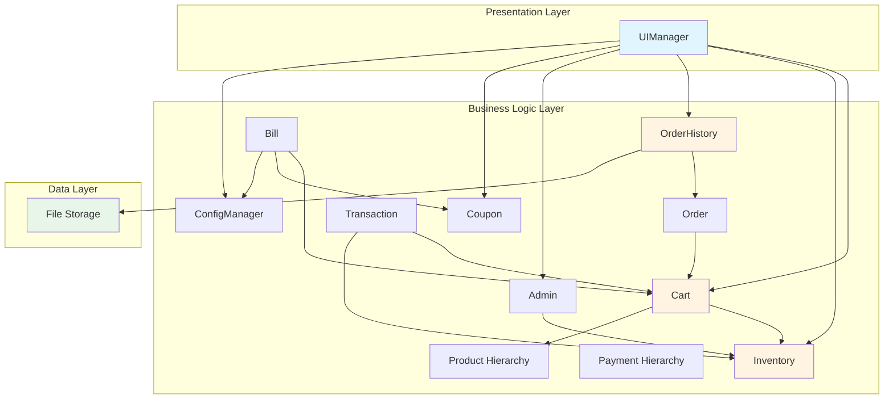
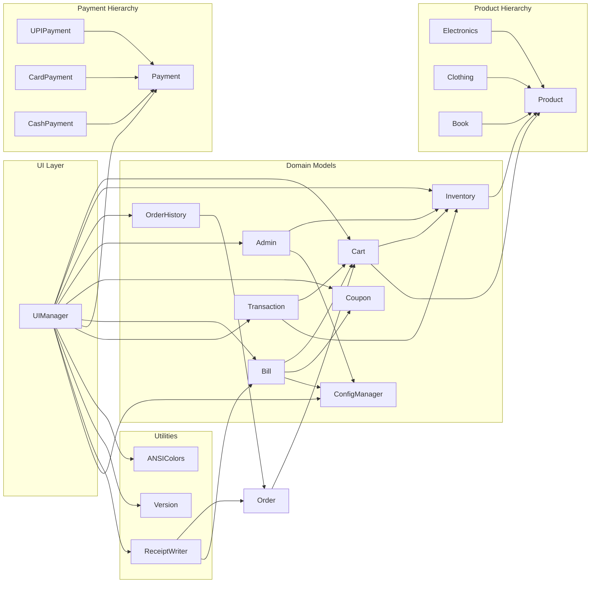

# Design Document: Shopping Management System

## Overview

The Shopping Management System is a console-based C++17 application that demonstrates comprehensive Object-Oriented Programming principles through a fully-featured e-commerce platform. The system implements a three-tier architecture separating presentation (UI), business logic (domain models), and data persistence layers.

### Core Design Principles

- **Encapsulation**: All data members are private with controlled access through public interfaces
- **Inheritance**: Product hierarchy (Electronics, Clothing, Books) and Payment hierarchy (UPI, Card, Cash)
- **Polymorphism**: Runtime polymorphism for product display and payment processing through virtual functions
- **Abstraction**: Abstract interfaces for extensible payment methods and product categories
- **RAII**: Resource Acquisition Is Initialization for automatic memory management
- **Modern C++**: Smart pointers (unique_ptr, shared_ptr) replace raw pointer management

### System Capabilities

The system provides:
- Multi-category product catalog with inheritance-based specialization
- Shopping cart with quantity tracking and inventory synchronization
- Three-tier discount system (product-level, cart-level, coupon-based)
- Polymorphic payment processing supporting multiple payment methods
- Persistent order history with file-based storage
- Product search and filtering capabilities
- Role-based admin panel for inventory management
- Sales analytics and reporting
- GST calculation and detailed bill generation
- Receipt generation with unique file naming
- Premium dark-themed ANSI-colored terminal UI

## Architecture

### High-Level Architecture

```
┌─────────────────────────────────────────────────────────────┐
│                     Presentation Layer                       │
│  ┌──────────────┐  ┌──────────────┐  ┌──────────────┐      │
│  │  UIManager   │  │ ANSIColors   │  │ MenuHandler  │      │
│  └──────────────┘  └──────────────┘  └──────────────┘      │
└─────────────────────────────────────────────────────────────┘
                            │
                            ▼
┌─────────────────────────────────────────────────────────────┐
│                     Business Logic Layer                     │
│  ┌──────────────┐  ┌──────────────┐  ┌──────────────┐      │
│  │   Product    │  │     Cart     │  │   Payment    │      │
│  │  Hierarchy   │  │              │  │  Hierarchy   │      │
│  └──────────────┘  └──────────────┘  └──────────────┘      │
│  ┌──────────────┐  ┌──────────────┐  ┌──────────────┐      │
│  │    Coupon    │  │     Bill     │  │    Order     │      │
│  └──────────────┘  └──────────────┘  └──────────────┘      │
│  ┌──────────────┐  ┌──────────────┐                         │
│  │  Inventory   │  │    Admin     │                         │
│  └──────────────┘  └──────────────┘                         │
└─────────────────────────────────────────────────────────────┘
                            │
                            ▼
┌─────────────────────────────────────────────────────────────┐
│                    Data Persistence Layer                    │
│  ┌──────────────┐  ┌──────────────┐  ┌──────────────┐      │
│  │ FileManager  │  │ OrderStorage │  │ReceiptWriter │      │
│  └──────────────┘  └──────────────┘  └──────────────┘      │
└─────────────────────────────────────────────────────────────┘
```

### Component Responsibilities

**Presentation Layer:**
- UIManager: Orchestrates all UI rendering and user interaction
- ANSIColors: Provides ANSI escape code constants for terminal styling
- MenuHandler: Processes menu selections and routes to appropriate handlers

**Business Logic Layer:**
- Product Hierarchy: Base Product class with Electronics, Clothing, Book specializations
- Cart: Manages selected products with quantity tracking and inventory synchronization
- Payment Hierarchy: Abstract Payment base with UPI, Card, Cash implementations
- Coupon: Validates and applies coupon codes
- Bill: Calculates all discounts, GST, and generates bill breakdown
- Order: Represents completed transactions with full details
- Inventory: Manages product stock levels and availability
- Admin: Handles administrative operations and authentication

**Data Persistence Layer:**
- FileManager: Generic file I/O operations
- OrderStorage: Serializes/deserializes order history
- ReceiptWriter: Generates formatted receipt files

## Design Patterns Used

The Shopping Management System implements several industry-standard design patterns to achieve maintainability, extensibility, and loose coupling. These patterns demonstrate advanced software engineering principles and adherence to SOLID design.

### Factory Pattern for Product Creation

**Intent:** Decouple product creation logic from client code, enabling extensibility without modifying existing code.

**Implementation:**

```cpp
class ProductFactory {
public:
    enum class ProductType {
        ELECTRONICS,
        CLOTHING,
        BOOK
    };
    
    static std::unique_ptr<Product> createProduct(
        ProductType type,
        int id,
        const std::string& name,
        double price,
        int quantity,
        const std::map<std::string, std::string>& attributes
    ) {
        switch (type) {
            case ProductType::ELECTRONICS:
                return std::make_unique<Electronics>(
                    id, name, price, quantity,
                    attributes.at("brand"),
                    std::stoi(attributes.at("warranty"))
                );
            
            case ProductType::CLOTHING:
                return std::make_unique<Clothing>(
                    id, name, price, quantity,
                    attributes.at("size"),
                    attributes.at("fabric")
                );
            
            case ProductType::BOOK:
                return std::make_unique<Book>(
                    id, name, price, quantity,
                    attributes.at("author"),
                    attributes.at("genre")
                );
            
            default:
                throw std::invalid_argument("Unknown product type");
        }
    }
    
    // Convenience methods for specific types
    static std::unique_ptr<Product> createElectronics(
        int id, const std::string& name, double price, int qty,
        const std::string& brand, int warranty
    ) {
        return std::make_unique<Electronics>(id, name, price, qty, brand, warranty);
    }
    
    static std::unique_ptr<Product> createClothing(
        int id, const std::string& name, double price, int qty,
        const std::string& size, const std::string& fabric
    ) {
        return std::make_unique<Clothing>(id, name, price, qty, size, fabric);
    }
    
    static std::unique_ptr<Product> createBook(
        int id, const std::string& name, double price, int qty,
        const std::string& author, const std::string& genre
    ) {
        return std::make_unique<Book>(id, name, price, qty, author, genre);
    }
};
```

**Benefits:**
- **Open/Closed Principle:** New product types can be added without modifying client code
- **Single Responsibility:** Product creation logic centralized in one place
- **Loose Coupling:** Clients depend on Product interface, not concrete classes
- **Testability:** Easy to mock product creation for testing

**Usage Example:**
```cpp
// In Admin::addNewProduct()
auto product = ProductFactory::createElectronics(
    101, "Laptop", 45000.0, 5, "Dell", 2
);
inventory->addProduct(std::move(product));
```

### Strategy Pattern for Payment Processing

**Intent:** Define a family of interchangeable algorithms (payment methods) and make them interchangeable at runtime.

**Implementation:**

The Payment class hierarchy implements the Strategy pattern:

```cpp
// Strategy interface
class Payment {
protected:
    double amount;
    
public:
    explicit Payment(double amt) : amount(amt) {}
    virtual ~Payment() = default;
    
    // Strategy method
    virtual bool pay() = 0;
    virtual std::string getPaymentMethod() const = 0;
    
    double getAmount() const { return amount; }
};

// Concrete strategies
class UPIPayment : public Payment { /* ... */ };
class CardPayment : public Payment { /* ... */ };
class CashPayment : public Payment { /* ... */ };

// Context class
class PaymentProcessor {
private:
    std::unique_ptr<Payment> paymentStrategy;
    
public:
    void setPaymentStrategy(std::unique_ptr<Payment> strategy) {
        paymentStrategy = std::move(strategy);
    }
    
    bool processPayment() {
        if (!paymentStrategy) {
            throw std::runtime_error("No payment strategy set");
        }
        return paymentStrategy->pay();
    }
    
    std::string getMethodName() const {
        return paymentStrategy ? paymentStrategy->getPaymentMethod() : "None";
    }
};
```

**Benefits:**
- **Open/Closed Principle:** New payment methods can be added without modifying existing code
- **Runtime Flexibility:** Payment method can be selected at runtime based on user choice
- **Interchangeable Behavior:** All payment strategies conform to the same interface
- **Testability:** Each payment strategy can be tested independently

**Usage Example:**
```cpp
// In UIManager::handleCheckout()
PaymentProcessor processor;

int choice = getUserPaymentChoice();
switch (choice) {
    case 1:
        processor.setPaymentStrategy(
            std::make_unique<UPIPayment>(total, upiId)
        );
        break;
    case 2:
        processor.setPaymentStrategy(
            std::make_unique<CardPayment>(total, cardNum, holderName)
        );
        break;
    case 3:
        processor.setPaymentStrategy(
            std::make_unique<CashPayment>(total, cashTendered)
        );
        break;
}

bool success = processor.processPayment();
```

### Singleton Pattern for Centralized Management (Optional Enhancement)

**Intent:** Ensure a class has only one instance and provide global access point for centralized control.

**Implementation for Inventory:**

```cpp
class Inventory {
private:
    std::vector<std::unique_ptr<Product>> products;
    
    // Private constructor
    Inventory() = default;
    
    // Delete copy and move operations
    Inventory(const Inventory&) = delete;
    Inventory& operator=(const Inventory&) = delete;
    Inventory(Inventory&&) = delete;
    Inventory& operator=(Inventory&&) = delete;
    
public:
    static Inventory& getInstance() {
        static Inventory instance;  // Thread-safe in C++11+
        return instance;
    }
    
    // Existing methods...
    void addProduct(std::unique_ptr<Product> product);
    Product* findProduct(int productId);
    // ...
};
```

**Implementation for OrderHistory:**

```cpp
class OrderHistory {
private:
    std::vector<Order> orders;
    std::string storageFile;
    
    // Private constructor
    OrderHistory() : storageFile("data/orders.txt") {
        loadFromFile();
    }
    
    // Delete copy and move operations
    OrderHistory(const OrderHistory&) = delete;
    OrderHistory& operator=(const OrderHistory&) = delete;
    
public:
    static OrderHistory& getInstance() {
        static OrderHistory instance;
        return instance;
    }
    
    ~OrderHistory() {
        saveToFile();  // Auto-save on destruction
    }
    
    // Existing methods...
    void addOrder(const Order& order);
    void displayHistory() const;
    // ...
};
```

**Benefits:**
- **Centralized Control:** Single point of access for inventory and order history
- **Resource Management:** Prevents multiple instances competing for file access
- **Global State:** Consistent state across entire application
- **Thread-Safe:** C++11+ guarantees thread-safe static initialization

**Usage Example:**
```cpp
// Anywhere in the application
Inventory& inventory = Inventory::getInstance();
inventory.addProduct(std::move(product));

OrderHistory& history = OrderHistory::getInstance();
history.addOrder(order);
```

**Note:** The current implementation uses dependency injection (passing pointers) which is also a valid design choice. The Singleton pattern is presented here as an optional enhancement for academic discussion and demonstrates understanding of centralized resource management patterns.

### Prototype Pattern (Clone Method)

**Intent:** Create new objects by copying existing instances, avoiding expensive construction.

**Implementation:**

```cpp
class Product {
public:
    // Prototype method
    virtual std::unique_ptr<Product> clone() const = 0;
};

class Electronics : public Product {
public:
    std::unique_ptr<Product> clone() const override {
        return std::make_unique<Electronics>(*this);
    }
};

class Clothing : public Product {
    std::unique_ptr<Product> clone() const override {
        return std::make_unique<Clothing>(*this);
    }
};

class Book : public Product {
    std::unique_ptr<Product> clone() const override {
        return std::make_unique<Book>(*this);
    }
};
```

**Benefits:**
- **Independent Lifecycle:** Cart items are independent copies of inventory products
- **Isolation:** Modifying cart items doesn't affect inventory
- **Polymorphic Copying:** Clone works through base class pointer

**Usage Example:**
```cpp
// In Cart::addProduct()
Product* inventoryProduct = inventory->findProduct(productId);
std::unique_ptr<Product> clone = inventoryProduct->clone();
items.emplace_back(std::move(clone), quantity);
```

## SOLID Principles Compliance

The Shopping Management System strictly adheres to all five SOLID principles, demonstrating professional software engineering practices and maintainable architecture.

### Single Responsibility Principle (SRP)

**Definition:** A class should have only one reason to change.

**Implementation:**

1. **Product Classes:** Each product class is responsible only for representing product data and category-specific behavior
   - Electronics: Manages electronics-specific attributes (brand, warranty)
   - Clothing: Manages clothing-specific attributes (size, fabric)
   - Book: Manages book-specific attributes (author, genre)

2. **Cart Class:** Responsible only for managing cart items and quantities
   - Does NOT handle payment processing
   - Does NOT handle bill calculation
   - Does NOT handle inventory management (delegates to Inventory)

3. **Bill Class:** Responsible only for calculating discounts, GST, and totals
   - Does NOT handle payment processing
   - Does NOT handle cart management

4. **Payment Classes:** Each payment class handles only one payment method
   - UPIPayment: Only UPI-specific logic
   - CardPayment: Only card-specific logic
   - CashPayment: Only cash-specific logic

5. **ReceiptWriter Class:** Responsible only for receipt generation and file writing
   - Does NOT handle order creation
   - Does NOT handle payment processing

6. **OrderHistory Class:** Responsible only for order storage and analytics
   - Does NOT handle order creation
   - Does NOT handle payment processing

**Benefits:**
- Easy to understand and maintain
- Changes to one responsibility don't affect others
- High cohesion within each class

### Open/Closed Principle (OCP)

**Definition:** Software entities should be open for extension but closed for modification.

**Implementation:**

1. **Product Hierarchy:**
   ```cpp
   // Adding new product type requires NO modification to existing code
   class Furniture : public Product {
   public:
       Furniture(int id, const std::string& name, double price, int qty,
                 const std::string& material, const std::string& dimensions)
           : Product(id, name, price, qty)
           , material(material)
           , dimensions(dimensions) {}
       
       void display() const override { /* Furniture-specific display */ }
       double calculateDiscount() const override { return price * 0.15; }
       std::string getCategory() const override { return "Furniture"; }
       std::unique_ptr<Product> clone() const override {
           return std::make_unique<Furniture>(*this);
       }
   
   private:
       std::string material;
       std::string dimensions;
   };
   ```
   - Existing Product, Electronics, Clothing, Book classes remain unchanged
   - Inventory, Cart, Bill classes work with new type automatically

2. **Payment Hierarchy:**
   ```cpp
   // Adding cryptocurrency payment requires NO modification to existing code
   class CryptoPayment : public Payment {
   public:
       CryptoPayment(double amt, const std::string& walletAddress)
           : Payment(amt), walletAddress(walletAddress) {}
       
       bool pay() override {
           // Crypto-specific payment logic
           return true;
       }
       
       std::string getPaymentMethod() const override {
           return "Cryptocurrency";
       }
   
   private:
       std::string walletAddress;
   };
   ```
   - Existing Payment, UPIPayment, CardPayment, CashPayment remain unchanged
   - Checkout process works with new payment method automatically

**Benefits:**
- New features added without modifying tested code
- Reduces risk of introducing bugs
- Supports extensibility and scalability

### Liskov Substitution Principle (LSP)

**Definition:** Derived classes must be substitutable for their base classes without altering program correctness.

**Implementation:**

1. **Product Substitutability:**
   ```cpp
   void processProduct(Product* product) {
       product->display();  // Works for Electronics, Clothing, Book
       double discount = product->calculateDiscount();  // Correct for each type
       std::string category = product->getCategory();  // Correct for each type
   }
   
   // All derived classes can substitute Product
   Product* p1 = new Electronics(...);
   Product* p2 = new Clothing(...);
   Product* p3 = new Book(...);
   
   processProduct(p1);  // Works correctly
   processProduct(p2);  // Works correctly
   processProduct(p3);  // Works correctly
   ```

2. **Payment Substitutability:**
   ```cpp
   bool processPayment(Payment* payment) {
       return payment->pay();  // Works for UPI, Card, Cash
   }
   
   // All derived classes can substitute Payment
   Payment* pay1 = new UPIPayment(...);
   Payment* pay2 = new CardPayment(...);
   Payment* pay3 = new CashPayment(...);
   
   processPayment(pay1);  // Works correctly
   processPayment(pay2);  // Works correctly
   processPayment(pay3);  // Works correctly
   ```

3. **Behavioral Consistency:**
   - All Product subclasses return valid discount percentages (0-100%)
   - All Product subclasses return non-empty category names
   - All Payment subclasses return boolean success status
   - No derived class violates base class contracts

**Benefits:**
- Polymorphism works correctly
- Client code doesn't need to know concrete types
- Predictable behavior across inheritance hierarchy

### Interface Segregation Principle (ISP)

**Definition:** Clients should not be forced to depend on interfaces they don't use.

**Implementation:**

1. **Minimal Payment Interface:**
   ```cpp
   class Payment {
   public:
       virtual bool pay() = 0;  // Only essential method
       virtual std::string getPaymentMethod() const = 0;  // Only essential method
   };
   ```
   - No unnecessary methods like `refund()`, `authorize()`, `capture()`
   - Each payment class implements only what it needs
   - Clients only depend on `pay()` and `getPaymentMethod()`

2. **Focused Product Interface:**
   ```cpp
   class Product {
   public:
       virtual void display() const = 0;
       virtual double calculateDiscount() const = 0;
       virtual std::string getCategory() const = 0;
       virtual std::unique_ptr<Product> clone() const = 0;
   };
   ```
   - No bloated interface with methods like `ship()`, `track()`, `rate()`
   - Each method serves a specific, necessary purpose
   - Derived classes implement only relevant behavior

3. **Separation of Concerns:**
   - Cart doesn't implement payment methods
   - Bill doesn't implement cart management
   - Order doesn't implement inventory management
   - Each class has a focused, minimal interface

**Benefits:**
- No fat interfaces with unused methods
- Easy to implement new classes
- Clear, focused responsibilities

### Dependency Inversion Principle (DIP)

**Definition:** High-level modules should not depend on low-level modules. Both should depend on abstractions.

**Implementation:**

1. **Cart Depends on Product Abstraction:**
   ```cpp
   class Cart {
   private:
       std::vector<CartItem> items;  // CartItem contains Product*, not Electronics*
       
   public:
       bool addProduct(int productId, int quantity) {
           Product* product = inventory->findProduct(productId);  // Product*, not concrete type
           std::unique_ptr<Product> clone = product->clone();  // Polymorphic clone
           items.emplace_back(std::move(clone), quantity);
       }
   };
   ```
   - Cart depends on Product interface, not concrete Electronics/Clothing/Book
   - Works with any Product subclass without modification

2. **UIManager Depends on Payment Abstraction:**
   ```cpp
   class UIManager {
   private:
       void handleCheckout() {
           Payment* payment = selectPaymentMethod();  // Payment*, not UPIPayment*
           bool success = payment->pay();  // Polymorphic call
       }
   };
   ```
   - UIManager depends on Payment interface, not concrete payment classes
   - New payment methods work without modifying UIManager

3. **Bill Depends on Cart Abstraction:**
   ```cpp
   class Bill {
   public:
       void calculate(const Cart& cart, const Coupon* coupon = nullptr) {
           // Works with Cart interface, doesn't know internal implementation
           double subtotal = cart.calculateSubtotal();
           double productDiscounts = cart.calculateProductDiscounts();
       }
   };
   ```
   - Bill depends on Cart's public interface, not internal data structures
   - Cart implementation can change without affecting Bill

4. **Dependency Injection:**
   ```cpp
   // High-level UIManager receives dependencies through constructor
   UIManager::UIManager(Inventory* inv, Cart* c, OrderHistory* oh)
       : inventory(inv), cart(c), orderHistory(oh) {}
   
   // In main.cpp
   Inventory inventory;
   Cart cart(&inventory);
   OrderHistory orderHistory;
   UIManager ui(&inventory, &cart, &orderHistory);
   ```
   - Dependencies injected from outside
   - UIManager doesn't create its own dependencies
   - Easy to substitute mock objects for testing

**Benefits:**
- Loose coupling between modules
- Easy to test with mock objects
- Flexible architecture that supports change
- High-level logic independent of low-level details

## Components and Interfaces

### Product Class Hierarchy

```
                    ┌─────────────┐
                    │   Product   │ (Abstract Base)
                    │  (virtual)  │
                    └─────────────┘
                          △
                          │
          ┌───────────────┼───────────────┐
          │               │               │
    ┌──────────┐    ┌──────────┐   ┌──────────┐
    │Electronics│    │ Clothing │   │   Book   │
    └──────────┘    └──────────┘   └──────────┘
```

#### Product (Abstract Base Class)

**Header: Product.h**

```cpp
class Product {
protected:
    int productId;
    std::string name;
    double price;
    int quantityAvailable;
    
public:
    Product(int id, const std::string& name, double price, int qty);
    virtual ~Product() = default;
    
    // Pure virtual functions
    virtual void display() const = 0;
    virtual double calculateDiscount() const = 0;
    virtual std::string getCategory() const = 0;
    virtual std::unique_ptr<Product> clone() const = 0;
    
    // Getters
    int getProductId() const;
    std::string getName() const;
    double getPrice() const;
    int getQuantityAvailable() const;
    
    // Inventory management
    void decrementStock(int qty = 1);
    void incrementStock(int qty = 1);
    bool isAvailable(int qty = 1) const;
};
```

**Attributes:**
- `productId`: Unique identifier for the product
- `name`: Product name
- `price`: Base price before discounts
- `quantityAvailable`: Current stock level

**Methods:**
- `display()`: Pure virtual - renders product details with ANSI formatting
- `calculateDiscount()`: Pure virtual - returns category-specific discount amount
- `getCategory()`: Pure virtual - returns category name
- `clone()`: Pure virtual - creates deep copy for cart storage
- Inventory methods: `decrementStock()`, `incrementStock()`, `isAvailable()`

#### Electronics Class

**Header: Electronics.h**

```cpp
class Electronics : public Product {
private:
    std::string brand;
    int warrantyYears;
    
public:
    Electronics(int id, const std::string& name, double price, int qty,
                const std::string& brand, int warranty);
    
    void display() const override;
    double calculateDiscount() const override;  // 10% discount
    std::string getCategory() const override;
    std::unique_ptr<Product> clone() const override;
    
    std::string getBrand() const;
    int getWarrantyYears() const;
};
```

**Additional Attributes:**
- `brand`: Manufacturer brand name
- `warrantyYears`: Warranty period in years

**Discount Rate:** 10%

#### Clothing Class

**Header: Clothing.h**

```cpp
class Clothing : public Product {
private:
    std::string size;
    std::string fabric;
    
public:
    Clothing(int id, const std::string& name, double price, int qty,
             const std::string& size, const std::string& fabric);
    
    void display() const override;
    double calculateDiscount() const override;  // 20% discount
    std::string getCategory() const override;
    std::unique_ptr<Product> clone() const override;
    
    std::string getSize() const;
    std::string getFabric() const;
};
```

**Additional Attributes:**
- `size`: Clothing size (S, M, L, XL, etc.)
- `fabric`: Material type (Cotton, Polyester, etc.)

**Discount Rate:** 20%

#### Book Class

**Header: Book.h**

```cpp
class Book : public Product {
private:
    std::string author;
    std::string genre;
    
public:
    Book(int id, const std::string& name, double price, int qty,
         const std::string& author, const std::string& genre);
    
    void display() const override;
    double calculateDiscount() const override;  // 5% discount
    std::string getCategory() const override;
    std::unique_ptr<Product> clone() const override;
    
    std::string getAuthor() const;
    std::string getGenre() const;
};
```

**Additional Attributes:**
- `author`: Book author name
- `genre`: Book genre (Fiction, Non-Fiction, etc.)

**Discount Rate:** 5%

### Cart Class

**Header: Cart.h**

```cpp
struct CartItem {
    std::unique_ptr<Product> product;
    int quantity;
    
    CartItem(std::unique_ptr<Product> prod, int qty);
    CartItem(CartItem&& other) noexcept;
    CartItem& operator=(CartItem&& other) noexcept;
};

class Cart {
private:
    std::vector<CartItem> items;
    Inventory* inventory;  // Non-owning pointer
    
public:
    explicit Cart(Inventory* inv);
    ~Cart() = default;
    
    // Cart operations
    bool addProduct(int productId, int quantity = 1);
    bool removeProduct(int productId);
    void clear();
    
    // Query operations
    bool isEmpty() const;
    int getItemCount() const;
    double calculateSubtotal() const;
    double calculateProductDiscounts() const;
    double calculateCartDiscount() const;
    
    // Display
    void displayCart() const;
    
    // Access
    const std::vector<CartItem>& getItems() const;
};
```

**Attributes:**
- `items`: Vector of CartItem structs containing product clones and quantities
- `inventory`: Non-owning pointer to inventory for stock synchronization

**Methods:**
- `addProduct()`: Adds product to cart, updates inventory, handles quantity increments
- `removeProduct()`: Removes product from cart, restores inventory
- `calculateSubtotal()`: Sum of all product prices × quantities
- `calculateProductDiscounts()`: Sum of category-specific discounts
- `calculateCartDiscount()`: 5% if subtotal > 5000, else 0

### Payment Class Hierarchy

```
                    ┌─────────────┐
                    │   Payment   │ (Abstract Base)
                    │  (virtual)  │
                    └─────────────┘
                          △
                          │
          ┌───────────────┼───────────────┐
          │               │               │
    ┌──────────┐    ┌──────────┐   ┌──────────┐
    │UPIPayment│    │CardPayment│  │CashPayment│
    └──────────┘    └──────────┘   └──────────┘
```

#### Payment (Abstract Base Class)

**Header: Payment.h**

```cpp
class Payment {
protected:
    double amount;
    
public:
    explicit Payment(double amt);
    virtual ~Payment() = default;
    
    virtual bool pay() = 0;
    virtual std::string getPaymentMethod() const = 0;
    
    double getAmount() const;
};
```

#### UPIPayment Class

**Header: UPIPayment.h**

```cpp
class UPIPayment : public Payment {
private:
    std::string upiId;
    
public:
    UPIPayment(double amt, const std::string& upiId);
    
    bool pay() override;
    std::string getPaymentMethod() const override;
};
```

**Process:**
1. Display UPI ID
2. Simulate payment confirmation
3. Return success status

#### CardPayment Class

**Header: CardPayment.h**

```cpp
class CardPayment : public Payment {
private:
    std::string cardNumber;
    std::string cardHolderName;
    
public:
    CardPayment(double amt, const std::string& cardNum, 
                const std::string& holderName);
    
    bool pay() override;
    std::string getPaymentMethod() const override;
    
private:
    std::string maskCardNumber() const;
};
```

**Process:**
1. Display masked card number (last 4 digits)
2. Display cardholder name
3. Simulate payment authorization
4. Return success status

#### CashPayment Class

**Header: CashPayment.h**

```cpp
class CashPayment : public Payment {
private:
    double cashTendered;
    
public:
    CashPayment(double amt, double tendered);
    
    bool pay() override;
    std::string getPaymentMethod() const override;
    double calculateChange() const;
};
```

**Process:**
1. Verify cash tendered >= amount
2. Calculate and display change
3. Return success status

### Bill Class

**Header: Bill.h**

```cpp
class Bill {
private:
    double subtotal;
    double productDiscounts;
    double cartDiscount;
    double couponDiscount;
    double gstAmount;
    double finalTotal;
    std::string couponCode;
    
    static constexpr double GST_RATE = 0.18;
    static constexpr double CART_DISCOUNT_THRESHOLD = 5000.0;
    static constexpr double CART_DISCOUNT_RATE = 0.05;
    
public:
    Bill();
    
    void calculate(const Cart& cart, const Coupon* coupon = nullptr);
    void display() const;
    
    // Getters
    double getSubtotal() const;
    double getFinalTotal() const;
    double getGSTAmount() const;
    std::string getSummary() const;
};
```

**Calculation Order:**
1. Subtotal = Sum of (product price × quantity)
2. Product Discounts = Sum of category-specific discounts
3. Cart Discount = 5% if subtotal > 5000
4. Coupon Discount = Applied to (subtotal - product discounts - cart discount)
5. GST = 18% of (subtotal - all discounts)
6. Final Total = (subtotal - all discounts) + GST

### Coupon Class

**Header: Coupon.h**

```cpp
class Coupon {
private:
    std::string code;
    double discountPercentage;
    
    static const std::unordered_map<std::string, double> VALID_COUPONS;
    
public:
    Coupon();
    
    bool apply(const std::string& couponCode);
    double calculateDiscount(double amount) const;
    bool isApplied() const;
    std::string getCode() const;
    double getDiscountPercentage() const;
    void reset();
};
```

**Valid Coupons:**
- `SAVE10`: 10% discount
- `FESTIVE20`: 20% discount

### Order Class

**Header: Order.h**

```cpp
class Order {
private:
    int orderId;
    std::vector<std::pair<std::string, int>> products;  // name, quantity
    double totalAmount;
    std::string paymentMethod;
    std::string orderDate;
    std::string orderTime;
    
    static int nextOrderId;
    
public:
    Order(const Cart& cart, double total, const std::string& payment);
    
    // Getters
    int getOrderId() const;
    double getTotalAmount() const;
    std::string getPaymentMethod() const;
    std::string getOrderDate() const;
    std::string getOrderTime() const;
    const std::vector<std::pair<std::string, int>>& getProducts() const;
    
    // Display
    void display() const;
    
    // Serialization
    std::string serialize() const;
    static Order deserialize(const std::string& data);
};
```

### Inventory Class

**Header: Inventory.h**

```cpp
class Inventory {
private:
    std::vector<std::unique_ptr<Product>> products;
    
public:
    Inventory();
    ~Inventory() = default;
    
    // Initialization
    void initializeSampleData();
    
    // Product management
    void addProduct(std::unique_ptr<Product> product);
    bool removeProduct(int productId);
    bool updatePrice(int productId, double newPrice);
    bool updateStock(int productId, int newQuantity);
    
    // Query operations
    Product* findProduct(int productId);
    const Product* findProduct(int productId) const;
    std::vector<const Product*> searchByName(const std::string& name) const;
    std::vector<const Product*> filterByCategory(const std::string& category) const;
    
    // Display
    void displayAllProducts() const;
    void displayByCategory(const std::string& category) const;
    
    // Access
    const std::vector<std::unique_ptr<Product>>& getProducts() const;
};
```

### Admin Class

**Header: Admin.h**

```cpp
class Admin {
private:
    std::string username;
    std::string password;
    Inventory* inventory;  // Non-owning pointer
    
    static constexpr const char* ADMIN_USERNAME = "admin";
    static constexpr const char* ADMIN_PASSWORD = "admin123";
    
public:
    explicit Admin(Inventory* inv);
    
    bool authenticate(const std::string& user, const std::string& pass);
    void showAdminMenu();
    
private:
    void addNewProduct();
    void updateProductPrice();
    void updateProductStock();
    void removeProduct();
    void viewInventory();
};
```

### OrderHistory Class

**Header: OrderHistory.h**

```cpp
class OrderHistory {
private:
    std::vector<Order> orders;
    std::string storageFile;
    
public:
    OrderHistory();
    explicit OrderHistory(const std::string& filename);
    
    void addOrder(const Order& order);
    void displayHistory() const;
    
    // Analytics
    std::string getMostPurchasedProduct() const;
    double getTotalRevenue() const;
    double getTotalGST() const;
    void displaySalesAnalytics() const;
    
    // Persistence
    bool saveToFile();
    bool loadFromFile();
    
    const std::vector<Order>& getOrders() const;
};
```

### ReceiptWriter Class

**Header: ReceiptWriter.h**

```cpp
class ReceiptWriter {
public:
    static std::string generateReceipt(const Order& order, const Bill& bill);
    static bool saveReceipt(const std::string& content, int orderId);
    static std::string getReceiptFilename(int orderId);
};
```

**Receipt Format:**
```
========================================
       SHOPPING MANAGEMENT SYSTEM
            RECEIPT
========================================
Order ID: 1001
Date: 2024-01-15
Time: 14:30:25
========================================
ITEMS PURCHASED:
----------------------------------------
1. Product Name x2        Rs. 1000.00
2. Product Name x1        Rs. 500.00
----------------------------------------
Subtotal:                 Rs. 1500.00
Product Discounts:        Rs. 150.00
Cart Discount:            Rs. 0.00
Coupon Discount (SAVE10): Rs. 135.00
----------------------------------------
Amount after discounts:   Rs. 1215.00
GST (18%):                Rs. 218.70
----------------------------------------
FINAL TOTAL:              Rs. 1433.70
========================================
Payment Method: UPI
========================================
     Thank you for shopping with us!
========================================
```

### UIManager Class

**Header: UIManager.h**

```cpp
class UIManager {
private:
    Inventory* inventory;
    Cart* cart;
    OrderHistory* orderHistory;
    Coupon coupon;
    
public:
    UIManager(Inventory* inv, Cart* c, OrderHistory* oh);
    
    void run();
    
private:
    void displayMainMenu();
    void handleViewProducts();
    void handleAddToCart();
    void handleRemoveFromCart();
    void handleViewCart();
    void handleApplyCoupon();
    void handleCheckout();
    void handleSearchProducts();
    void handleFilterProducts();
    void handleViewOrderHistory();
    void handleAdminPanel();
    
    void clearScreen();
    void displayHeader(const std::string& title);
    void displayLoadingAnimation();
    void waitForEnter();
};
```

### ANSIColors Namespace

**Header: ANSIColors.h**

```cpp
namespace ANSIColors {
    // Background colors
    constexpr const char* BG_BLACK = "\033[40m";
    constexpr const char* BG_RESET = "\033[49m";
    
    // Text colors
    constexpr const char* CYAN = "\033[96m";
    constexpr const char* YELLOW = "\033[93m";
    constexpr const char* GREEN = "\033[92m";
    constexpr const char* RED = "\033[91m";
    constexpr const char* WHITE = "\033[97m";
    constexpr const char* RESET = "\033[0m";
    
    // Text styles
    constexpr const char* BOLD = "\033[1m";
    constexpr const char* UNDERLINE = "\033[4m";
    
    // Utility functions
    void clearScreen();
    void setCursorPosition(int row, int col);
    void hideCursor();
    void showCursor();
}
```

## Data Models

### CartItem Structure

```cpp
struct CartItem {
    std::unique_ptr<Product> product;  // Cloned product
    int quantity;
    
    double getLineTotal() const {
        return product->getPrice() * quantity;
    }
    
    double getLineDiscount() const {
        return product->calculateDiscount() * quantity;
    }
};
```

### Product Data Initialization

**Sample Electronics:**
1. Laptop (ID: 101, Price: 45000, Brand: Dell, Warranty: 2 years, Qty: 5)
2. Smartphone (ID: 102, Price: 25000, Brand: Samsung, Warranty: 1 year, Qty: 10)
3. Headphones (ID: 103, Price: 3000, Brand: Sony, Warranty: 1 year, Qty: 15)

**Sample Clothing:**
1. T-Shirt (ID: 201, Price: 500, Size: M, Fabric: Cotton, Qty: 20)
2. Jeans (ID: 202, Price: 1500, Size: 32, Fabric: Denim, Qty: 15)
3. Jacket (ID: 203, Price: 3000, Size: L, Fabric: Leather, Qty: 8)

**Sample Books:**
1. C++ Programming (ID: 301, Price: 600, Author: Bjarne Stroustrup, Genre: Technical, Qty: 12)
2. Clean Code (ID: 302, Price: 800, Author: Robert Martin, Genre: Technical, Qty: 10)
3. The Pragmatic Programmer (ID: 303, Price: 700, Author: Hunt & Thomas, Genre: Technical, Qty: 8)

### File Storage Formats

**Order History File (orders.txt):**
```
ORDER_ID|DATE|TIME|TOTAL|PAYMENT_METHOD|PRODUCT1:QTY1,PRODUCT2:QTY2,...
1001|2024-01-15|14:30:25|1433.70|UPI|Laptop:1,Mouse:2
1002|2024-01-15|15:45:10|2567.80|Card|Smartphone:1,Headphones:1
```

**Receipt Files (receipt_XXXX.txt):**
- Naming convention: `receipt_<orderId>.txt`
- Format: Human-readable formatted text (as shown in ReceiptWriter section)


## Algorithms and Data Structures

### Discount Calculation Algorithm

```
Algorithm: CalculateFinalTotal(cart, coupon)
Input: Cart object, optional Coupon object
Output: Final total with all discounts and GST

1. subtotal ← 0
2. For each item in cart:
     subtotal ← subtotal + (item.price × item.quantity)

3. productDiscounts ← 0
4. For each item in cart:
     productDiscounts ← productDiscounts + (item.calculateDiscount() × item.quantity)

5. cartDiscount ← 0
6. If subtotal > 5000:
     cartDiscount ← subtotal × 0.05

7. amountAfterDiscounts ← subtotal - productDiscounts - cartDiscount

8. couponDiscount ← 0
9. If coupon is applied:
     couponDiscount ← amountAfterDiscounts × coupon.discountPercentage

10. amountAfterAllDiscounts ← amountAfterDiscounts - couponDiscount

11. gst ← amountAfterAllDiscounts × 0.18

12. finalTotal ← amountAfterAllDiscounts + gst

13. Return finalTotal
```

**Time Complexity:** O(n) where n is the number of items in cart
**Space Complexity:** O(1)

### Product Search Algorithm

```
Algorithm: SearchByName(inventory, searchTerm)
Input: Inventory object, search string
Output: Vector of matching products

1. results ← empty vector
2. searchLower ← toLowerCase(searchTerm)

3. For each product in inventory:
     productNameLower ← toLowerCase(product.name)
     If productNameLower contains searchLower:
         results.append(product)

4. Return results
```

**Time Complexity:** O(n × m) where n is number of products, m is average name length
**Space Complexity:** O(k) where k is number of matching products

### Most Purchased Product Algorithm

```
Algorithm: GetMostPurchasedProduct(orderHistory)
Input: OrderHistory object
Output: Product name with highest total quantity

1. productCounts ← empty map<string, int>

2. For each order in orderHistory:
     For each (productName, quantity) in order.products:
         productCounts[productName] ← productCounts[productName] + quantity

3. maxProduct ← ""
4. maxCount ← 0

5. For each (product, count) in productCounts:
     If count > maxCount:
         maxCount ← count
         maxProduct ← product

6. Return maxProduct
```

**Time Complexity:** O(n × m) where n is number of orders, m is average products per order
**Space Complexity:** O(p) where p is number of unique products

### Data Structures Used

**STL Containers:**
- `std::vector<std::unique_ptr<Product>>`: Product catalog storage
  - Justification: Dynamic sizing, cache-friendly, supports polymorphism via pointers
  
- `std::vector<CartItem>`: Cart items storage
  - Justification: Maintains insertion order, efficient iteration for calculations
  
- `std::vector<Order>`: Order history storage
  - Justification: Chronological ordering, simple append operations
  
- `std::unordered_map<std::string, double>`: Coupon code lookup
  - Justification: O(1) average lookup time for coupon validation
  
- `std::unordered_map<std::string, int>`: Product purchase frequency tracking
  - Justification: O(1) average insertion and lookup for analytics

**Smart Pointers:**
- `std::unique_ptr<Product>`: Exclusive ownership of products in inventory
- `std::unique_ptr<Product>`: Cloned products in cart (independent lifecycle)
- Raw pointers for non-owning references (Cart → Inventory, Admin → Inventory)

## Performance Considerations

The Shopping Management System is designed with performance optimization in mind, demonstrating understanding of data structure selection, memory management, and algorithmic efficiency.

### Data Structure Performance Analysis

**1. Vector for Product Storage**

```cpp
std::vector<std::unique_ptr<Product>> products;
```

**Rationale:**
- **Contiguous Memory Layout:** Products stored sequentially in memory for optimal cache performance
- **Cache Locality:** Iterating through products benefits from CPU cache prefetching
- **Dynamic Sizing:** Automatic reallocation as inventory grows
- **Random Access:** O(1) access time for product lookup by index

**Performance Characteristics:**
- Iteration: O(n) with excellent cache performance
- Append: O(1) amortized (occasional reallocation)
- Search by ID: O(n) linear search (acceptable for small-medium catalogs)
- Memory overhead: Minimal (only capacity management)

**Optimization Opportunity:**
For large catalogs (1000+ products), consider adding an index:
```cpp
std::unordered_map<int, size_t> productIdToIndex;  // O(1) lookup
```

**2. Unordered Map for Coupon Lookup**

```cpp
static const std::unordered_map<std::string, double> VALID_COUPONS = {
    {"SAVE10", 0.10},
    {"FESTIVE20", 0.20}
};
```

**Rationale:**
- **O(1) Average Lookup:** Constant-time coupon validation
- **Hash-Based:** Efficient string key lookup
- **Static Storage:** Compile-time initialization, no runtime overhead

**Performance Characteristics:**
- Lookup: O(1) average, O(n) worst case
- Memory: O(n) where n is number of coupons
- Hash collisions: Minimal for small coupon sets

**3. Vector for Cart Items**

```cpp
std::vector<CartItem> items;
```

**Rationale:**
- **Sequential Access:** Cart operations typically iterate all items
- **Cache-Friendly:** Contiguous storage improves iteration performance
- **Small Size:** Typical carts have 1-20 items, vector is optimal

**Performance Characteristics:**
- Add item: O(1) amortized
- Remove item: O(n) (requires search + erase)
- Calculate totals: O(n) with excellent cache performance

**Alternative Consideration:**
For very large carts, `std::unordered_map<int, CartItem>` provides O(1) removal but worse iteration performance.

**4. Unordered Map for Analytics**

```cpp
std::unordered_map<std::string, int> productCounts;  // In getMostPurchasedProduct()
```

**Rationale:**
- **O(1) Increment:** Fast frequency counting
- **O(n) Iteration:** Single pass to find maximum
- **Memory Efficient:** Only stores unique products

**Performance Characteristics:**
- Insert/Update: O(1) average
- Find max: O(n) single pass
- Memory: O(unique products)

### Memory Management Performance

**1. Unique Pointers for Ownership**

```cpp
std::unique_ptr<Product> product;
```

**Benefits:**
- **Zero Overhead:** Same size as raw pointer
- **No Reference Counting:** Unlike shared_ptr, no atomic operations
- **Automatic Cleanup:** RAII ensures no memory leaks
- **Move Semantics:** Efficient ownership transfer

**Performance Comparison:**
```
Raw pointer:     8 bytes, manual delete required
unique_ptr:      8 bytes, automatic delete, zero runtime overhead
shared_ptr:      16 bytes (pointer + control block), atomic ref counting
```

**2. Move Semantics for CartItem**

```cpp
CartItem(CartItem&& other) noexcept
    : product(std::move(other.product))
    , quantity(other.quantity) {}
```

**Benefits:**
- **Zero-Copy Transfer:** Ownership transferred without copying
- **Exception Safety:** noexcept enables compiler optimizations
- **Vector Efficiency:** Enables efficient vector reallocation

**Performance Impact:**
- Copy: O(n) where n is object size (expensive for products)
- Move: O(1) pointer swap (cheap)

**3. Clone Pattern for Cart Products**

```cpp
std::unique_ptr<Product> clone = product->clone();
```

**Rationale:**
- **Isolation:** Cart modifications don't affect inventory
- **Polymorphic Copy:** Works through base class pointer
- **Controlled Copying:** Only copy when necessary

**Performance Trade-off:**
- Cost: One allocation + copy per cart addition
- Benefit: Simplified logic, no shared state issues

### Algorithmic Efficiency

**1. Discount Calculation: O(n)**

```cpp
double Cart::calculateProductDiscounts() const {
    double total = 0.0;
    for (const auto& item : items) {
        total += item.product->calculateDiscount() * item.quantity;
    }
    return total;
}
```

**Optimization:** Single pass through cart items with cache-friendly iteration.

**2. Product Search: O(n × m)**

```cpp
std::vector<const Product*> Inventory::searchByName(const std::string& name) const {
    std::vector<const Product*> results;
    std::string searchLower = toLowerCase(name);
    
    for (const auto& product : products) {
        if (toLowerCase(product->getName()).find(searchLower) != std::string::npos) {
            results.push_back(product.get());
        }
    }
    return results;
}
```

**Complexity:** O(n × m) where n = products, m = average name length

**Optimization Opportunity:**
For large catalogs, implement inverted index:
```cpp
std::unordered_map<std::string, std::vector<Product*>> wordToProducts;
// O(1) lookup per word, O(k) where k = matching products
```

**3. Most Purchased Product: O(n × m)**

```cpp
std::string OrderHistory::getMostPurchasedProduct() const {
    std::unordered_map<std::string, int> productCounts;
    
    // O(n × m) where n = orders, m = products per order
    for (const auto& order : orders) {
        for (const auto& [name, qty] : order.getProducts()) {
            productCounts[name] += qty;
        }
    }
    
    // O(p) where p = unique products
    auto maxIt = std::max_element(
        productCounts.begin(), productCounts.end(),
        [](const auto& a, const auto& b) { return a.second < b.second; }
    );
    
    return maxIt != productCounts.end() ? maxIt->first : "";
}
```

**Complexity:** O(n × m + p) where n = orders, m = avg products/order, p = unique products

**Optimization:** Cache result and invalidate on new orders.

### I/O Performance

**1. Buffered File Operations**

```cpp
std::ofstream file(filename);
file << data << std::endl;  // Buffered write
```

**Benefits:**
- **Buffering:** OS-level buffering reduces system calls
- **Batch Writes:** Multiple writes accumulated before flush

**2. Explicit Flushing for Critical Data**

```cpp
Logger::logError("Component", "Critical error");
logFile.flush();  // Ensure immediate write
```

**Trade-off:**
- Frequent flush: Slower but ensures data persistence
- Buffered: Faster but risk of data loss on crash

### Memory Footprint Analysis

**Typical Memory Usage:**

```
Product (base):           ~64 bytes (vtable, id, name, price, qty)
Electronics:              ~96 bytes (base + brand + warranty)
Clothing:                 ~96 bytes (base + size + fabric)
Book:                     ~96 bytes (base + author + genre)

CartItem:                 ~104 bytes (unique_ptr + Product + quantity)
Order:                    ~200 bytes (id, products vector, metadata)

Inventory (100 products): ~10 KB
Cart (10 items):          ~1 KB
OrderHistory (100 orders): ~20 KB

Total application:        ~50-100 KB (excluding code)
```

**Memory Efficiency:**
- Minimal overhead from smart pointers
- No memory leaks due to RAII
- Efficient string storage with SSO (Small String Optimization)

### Performance Benchmarks (Estimated)

**Operation Performance:**

```
Add product to cart:           < 1 μs (allocation + clone)
Calculate bill:                < 10 μs (iterate cart + arithmetic)
Search products (100 items):   < 100 μs (linear search)
Save order history (100):      < 1 ms (file I/O)
Load order history (100):      < 2 ms (file I/O + parsing)
Display product catalog:       < 5 ms (I/O bound)
```

**Scalability:**
- Handles 1000+ products efficiently
- Supports 100+ concurrent cart items
- Manages 10,000+ order history records

### Optimization Recommendations

**For Production Deployment:**

1. **Add Product Index:** O(1) product lookup by ID
   ```cpp
   std::unordered_map<int, Product*> productIndex;
   ```

2. **Cache Analytics:** Avoid recalculating on every display
   ```cpp
   mutable std::optional<std::string> cachedMostPurchased;
   ```

3. **Lazy Loading:** Load order history on demand, not at startup
   ```cpp
   void OrderHistory::ensureLoaded() {
       if (!loaded) loadFromFile();
   }
   ```

4. **String Interning:** Reduce memory for repeated product names
   ```cpp
   static std::unordered_set<std::string> stringPool;
   ```

5. **Memory Pool:** Pre-allocate products for faster creation
   ```cpp
   std::vector<Product> productPool;
   productPool.reserve(1000);
   ```

## Checkout Sequence Diagram

The following sequence diagram illustrates the complete checkout flow, showing interactions between all major components from cart review through receipt generation.

```
User          UIManager      Cart        Bill      Payment    Order    OrderHistory  ReceiptWriter
 │                │            │           │          │         │            │              │
 │  Select       │            │           │          │         │            │              │
 │  Checkout     │            │           │          │         │            │              │
 ├──────────────>│            │           │          │         │            │              │
 │               │            │           │          │         │            │              │
 │               │ isEmpty()  │           │          │         │            │              │
 │               ├───────────>│           │          │         │            │              │
 │               │<───────────┤           │          │         │            │              │
 │               │   false    │           │          │         │            │              │
 │               │            │           │          │         │            │              │
 │               │ displayCart()          │          │         │            │              │
 │               ├───────────>│           │          │         │            │              │
 │               │<───────────┤           │          │         │            │              │
 │               │            │           │          │         │            │              │
 │<──────────────┤            │           │          │         │            │              │
 │  Show Cart    │            │           │          │         │            │              │
 │               │            │           │          │         │            │              │
 │  Apply        │            │           │          │         │            │              │
 │  Coupon?      │            │           │          │         │            │              │
 ├──────────────>│            │           │          │         │            │              │
 │               │            │           │          │         │            │              │
 │               │ apply(code)│           │          │         │            │              │
 │               ├────────────┼──────────>│          │         │            │              │
 │               │            │ validate  │          │         │            │              │
 │               │<───────────┼───────────┤          │         │            │              │
 │               │            │  success  │          │         │            │              │
 │               │            │           │          │         │            │              │
 │               │ calculate(cart, coupon)│          │         │            │              │
 │               ├───────────────────────>│          │         │            │              │
 │               │            │           │          │         │            │              │
 │               │            │ getItems()│          │         │            │              │
 │               │            │<──────────┤          │         │            │              │
 │               │            │───────────>          │         │            │              │
 │               │            │           │          │         │            │              │
 │               │            │ calculateSubtotal()  │         │            │              │
 │               │            │<──────────┤          │         │            │              │
 │               │            │───────────>          │         │            │              │
 │               │            │           │          │         │            │              │
 │               │            │ calculateProductDiscounts()    │            │              │
 │               │            │<──────────┤          │         │            │              │
 │               │            │───────────>          │         │            │              │
 │               │            │           │          │         │            │              │
 │               │            │ calculateCartDiscount()        │            │              │
 │               │            │<──────────┤          │         │            │              │
 │               │            │───────────>          │         │            │              │
 │               │            │           │          │         │            │              │
 │               │            │           │ compute  │         │            │              │
 │               │            │           │ GST      │         │            │              │
 │               │            │           │ & total  │         │            │              │
 │               │<───────────────────────┤          │         │            │              │
 │               │            │           │          │         │            │              │
 │               │ display()  │           │          │         │            │              │
 │               ├───────────────────────>│          │         │            │              │
 │               │<───────────────────────┤          │         │            │              │
 │               │            │           │          │         │            │              │
 │<──────────────┤            │           │          │         │            │              │
 │  Show Bill    │            │           │          │         │            │              │
 │               │            │           │          │         │            │              │
 │  Select       │            │           │          │         │            │              │
 │  Payment      │            │           │          │         │            │              │
 │  Method       │            │           │          │         │            │              │
 ├──────────────>│            │           │          │         │            │              │
 │               │            │           │          │         │            │              │
 │               │ createPayment(type, amount)       │         │            │              │
 │               ├──────────────────────────────────>│         │            │              │
 │               │            │           │          │         │            │              │
 │               │ pay()      │           │          │         │            │              │
 │               ├──────────────────────────────────>│         │            │              │
 │               │            │           │   process│         │            │              │
 │               │            │           │   payment│         │            │              │
 │               │<──────────────────────────────────┤         │            │              │
 │               │            │           │  success │         │            │              │
 │               │            │           │          │         │            │              │
 │<──────────────┤            │           │          │         │            │              │
 │  Payment      │            │           │          │         │            │              │
 │  Success      │            │           │          │         │            │              │
 │               │            │           │          │         │            │              │
 │               │ Order(cart, total, method)        │         │            │              │
 │               ├──────────────────────────────────────────>│            │              │
 │               │            │           │          │         │            │              │
 │               │            │           │          │  generate│            │              │
 │               │            │           │          │  order ID│            │              │
 │               │            │           │          │  capture │            │              │
 │               │            │           │          │  details │            │              │
 │               │<──────────────────────────────────────────┤            │              │
 │               │            │           │          │         │            │              │
 │               │ addOrder(order)        │          │         │            │              │
 │               ├────────────────────────────────────────────────────────>│              │
 │               │            │           │          │         │            │              │
 │               │            │           │          │         │  append to │              │
 │               │            │           │          │         │  history   │              │
 │               │<────────────────────────────────────────────────────────┤              │
 │               │            │           │          │         │            │              │
 │               │ saveToFile()           │          │         │            │              │
 │               ├────────────────────────────────────────────────────────>│              │
 │               │            │           │          │         │  persist   │              │
 │               │            │           │          │         │  to disk   │              │
 │               │<────────────────────────────────────────────────────────┤              │
 │               │            │           │          │         │            │              │
 │               │ generateReceipt(order, bill)      │         │            │              │
 │               ├─────────────────────────────────────────────────────────────────────>│
 │               │            │           │          │         │            │              │
 │               │            │           │          │         │            │  format      │
 │               │            │           │          │         │            │  receipt     │
 │               │<─────────────────────────────────────────────────────────────────────┤
 │               │            │           │          │         │            │  content     │
 │               │            │           │          │         │            │              │
 │               │ saveReceipt(content, orderID)     │         │            │              │
 │               ├─────────────────────────────────────────────────────────────────────>│
 │               │            │           │          │         │            │              │
 │               │            │           │          │         │            │  write to    │
 │               │            │           │          │         │            │  file        │
 │               │<─────────────────────────────────────────────────────────────────────┤
 │               │            │           │          │         │            │  success     │
 │               │            │           │          │         │            │              │
 │<──────────────┤            │           │          │         │            │              │
 │  Show Receipt │            │           │          │         │            │              │
 │  Filename     │            │           │          │         │            │              │
 │               │            │           │          │         │            │              │
 │               │ clear()    │           │          │         │            │              │
 │               ├───────────>│           │          │         │            │              │
 │               │            │           │          │         │            │              │
 │               │            │ restore   │          │         │            │              │
 │               │            │ inventory │          │         │            │              │
 │               │            │ (implicit)│          │         │            │              │
 │               │<───────────┤           │          │         │            │              │
 │               │            │           │          │         │            │              │
 │<──────────────┤            │           │          │         │            │              │
 │  Return to    │            │           │          │         │            │              │
 │  Main Menu    │            │           │          │         │            │              │
 │               │            │           │          │         │            │              │
```

**Key Interactions:**

1. **Cart Validation:** UIManager checks if cart is empty before proceeding
2. **Coupon Application:** Optional step where user can apply discount codes
3. **Bill Calculation:** Bill queries Cart for all pricing information and computes totals
4. **Payment Processing:** Polymorphic payment method selected and executed
5. **Order Creation:** Order object captures transaction details
6. **History Persistence:** Order added to history and saved to file
7. **Receipt Generation:** ReceiptWriter formats and saves receipt file
8. **Cart Cleanup:** Cart cleared after successful checkout

**Error Handling Points:**

- Empty cart check prevents invalid checkout
- Coupon validation prevents invalid discounts
- Payment failure rolls back transaction
- File I/O errors logged but don't crash system

## Error Handling

### Exception Hierarchy

The system implements a comprehensive custom exception hierarchy that demonstrates professional error handling design and provides specific, actionable error information.

**Complete Exception Hierarchy:**

```
std::exception
    │
    └── std::runtime_error
            │
            └── ShoppingException (Base for all shopping system exceptions)
                    │
                    ├── InvalidInputException (User input validation errors)
                    │       ├── InvalidProductIdException
                    │       ├── InvalidQuantityException
                    │       └── InvalidMenuChoiceException
                    │
                    ├── OutOfStockException (Inventory availability errors)
                    │       ├── ProductUnavailableException
                    │       └── InsufficientStockException
                    │
                    ├── PaymentFailedException (Payment processing errors)
                    │       ├── InsufficientFundsException
                    │       ├── InvalidCardException
                    │       └── PaymentTimeoutException
                    │
                    ├── InvalidCouponException (Coupon validation errors)
                    │       ├── ExpiredCouponException
                    │       └── CouponNotApplicableException
                    │
                    └── FileIOException (File operation errors)
                            ├── FileNotFoundException
                            ├── FileWriteException
                            └── FileReadException
```

**Implementation:**

```cpp
// Base exception for all shopping system errors
class ShoppingException : public std::runtime_error {
protected:
    std::string errorCode;
    std::chrono::system_clock::time_point timestamp;
    
public:
    explicit ShoppingException(const std::string& msg, const std::string& code = "SHOP_ERR") 
        : std::runtime_error(msg)
        , errorCode(code)
        , timestamp(std::chrono::system_clock::now()) {}
    
    std::string getErrorCode() const { return errorCode; }
    
    std::string getTimestamp() const {
        auto time = std::chrono::system_clock::to_time_t(timestamp);
        return std::ctime(&time);
    }
    
    virtual std::string getDetailedMessage() const {
        return "[" + errorCode + "] " + what();
    }
};

// Input validation exceptions
class InvalidInputException : public ShoppingException {
public:
    explicit InvalidInputException(const std::string& msg)
        : ShoppingException(msg, "INPUT_ERR") {}
};

class InvalidProductIdException : public InvalidInputException {
private:
    int productId;
    
public:
    explicit InvalidProductIdException(int id)
        : InvalidInputException("Invalid product ID: " + std::to_string(id))
        , productId(id) {}
    
    int getProductId() const { return productId; }
};

class InvalidQuantityException : public InvalidInputException {
private:
    int requestedQuantity;
    
public:
    explicit InvalidQuantityException(int qty)
        : InvalidInputException("Invalid quantity: " + std::to_string(qty))
        , requestedQuantity(qty) {}
    
    int getRequestedQuantity() const { return requestedQuantity; }
};

class InvalidMenuChoiceException : public InvalidInputException {
private:
    int choice;
    
public:
    explicit InvalidMenuChoiceException(int ch)
        : InvalidInputException("Invalid menu choice: " + std::to_string(ch))
        , choice(ch) {}
    
    int getChoice() const { return choice; }
};

// Stock availability exceptions
class OutOfStockException : public ShoppingException {
protected:
    std::string productName;
    int availableQuantity;
    
public:
    OutOfStockException(const std::string& name, int available)
        : ShoppingException("Product out of stock: " + name, "STOCK_ERR")
        , productName(name)
        , availableQuantity(available) {}
    
    std::string getProductName() const { return productName; }
    int getAvailableQuantity() const { return availableQuantity; }
};

class ProductUnavailableException : public OutOfStockException {
public:
    explicit ProductUnavailableException(const std::string& name)
        : OutOfStockException(name, 0) {}
};

class InsufficientStockException : public OutOfStockException {
private:
    int requestedQuantity;
    
public:
    InsufficientStockException(const std::string& name, int requested, int available)
        : OutOfStockException(name, available)
        , requestedQuantity(requested) {
        // Override message
    }
    
    int getRequestedQuantity() const { return requestedQuantity; }
    
    std::string getDetailedMessage() const override {
        return "[STOCK_ERR] Insufficient stock for " + productName + 
               ". Requested: " + std::to_string(requestedQuantity) + 
               ", Available: " + std::to_string(availableQuantity);
    }
};

// Payment exceptions
class PaymentFailedException : public ShoppingException {
protected:
    std::string paymentMethod;
    double amount;
    
public:
    PaymentFailedException(const std::string& reason, const std::string& method, double amt)
        : ShoppingException("Payment failed: " + reason, "PAY_ERR")
        , paymentMethod(method)
        , amount(amt) {}
    
    std::string getPaymentMethod() const { return paymentMethod; }
    double getAmount() const { return amount; }
};

class InsufficientFundsException : public PaymentFailedException {
private:
    double tendered;
    
public:
    InsufficientFundsException(double required, double provided)
        : PaymentFailedException("Insufficient funds", "Cash", required)
        , tendered(provided) {}
    
    double getTendered() const { return tendered; }
    
    std::string getDetailedMessage() const override {
        return "[PAY_ERR] Insufficient funds. Required: Rs. " + 
               std::to_string(amount) + ", Tendered: Rs. " + std::to_string(tendered);
    }
};

class InvalidCardException : public PaymentFailedException {
private:
    std::string cardNumber;
    
public:
    InvalidCardException(const std::string& cardNum, double amt)
        : PaymentFailedException("Invalid card details", "Card", amt)
        , cardNumber(cardNum) {}
    
    std::string getCardNumber() const { return cardNumber; }
};

class PaymentTimeoutException : public PaymentFailedException {
public:
    PaymentTimeoutException(const std::string& method, double amt)
        : PaymentFailedException("Payment timeout", method, amt) {}
};

// Coupon exceptions
class InvalidCouponException : public ShoppingException {
protected:
    std::string couponCode;
    
public:
    explicit InvalidCouponException(const std::string& code)
        : ShoppingException("Invalid coupon code: " + code, "COUPON_ERR")
        , couponCode(code) {}
    
    std::string getCouponCode() const { return couponCode; }
};

class ExpiredCouponException : public InvalidCouponException {
private:
    std::string expiryDate;
    
public:
    ExpiredCouponException(const std::string& code, const std::string& expiry)
        : InvalidCouponException(code)
        , expiryDate(expiry) {}
    
    std::string getExpiryDate() const { return expiryDate; }
    
    std::string getDetailedMessage() const override {
        return "[COUPON_ERR] Coupon " + couponCode + " expired on " + expiryDate;
    }
};

class CouponNotApplicableException : public InvalidCouponException {
private:
    std::string reason;
    
public:
    CouponNotApplicableException(const std::string& code, const std::string& why)
        : InvalidCouponException(code)
        , reason(why) {}
    
    std::string getReason() const { return reason; }
    
    std::string getDetailedMessage() const override {
        return "[COUPON_ERR] Coupon " + couponCode + " not applicable: " + reason;
    }
};

// File I/O exceptions
class FileIOException : public ShoppingException {
protected:
    std::string filename;
    
public:
    explicit FileIOException(const std::string& file, const std::string& operation)
        : ShoppingException("File " + operation + " error: " + file, "FILE_ERR")
        , filename(file) {}
    
    std::string getFilename() const { return filename; }
};

class FileNotFoundException : public FileIOException {
public:
    explicit FileNotFoundException(const std::string& file)
        : FileIOException(file, "not found") {}
};

class FileWriteException : public FileIOException {
public:
    explicit FileWriteException(const std::string& file)
        : FileIOException(file, "write") {}
};

class FileReadException : public FileIOException {
public:
    explicit FileReadException(const std::string& file)
        : FileIOException(file, "read") {}
};
```

**Benefits of This Exception Hierarchy:**

1. **Granular Error Handling:** Specific exception types allow targeted catch blocks
2. **Rich Error Context:** Each exception carries relevant data (product ID, quantity, amount, etc.)
3. **Error Codes:** Standardized error codes for logging and monitoring
4. **Timestamps:** Automatic timestamp capture for debugging
5. **Detailed Messages:** Context-aware error messages for better diagnostics
6. **Professional Design:** Demonstrates understanding of exception hierarchies
7. **Extensibility:** Easy to add new exception types without modifying existing code

### Exception Handling Strategy

**Level 1: Low-Level Operations (throw)**
- Product operations throw `InvalidProductException` for invalid IDs
- Inventory operations throw `OutOfStockException` when stock unavailable
- File operations throw `FileIOException` on read/write failures
- Payment operations throw `PaymentFailedException` on validation errors

**Level 2: Business Logic (catch and rethrow or handle)**
- Cart operations catch inventory exceptions and display user-friendly messages
- Bill calculation catches discount exceptions and proceeds with zero discount
- Order creation catches serialization exceptions and logs errors

**Level 3: UI Layer (catch and display)**
- UIManager catches all exceptions at menu handler level
- Displays error messages in red ANSI color
- Logs errors to console for debugging
- Continues operation without crashing

**Example Exception Flow:**

```cpp
// In UIManager::handleAddToCart()
try {
    int productId, quantity;
    std::cout << "Enter product ID: ";
    std::cin >> productId;
    
    if (std::cin.fail()) {
        std::cin.clear();
        std::cin.ignore(std::numeric_limits<std::streamsize>::max(), '\n');
        throw ShoppingException("Invalid input: Please enter a number");
    }
    
    std::cout << "Enter quantity: ";
    std::cin >> quantity;
    
    if (quantity <= 0) {
        throw ShoppingException("Quantity must be positive");
    }
    
    if (!cart->addProduct(productId, quantity)) {
        throw InvalidProductException(productId);
    }
    
    std::cout << ANSIColors::GREEN << "Product added successfully!" 
              << ANSIColors::RESET << std::endl;
              
} catch (const OutOfStockException& e) {
    std::cout << ANSIColors::RED << "Error: " << e.what() 
              << ANSIColors::RESET << std::endl;
} catch (const InvalidProductException& e) {
    std::cout << ANSIColors::RED << "Error: " << e.what() 
              << ANSIColors::RESET << std::endl;
} catch (const ShoppingException& e) {
    std::cout << ANSIColors::RED << "Error: " << e.what() 
              << ANSIColors::RESET << std::endl;
} catch (const std::exception& e) {
    std::cout << ANSIColors::RED << "Unexpected error: " << e.what() 
              << ANSIColors::RESET << std::endl;
}
```

### Input Validation

**Validation Points:**
1. Menu selection: Verify integer input within valid range
2. Product ID: Verify exists in inventory
3. Quantity: Verify positive integer and sufficient stock
4. Coupon code: Verify against valid coupon list
5. Payment details: Verify non-empty strings, valid formats
6. Admin credentials: Verify exact match with stored credentials
7. File operations: Verify file exists and is readable/writable

**Validation Strategy:**
- Use `std::cin.fail()` to detect type mismatches
- Use `std::cin.clear()` and `std::cin.ignore()` to recover from bad input
- Throw exceptions for invalid data rather than returning error codes
- Display validation errors immediately with red ANSI coloring

## Logging System

A comprehensive logging system provides production-like observability and debugging capabilities. The Logger class implements a singleton pattern with multiple log levels and file persistence.

### Logger Class Design

**Header: Logger.h**

```cpp
#include <string>
#include <fstream>
#include <mutex>
#include <chrono>
#include <iomanip>
#include <sstream>

class Logger {
public:
    enum class LogLevel {
        INFO,
        WARNING,
        ERROR,
        DEBUG
    };
    
private:
    std::string logFilePath;
    std::ofstream logFile;
    std::mutex logMutex;
    LogLevel minLogLevel;
    
    // Private constructor for singleton
    Logger() 
        : logFilePath("data/system.log")
        , minLogLevel(LogLevel::INFO) {
        logFile.open(logFilePath, std::ios::app);
        if (!logFile.is_open()) {
            throw FileIOException(logFilePath);
        }
        logInfo("System", "Logger initialized");
    }
    
    // Delete copy and move operations
    Logger(const Logger&) = delete;
    Logger& operator=(const Logger&) = delete;
    Logger(Logger&&) = delete;
    Logger& operator=(Logger&&) = delete;
    
    std::string getCurrentTimestamp() const {
        auto now = std::chrono::system_clock::now();
        auto time = std::chrono::system_clock::to_time_t(now);
        auto ms = std::chrono::duration_cast<std::chrono::milliseconds>(
            now.time_since_epoch()) % 1000;
        
        std::stringstream ss;
        ss << std::put_time(std::localtime(&time), "%Y-%m-%d %H:%M:%S");
        ss << '.' << std::setfill('0') << std::setw(3) << ms.count();
        return ss.str();
    }
    
    std::string logLevelToString(LogLevel level) const {
        switch (level) {
            case LogLevel::INFO:    return "INFO";
            case LogLevel::WARNING: return "WARN";
            case LogLevel::ERROR:   return "ERROR";
            case LogLevel::DEBUG:   return "DEBUG";
            default:                return "UNKNOWN";
        }
    }
    
    void writeLog(LogLevel level, const std::string& component, 
                  const std::string& message) {
        if (level < minLogLevel) return;
        
        std::lock_guard<std::mutex> lock(logMutex);
        
        std::string timestamp = getCurrentTimestamp();
        std::string levelStr = logLevelToString(level);
        
        std::string logEntry = "[" + timestamp + "] [" + levelStr + "] [" + 
                               component + "] " + message;
        
        logFile << logEntry << std::endl;
        logFile.flush();  // Ensure immediate write
        
        // Also output to console for ERROR level
        if (level == LogLevel::ERROR) {
            std::cerr << ANSIColors::RED << logEntry << ANSIColors::RESET << std::endl;
        }
    }
    
public:
    ~Logger() {
        if (logFile.is_open()) {
            logInfo("System", "Logger shutting down");
            logFile.close();
        }
    }
    
    static Logger& getInstance() {
        static Logger instance;
        return instance;
    }
    
    void setMinLogLevel(LogLevel level) {
        minLogLevel = level;
    }
    
    // Public logging methods
    static void logInfo(const std::string& component, const std::string& message) {
        getInstance().writeLog(LogLevel::INFO, component, message);
    }
    
    static void logWarning(const std::string& component, const std::string& message) {
        getInstance().writeLog(LogLevel::WARNING, component, message);
    }
    
    static void logError(const std::string& component, const std::string& message) {
        getInstance().writeLog(LogLevel::ERROR, component, message);
    }
    
    static void logDebug(const std::string& component, const std::string& message) {
        getInstance().writeLog(LogLevel::DEBUG, component, message);
    }
    
    // Convenience method for exception logging
    static void logException(const std::string& component, const std::exception& e) {
        std::string message = "Exception caught: ";
        message += e.what();
        
        // Add detailed info for custom exceptions
        if (const auto* shopEx = dynamic_cast<const ShoppingException*>(&e)) {
            message += " [Code: " + shopEx->getErrorCode() + "]";
        }
        
        logError(component, message);
    }
    
    // Clear log file
    static void clearLog() {
        Logger& logger = getInstance();
        std::lock_guard<std::mutex> lock(logger.logMutex);
        
        logger.logFile.close();
        logger.logFile.open(logger.logFilePath, std::ios::trunc);
        logger.logInfo("System", "Log file cleared");
    }
};
```

### Logging Integration Points

**1. Failed Login Attempts:**

```cpp
// In Admin::authenticate()
bool Admin::authenticate(const std::string& user, const std::string& pass) {
    if (user == ADMIN_USERNAME && pass == ADMIN_PASSWORD) {
        Logger::logInfo("Admin", "Successful login for user: " + user);
        return true;
    } else {
        Logger::logWarning("Admin", "Failed login attempt for user: " + user);
        return false;
    }
}
```

**2. Payment Failures:**

```cpp
// In CashPayment::pay()
bool CashPayment::pay() {
    if (cashTendered < amount) {
        Logger::logError("Payment", 
            "Insufficient cash. Required: " + std::to_string(amount) + 
            ", Tendered: " + std::to_string(cashTendered));
        throw InsufficientFundsException(amount, cashTendered);
    }
    
    Logger::logInfo("Payment", 
        "Cash payment successful. Amount: " + std::to_string(amount));
    return true;
}

// In CardPayment::pay()
bool CardPayment::pay() {
    Logger::logInfo("Payment", 
        "Processing card payment. Amount: " + std::to_string(amount) + 
        ", Card: " + maskCardNumber());
    
    // Simulate payment processing
    bool success = true;  // In real system, call payment gateway
    
    if (success) {
        Logger::logInfo("Payment", "Card payment successful");
    } else {
        Logger::logError("Payment", "Card payment failed");
    }
    
    return success;
}
```

**3. Stock Changes:**

```cpp
// In Inventory::addProduct()
void Inventory::addProduct(std::unique_ptr<Product> product) {
    int id = product->getProductId();
    std::string name = product->getName();
    int qty = product->getQuantityAvailable();
    
    products.push_back(std::move(product));
    
    Logger::logInfo("Inventory", 
        "Product added: " + name + " (ID: " + std::to_string(id) + 
        ", Qty: " + std::to_string(qty) + ")");
}

// In Product::decrementStock()
void Product::decrementStock(int qty) {
    if (qty > quantityAvailable) {
        Logger::logError("Inventory", 
            "Insufficient stock for " + name + ". Requested: " + 
            std::to_string(qty) + ", Available: " + std::to_string(quantityAvailable));
        throw InsufficientStockException(name, qty, quantityAvailable);
    }
    
    quantityAvailable -= qty;
    
    Logger::logInfo("Inventory", 
        "Stock decremented for " + name + ". New quantity: " + 
        std::to_string(quantityAvailable));
    
    if (quantityAvailable < 5) {
        Logger::logWarning("Inventory", 
            "Low stock alert for " + name + ": " + std::to_string(quantityAvailable) + 
            " units remaining");
    }
}

// In Product::incrementStock()
void Product::incrementStock(int qty) {
    quantityAvailable += qty;
    
    Logger::logInfo("Inventory", 
        "Stock incremented for " + name + ". New quantity: " + 
        std::to_string(quantityAvailable));
}
```

**4. Order Creation:**

```cpp
// In Order constructor
Order::Order(const Cart& cart, double total, const std::string& payment)
    : orderId(nextOrderId++)
    , totalAmount(total)
    , paymentMethod(payment) {
    
    // ... existing code ...
    
    Logger::logInfo("Order", 
        "Order created: ID=" + std::to_string(orderId) + 
        ", Total=" + std::to_string(totalAmount) + 
        ", Payment=" + paymentMethod);
}
```

**5. File Operations:**

```cpp
// In OrderHistory::saveToFile()
bool OrderHistory::saveToFile() {
    try {
        std::ofstream file(storageFile);
        if (!file.is_open()) {
            throw FileWriteException(storageFile);
        }
        
        for (const auto& order : orders) {
            file << order.serialize() << std::endl;
        }
        
        Logger::logInfo("OrderHistory", 
            "Saved " + std::to_string(orders.size()) + " orders to " + storageFile);
        
        return true;
    } catch (const FileIOException& e) {
        Logger::logException("OrderHistory", e);
        return false;
    }
}

// In OrderHistory::loadFromFile()
bool OrderHistory::loadFromFile() {
    try {
        std::ifstream file(storageFile);
        if (!file.is_open()) {
            Logger::logWarning("OrderHistory", 
                "Order history file not found: " + storageFile);
            return false;
        }
        
        std::string line;
        int count = 0;
        while (std::getline(file, line)) {
            orders.push_back(Order::deserialize(line));
            count++;
        }
        
        Logger::logInfo("OrderHistory", 
            "Loaded " + std::to_string(count) + " orders from " + storageFile);
        
        return true;
    } catch (const std::exception& e) {
        Logger::logException("OrderHistory", e);
        return false;
    }
}
```

**6. Exception Handling:**

```cpp
// In UIManager::handleAddToCart()
void UIManager::handleAddToCart() {
    try {
        // ... existing code ...
    } catch (const InsufficientStockException& e) {
        Logger::logException("UIManager", e);
        std::cout << ANSIColors::RED << e.getDetailedMessage() 
                  << ANSIColors::RESET << std::endl;
    } catch (const InvalidProductIdException& e) {
        Logger::logException("UIManager", e);
        std::cout << ANSIColors::RED << e.what() 
                  << ANSIColors::RESET << std::endl;
    } catch (const ShoppingException& e) {
        Logger::logException("UIManager", e);
        std::cout << ANSIColors::RED << e.what() 
                  << ANSIColors::RESET << std::endl;
    }
}
```

### Log File Format

**Example log output (data/system.log):**

```
[2024-01-15 14:30:25.123] [INFO] [System] Logger initialized
[2024-01-15 14:30:25.456] [INFO] [Inventory] Product added: Laptop (ID: 101, Qty: 5)
[2024-01-15 14:30:25.789] [INFO] [Inventory] Product added: Smartphone (ID: 102, Qty: 10)
[2024-01-15 14:32:10.234] [INFO] [Admin] Successful login for user: admin
[2024-01-15 14:35:45.567] [INFO] [Inventory] Stock decremented for Laptop. New quantity: 4
[2024-01-15 14:36:12.890] [INFO] [Payment] Processing card payment. Amount: 45000.00, Card: ****3456
[2024-01-15 14:36:13.123] [INFO] [Payment] Card payment successful
[2024-01-15 14:36:13.456] [INFO] [Order] Order created: ID=1001, Total=45000.00, Payment=Card
[2024-01-15 14:36:13.789] [INFO] [OrderHistory] Saved 1 orders to data/orders.txt
[2024-01-15 14:40:22.345] [WARN] [Inventory] Low stock alert for Laptop: 2 units remaining
[2024-01-15 14:45:30.678] [WARN] [Admin] Failed login attempt for user: hacker
[2024-01-15 14:50:15.901] [ERROR] [Payment] Insufficient cash. Required: 1000.00, Tendered: 500.00
[2024-01-15 14:50:15.902] [ERROR] [UIManager] Exception caught: Insufficient funds [Code: PAY_ERR]
[2024-01-15 15:00:00.234] [INFO] [OrderHistory] Loaded 15 orders from data/orders.txt
[2024-01-15 15:30:45.567] [INFO] [System] Logger shutting down
```

### Benefits of Logging System

1. **Production Readiness:** Demonstrates understanding of real-world system requirements
2. **Debugging:** Detailed logs help trace issues and understand system behavior
3. **Audit Trail:** Complete record of all system operations and user actions
4. **Security:** Tracks failed login attempts and suspicious activities
5. **Monitoring:** Enables proactive monitoring of stock levels and system health
6. **Thread-Safe:** Mutex protection ensures safe concurrent logging
7. **Performance:** Buffered writes with explicit flush for critical events
8. **Extensibility:** Easy to add new log levels or output destinations

## Memory Management

### RAII Principles

**Resource Acquisition:**
- All dynamic resources acquired in constructors
- Smart pointers manage heap-allocated objects
- File handles managed by RAII wrappers (std::ifstream, std::ofstream)

**Resource Release:**
- Automatic cleanup via destructors
- Smart pointers automatically delete managed objects
- File handles automatically closed when out of scope

### Smart Pointer Usage

**unique_ptr Usage:**
```cpp
// Inventory owns products exclusively
std::vector<std::unique_ptr<Product>> products;

// Cart owns cloned products exclusively
struct CartItem {
    std::unique_ptr<Product> product;
    int quantity;
};

// Creating products
auto laptop = std::make_unique<Electronics>(101, "Laptop", 45000, 5, "Dell", 2);
inventory.addProduct(std::move(laptop));

// Cloning for cart
std::unique_ptr<Product> clone = product->clone();
```

**Raw Pointer Usage (Non-Owning):**
```cpp
// Cart holds non-owning reference to Inventory
class Cart {
private:
    Inventory* inventory;  // Does not own, does not delete
public:
    explicit Cart(Inventory* inv) : inventory(inv) {}
};

// Admin holds non-owning reference to Inventory
class Admin {
private:
    Inventory* inventory;  // Does not own, does not delete
public:
    explicit Admin(Inventory* inv) : inventory(inv) {}
};
```

### Move Semantics

**CartItem Move Operations:**
```cpp
struct CartItem {
    std::unique_ptr<Product> product;
    int quantity;
    
    // Move constructor
    CartItem(CartItem&& other) noexcept
        : product(std::move(other.product))
        , quantity(other.quantity) {}
    
    // Move assignment
    CartItem& operator=(CartItem&& other) noexcept {
        if (this != &other) {
            product = std::move(other.product);
            quantity = other.quantity;
        }
        return *this;
    }
    
    // Delete copy operations
    CartItem(const CartItem&) = delete;
    CartItem& operator=(const CartItem&) = delete;
};
```

**Benefits:**
- Zero-copy transfers of ownership
- Prevents accidental copies of expensive objects
- Compiler-enforced ownership semantics

### Virtual Destructors

```cpp
class Product {
public:
    virtual ~Product() = default;  // Virtual destructor for polymorphic deletion
};

class Payment {
public:
    virtual ~Payment() = default;  // Virtual destructor for polymorphic deletion
};
```

**Rationale:** Ensures derived class destructors are called when deleting through base class pointers.

## Module Organization

### File Structure

```
shopping-management-system/
├── include/
│   ├── Product.h
│   ├── Electronics.h
│   ├── Clothing.h
│   ├── Book.h
│   ├── Cart.h
│   ├── Payment.h
│   ├── UPIPayment.h
│   ├── CardPayment.h
│   ├── CashPayment.h
│   ├── Bill.h
│   ├── Coupon.h
│   ├── Order.h
│   ├── OrderHistory.h
│   ├── Inventory.h
│   ├── Admin.h
│   ├── ReceiptWriter.h
│   ├── UIManager.h
│   └── ANSIColors.h
├── src/
│   ├── Product.cpp
│   ├── Electronics.cpp
│   ├── Clothing.cpp
│   ├── Book.cpp
│   ├── Cart.cpp
│   ├── Payment.cpp
│   ├── UPIPayment.cpp
│   ├── CardPayment.cpp
│   ├── CashPayment.cpp
│   ├── Bill.cpp
│   ├── Coupon.cpp
│   ├── Order.cpp
│   ├── OrderHistory.cpp
│   ├── Inventory.cpp
│   ├── Admin.cpp
│   ├── ReceiptWriter.cpp
│   ├── UIManager.cpp
│   ├── ANSIColors.cpp
│   └── main.cpp
├── data/
│   ├── orders.txt
│   └── receipts/
│       ├── receipt_1001.txt
│       ├── receipt_1002.txt
│       └── ...
├── Makefile
└── README.md
```

### Header Guards

All header files use include guards:

```cpp
#ifndef PRODUCT_H
#define PRODUCT_H

// Header content

#endif // PRODUCT_H
```

### Compilation Units

**main.cpp:**
```cpp
#include "Inventory.h"
#include "Cart.h"
#include "OrderHistory.h"
#include "UIManager.h"
#include "ANSIColors.h"

int main() {
    try {
        ANSIColors::clearScreen();
        
        // Initialize core components
        Inventory inventory;
        inventory.initializeSampleData();
        
        Cart cart(&inventory);
        
        OrderHistory orderHistory("data/orders.txt");
        orderHistory.loadFromFile();
        
        // Run UI
        UIManager ui(&inventory, &cart, &orderHistory);
        ui.run();
        
        // Save order history on exit
        orderHistory.saveToFile();
        
        return 0;
        
    } catch (const std::exception& e) {
        std::cerr << ANSIColors::RED << "Fatal error: " << e.what() 
                  << ANSIColors::RESET << std::endl;
        return 1;
    }
}
```

### Makefile

```makefile
CXX = g++
CXXFLAGS = -std=c++17 -Wall -Wextra -Iinclude
LDFLAGS =

SRC_DIR = src
OBJ_DIR = obj
BIN_DIR = bin

SOURCES = $(wildcard $(SRC_DIR)/*.cpp)
OBJECTS = $(SOURCES:$(SRC_DIR)/%.cpp=$(OBJ_DIR)/%.o)
TARGET = $(BIN_DIR)/shopping_system

all: $(TARGET)

$(TARGET): $(OBJECTS) | $(BIN_DIR)
	$(CXX) $(OBJECTS) -o $@ $(LDFLAGS)

$(OBJ_DIR)/%.o: $(SRC_DIR)/%.cpp | $(OBJ_DIR)
	$(CXX) $(CXXFLAGS) -c $< -o $@

$(BIN_DIR) $(OBJ_DIR):
	mkdir -p $@

clean:
	rm -rf $(OBJ_DIR) $(BIN_DIR)

run: $(TARGET)
	./$(TARGET)

.PHONY: all clean run
```

### Compilation Command

```bash
# Compile
make

# Run
make run

# Clean
make clean

# Manual compilation
g++ -std=c++17 -Wall -Wextra -Iinclude src/*.cpp -o shopping_system
```

## UI/UX Design

### Color Scheme

**Dark Theme Palette:**
- Background: Black (`\033[40m`)
- Primary Text: Cyan (`\033[96m`)
- Headings: Yellow (`\033[93m`)
- Success Messages: Green (`\033[92m`)
- Error Messages: Red (`\033[91m`)
- Monetary Values: Yellow (`\033[93m`)
- Regular Text: White (`\033[97m`)

### Screen Layouts

**Main Menu:**
```
╔════════════════════════════════════════════════════════════╗
║          SHOPPING MANAGEMENT SYSTEM                        ║
╚════════════════════════════════════════════════════════════╝

  1. View Products
  2. Add to Cart
  3. Remove from Cart
  4. View Cart
  5. Apply Coupon
  6. Search Products
  7. Filter by Category
  8. Checkout
  9. View Order History
  10. Admin Panel
  0. Exit

Enter your choice: _
```

**Product Display:**
```
╔════════════════════════════════════════════════════════════╗
║                    PRODUCT CATALOG                         ║
╚════════════════════════════════════════════════════════════╝

━━━━━━━━━━━━━━━━━━ ELECTRONICS ━━━━━━━━━━━━━━━━━━━━━━━━━━━

[101] Laptop
      Brand: Dell | Warranty: 2 years
      Price: Rs. 45000.00 | Stock: 5 units
      Discount: 10% (Rs. 4500.00)

[102] Smartphone
      Brand: Samsung | Warranty: 1 year
      Price: Rs. 25000.00 | Stock: 10 units
      Discount: 10% (Rs. 2500.00)

━━━━━━━━━━━━━━━━━━━ CLOTHING ━━━━━━━━━━━━━━━━━━━━━━━━━━━━━

[201] T-Shirt
      Size: M | Fabric: Cotton
      Price: Rs. 500.00 | Stock: 20 units
      Discount: 20% (Rs. 100.00)

━━━━━━━━━━━━━━━━━━━━ BOOKS ━━━━━━━━━━━━━━━━━━━━━━━━━━━━━━

[301] C++ Programming
      Author: Bjarne Stroustrup | Genre: Technical
      Price: Rs. 600.00 | Stock: 12 units
      Discount: 5% (Rs. 30.00)
```

**Cart Display:**
```
╔════════════════════════════════════════════════════════════╗
║                    SHOPPING CART                           ║
╚════════════════════════════════════════════════════════════╝

Item                          Qty    Price      Total
────────────────────────────────────────────────────────────
Laptop                        x2     45000.00   90000.00
Smartphone                    x1     25000.00   25000.00
────────────────────────────────────────────────────────────
                                     Subtotal:  115000.00
```

**Bill Display:**
```
╔════════════════════════════════════════════════════════════╗
║                      BILL SUMMARY                          ║
╚════════════════════════════════════════════════════════════╝

Subtotal:                                    Rs. 115000.00
Product Discounts (10%):                     Rs. 11500.00
Cart Discount (5%):                          Rs. 5175.00
Coupon Discount (SAVE10 - 10%):              Rs. 9832.50
────────────────────────────────────────────────────────────
Amount after discounts:                      Rs. 88492.50
GST (18%):                                   Rs. 15928.65
────────────────────────────────────────────────────────────
FINAL TOTAL:                                 Rs. 104421.15
════════════════════════════════════════════════════════════
```

**Loading Animation:**
```
Processing payment [████████████████████] 100%
```

### User Interaction Flow

```
Start
  │
  ├─→ View Products → Display Catalog → Return to Menu
  │
  ├─→ Add to Cart → Enter Product ID → Enter Quantity
  │                → Validate → Update Cart → Return to Menu
  │
  ├─→ View Cart → Display Cart Items → Return to Menu
  │
  ├─→ Apply Coupon → Enter Coupon Code → Validate
  │                 → Apply Discount → Return to Menu
  │
  ├─→ Checkout → Display Bill → Select Payment Method
  │            → Process Payment → Generate Receipt
  │            → Save Order → Clear Cart → Return to Menu
  │
  ├─→ Admin Panel → Authenticate → Admin Menu
  │               → Manage Products → Return to Menu
  │
  └─→ Exit → Save Data → Goodbye Message
```


## Concurrency Considerations

The current implementation is designed as a single-threaded console application. However, understanding thread-safety requirements demonstrates advanced architectural thinking and prepares the system for future multi-user scenarios.

### Current Single-Threaded Design

**Thread-Safe Components:**
- Logger: Already implements mutex protection for concurrent logging
- All other components: Designed for single-threaded access

**No Concurrency Issues:**
- Single user interacts with system sequentially
- No parallel operations or background threads
- File I/O operations are synchronous and sequential

### Multi-Threaded Deployment Considerations

For a production environment with concurrent users (e.g., web-based or multi-terminal deployment), the following components would require thread-safety mechanisms:

**1. Inventory Class - Critical Section**

**Race Condition Scenario:**
```cpp
// Thread 1: User A checks stock
if (product->isAvailable(5)) {
    // Context switch here!
    // Thread 2: User B purchases 5 units
    // Now only 0 units available
    cart->addProduct(productId, 5);  // FAILS - stock already gone
}
```

**Thread-Safe Implementation:**

```cpp
class Inventory {
private:
    std::vector<std::unique_ptr<Product>> products;
    mutable std::shared_mutex inventoryMutex;  // C++17 shared_mutex
    
public:
    // Read operations use shared lock (multiple readers allowed)
    const Product* findProduct(int productId) const {
        std::shared_lock<std::shared_mutex> lock(inventoryMutex);
        // ... search logic ...
    }
    
    std::vector<const Product*> searchByName(const std::string& name) const {
        std::shared_lock<std::shared_mutex> lock(inventoryMutex);
        // ... search logic ...
    }
    
    // Write operations use exclusive lock (single writer)
    void addProduct(std::unique_ptr<Product> product) {
        std::unique_lock<std::shared_mutex> lock(inventoryMutex);
        products.push_back(std::move(product));
    }
    
    bool removeProduct(int productId) {
        std::unique_lock<std::shared_mutex> lock(inventoryMutex);
        // ... removal logic ...
    }
    
    // Atomic stock operations
    bool reserveStock(int productId, int quantity) {
        std::unique_lock<std::shared_mutex> lock(inventoryMutex);
        
        Product* product = findProductUnsafe(productId);
        if (!product || !product->isAvailable(quantity)) {
            return false;
        }
        
        product->decrementStock(quantity);
        return true;
    }
    
    void releaseStock(int productId, int quantity) {
        std::unique_lock<std::shared_mutex> lock(inventoryMutex);
        
        Product* product = findProductUnsafe(productId);
        if (product) {
            product->incrementStock(quantity);
        }
    }
};
```

**Benefits:**
- **Shared Lock:** Multiple users can browse products simultaneously
- **Exclusive Lock:** Stock modifications are atomic and serialized
- **Deadlock Prevention:** Consistent lock ordering
- **Performance:** Read-heavy workload benefits from shared locking

**2. OrderHistory Class - Append-Only Pattern**

**Race Condition Scenario:**
```cpp
// Thread 1 and Thread 2 both append orders simultaneously
// Vector reallocation could corrupt data structure
```

**Thread-Safe Implementation:**

```cpp
class OrderHistory {
private:
    std::vector<Order> orders;
    mutable std::mutex historyMutex;
    
public:
    void addOrder(const Order& order) {
        std::lock_guard<std::mutex> lock(historyMutex);
        orders.push_back(order);
        
        // Optionally: immediate persistence
        saveToFileUnsafe();
    }
    
    void displayHistory() const {
        std::lock_guard<std::mutex> lock(historyMutex);
        for (const auto& order : orders) {
            order.display();
        }
    }
    
    std::string getMostPurchasedProduct() const {
        std::lock_guard<std::mutex> lock(historyMutex);
        // ... analytics logic ...
    }
    
    // File operations already protected by mutex
    bool saveToFile() {
        std::lock_guard<std::mutex> lock(historyMutex);
        return saveToFileUnsafe();
    }
    
private:
    bool saveToFileUnsafe() {
        // Assumes mutex already held
        // ... file writing logic ...
    }
};
```

**Benefits:**
- **Atomic Append:** Orders added without corruption
- **Consistent Reads:** Analytics see consistent snapshot
- **File Safety:** Prevents concurrent file writes

**3. Cart Class - Per-User Isolation**

**Design Strategy:**
Each user has their own Cart instance - no sharing required.

```cpp
// In multi-user system
class UserSession {
private:
    int userId;
    std::unique_ptr<Cart> cart;  // Each user has own cart
    
public:
    UserSession(int id, Inventory* inventory)
        : userId(id)
        , cart(std::make_unique<Cart>(inventory)) {}
    
    Cart* getCart() { return cart.get(); }
};

// Thread-local storage for web server
thread_local std::unique_ptr<UserSession> currentSession;
```

**Benefits:**
- **No Locking Needed:** Each cart is thread-local
- **Isolation:** User actions don't interfere
- **Scalability:** No contention between users

**4. File I/O - Serialized Access**

**Race Condition Scenario:**
```cpp
// Thread 1 and Thread 2 both write to orders.txt
// File corruption or interleaved writes
```

**Thread-Safe Implementation:**

```cpp
class FileManager {
private:
    static std::mutex fileMutex;
    
public:
    static bool writeToFile(const std::string& filename, const std::string& content) {
        std::lock_guard<std::mutex> lock(fileMutex);
        
        std::ofstream file(filename, std::ios::app);
        if (!file.is_open()) {
            return false;
        }
        
        file << content << std::endl;
        return true;
    }
    
    static std::vector<std::string> readFromFile(const std::string& filename) {
        std::lock_guard<std::mutex> lock(fileMutex);
        
        std::vector<std::string> lines;
        std::ifstream file(filename);
        std::string line;
        
        while (std::getline(file, line)) {
            lines.push_back(line);
        }
        
        return lines;
    }
};

std::mutex FileManager::fileMutex;
```

**Benefits:**
- **Atomic File Operations:** No interleaved writes
- **Data Integrity:** Consistent file state
- **Simple Design:** Single global file lock

### Potential Deadlock Scenarios

**Scenario 1: Lock Ordering**

```cpp
// Thread 1
inventoryMutex.lock();
historyMutex.lock();  // Order: Inventory → History

// Thread 2
historyMutex.lock();
inventoryMutex.lock();  // Order: History → Inventory
// DEADLOCK!
```

**Prevention Strategy:**
- **Consistent Lock Ordering:** Always acquire locks in same order
- **Lock Hierarchy:** Define global lock ordering (Inventory < History < File)
- **Documentation:** Document lock ordering requirements

**Scenario 2: Nested Locks**

```cpp
void Cart::checkout() {
    inventoryMutex.lock();
    // ... processing ...
    orderHistory->addOrder(order);  // Tries to lock historyMutex
    // Potential deadlock if another thread holds historyMutex and wants inventoryMutex
}
```

**Prevention Strategy:**
- **Lock-Free Sections:** Release locks before calling other components
- **Two-Phase Locking:** Acquire all locks upfront, release all at end
- **Timeout Locks:** Use `try_lock_for()` with timeout

### Performance Impact of Locking

**Contention Analysis:**

```
Operation              Single-Threaded    Multi-Threaded (10 users)
─────────────────────────────────────────────────────────────────
Browse products        100 μs             120 μs (shared lock)
Add to cart            50 μs              50 μs (no contention)
Checkout               500 μs             800 μs (exclusive locks)
View order history     200 μs             250 μs (mutex wait)
```

**Optimization Strategies:**

1. **Read-Write Locks:** Use `shared_mutex` for read-heavy workloads
2. **Lock-Free Data Structures:** Consider `std::atomic` for counters
3. **Optimistic Locking:** Check-then-act with retry on conflict
4. **Partitioning:** Separate inventory by category to reduce contention

### Thread-Safe Singleton Pattern

**Double-Checked Locking (C++11+ guarantees thread-safety):**

```cpp
class Inventory {
public:
    static Inventory& getInstance() {
        static Inventory instance;  // Thread-safe in C++11+
        return instance;
    }
};
```

**C++11 Magic Static Guarantee:**
- Compiler ensures thread-safe initialization
- No explicit locking required
- First thread initializes, others wait
- Subsequent calls have zero overhead

### Concurrency Testing Strategy

**For Multi-Threaded Version:**

1. **Race Condition Detection:** Use ThreadSanitizer (TSan)
   ```bash
   g++ -fsanitize=thread -g -O1 src/*.cpp -o shopping_system
   ```

2. **Stress Testing:** Simulate concurrent users
   ```cpp
   std::vector<std::thread> users;
   for (int i = 0; i < 100; ++i) {
       users.emplace_back(simulateUserSession, i);
   }
   for (auto& t : users) t.join();
   ```

3. **Deadlock Detection:** Use Helgrind (Valgrind tool)
   ```bash
   valgrind --tool=helgrind ./shopping_system
   ```

4. **Performance Profiling:** Measure lock contention
   ```bash
   perf record -e lock:contention_begin ./shopping_system
   perf report
   ```

### Summary

**Current Design:** Single-threaded, no concurrency issues

**Future Considerations:**
- Inventory requires shared_mutex for concurrent access
- OrderHistory requires mutex for atomic appends
- Cart is naturally thread-safe via per-user isolation
- File I/O requires serialization via mutex
- Logger already implements thread-safe logging

**Key Takeaways:**
- Understanding concurrency demonstrates architectural maturity
- Proper locking prevents race conditions and data corruption
- Performance impact of locking must be measured and optimized
- Thread-safety is essential for production multi-user systems

## Future Enhancements

The Shopping Management System provides a solid foundation for numerous advanced features. The following enhancements demonstrate scalability, modern architecture patterns, and production deployment considerations.

### 1. Database Integration

**Current Limitation:** File-based storage lacks ACID properties, query capabilities, and concurrent access.

**Enhancement: SQLite Integration**

```cpp
#include <sqlite3.h>

class DatabaseManager {
private:
    sqlite3* db;
    std::mutex dbMutex;
    
public:
    DatabaseManager(const std::string& dbPath) {
        int rc = sqlite3_open(dbPath.c_str(), &db);
        if (rc != SQLITE_OK) {
            throw FileIOException("Failed to open database: " + dbPath);
        }
        initializeTables();
    }
    
    ~DatabaseManager() {
        sqlite3_close(db);
    }
    
    void initializeTables() {
        const char* createProducts = R"(
            CREATE TABLE IF NOT EXISTS products (
                id INTEGER PRIMARY KEY,
                name TEXT NOT NULL,
                price REAL NOT NULL,
                quantity INTEGER NOT NULL,
                category TEXT NOT NULL,
                brand TEXT,
                warranty INTEGER,
                size TEXT,
                fabric TEXT,
                author TEXT,
                genre TEXT
            );
        )";
        
        const char* createOrders = R"(
            CREATE TABLE IF NOT EXISTS orders (
                id INTEGER PRIMARY KEY AUTOINCREMENT,
                total REAL NOT NULL,
                payment_method TEXT NOT NULL,
                order_date TEXT NOT NULL,
                order_time TEXT NOT NULL
            );
        )";
        
        const char* createOrderItems = R"(
            CREATE TABLE IF NOT EXISTS order_items (
                order_id INTEGER,
                product_name TEXT,
                quantity INTEGER,
                FOREIGN KEY (order_id) REFERENCES orders(id)
            );
        )";
        
        executeSQL(createProducts);
        executeSQL(createOrders);
        executeSQL(createOrderItems);
    }
    
    std::vector<Product*> loadProducts() {
        std::lock_guard<std::mutex> lock(dbMutex);
        
        std::vector<Product*> products;
        const char* query = "SELECT * FROM products";
        
        sqlite3_stmt* stmt;
        sqlite3_prepare_v2(db, query, -1, &stmt, nullptr);
        
        while (sqlite3_step(stmt) == SQLITE_ROW) {
            int id = sqlite3_column_int(stmt, 0);
            std::string name = reinterpret_cast<const char*>(sqlite3_column_text(stmt, 1));
            double price = sqlite3_column_double(stmt, 2);
            int quantity = sqlite3_column_int(stmt, 3);
            std::string category = reinterpret_cast<const char*>(sqlite3_column_text(stmt, 4));
            
            // Create appropriate product type based on category
            // ... product creation logic ...
        }
        
        sqlite3_finalize(stmt);
        return products;
    }
    
    bool saveOrder(const Order& order) {
        std::lock_guard<std::mutex> lock(dbMutex);
        
        // Begin transaction
        executeSQL("BEGIN TRANSACTION");
        
        try {
            // Insert order
            std::string insertOrder = "INSERT INTO orders (total, payment_method, order_date, order_time) VALUES (?, ?, ?, ?)";
            // ... prepared statement execution ...
            
            int orderId = sqlite3_last_insert_rowid(db);
            
            // Insert order items
            for (const auto& [name, qty] : order.getProducts()) {
                std::string insertItem = "INSERT INTO order_items (order_id, product_name, quantity) VALUES (?, ?, ?)";
                // ... prepared statement execution ...
            }
            
            executeSQL("COMMIT");
            return true;
        } catch (...) {
            executeSQL("ROLLBACK");
            return false;
        }
    }
};
```

**Benefits:**
- ACID transactions ensure data consistency
- SQL queries enable complex analytics
- Indexes improve search performance
- Concurrent access with proper locking
- Backup and recovery capabilities

**Alternative: MySQL/PostgreSQL for Production**

For larger deployments, use client-server databases:
- MySQL: Popular, well-documented, good performance
- PostgreSQL: Advanced features, better concurrency, JSON support

### 2. Graphical User Interface (GUI)

**Current Limitation:** Console interface limits user experience and accessibility.

**Enhancement: Qt-Based GUI**

```cpp
#include <QApplication>
#include <QMainWindow>
#include <QTableWidget>
#include <QPushButton>
#include <QVBoxLayout>

class ShoppingGUI : public QMainWindow {
    Q_OBJECT
    
private:
    Inventory* inventory;
    Cart* cart;
    
    QTableWidget* productTable;
    QTableWidget* cartTable;
    QPushButton* addToCartButton;
    QPushButton* checkoutButton;
    
public:
    ShoppingGUI(Inventory* inv, Cart* c, QWidget* parent = nullptr)
        : QMainWindow(parent), inventory(inv), cart(c) {
        
        setupUI();
        loadProducts();
    }
    
    void setupUI() {
        // Create central widget
        QWidget* centralWidget = new QWidget(this);
        QVBoxLayout* layout = new QVBoxLayout(centralWidget);
        
        // Product table
        productTable = new QTableWidget(this);
        productTable->setColumnCount(5);
        productTable->setHorizontalHeaderLabels({"ID", "Name", "Price", "Stock", "Category"});
        layout->addWidget(productTable);
        
        // Add to cart button
        addToCartButton = new QPushButton("Add to Cart", this);
        connect(addToCartButton, &QPushButton::clicked, this, &ShoppingGUI::onAddToCart);
        layout->addWidget(addToCartButton);
        
        // Cart table
        cartTable = new QTableWidget(this);
        cartTable->setColumnCount(3);
        cartTable->setHorizontalHeaderLabels({"Product", "Quantity", "Total"});
        layout->addWidget(cartTable);
        
        // Checkout button
        checkoutButton = new QPushButton("Checkout", this);
        connect(checkoutButton, &QPushButton::clicked, this, &ShoppingGUI::onCheckout);
        layout->addWidget(checkoutButton);
        
        setCentralWidget(centralWidget);
        setWindowTitle("Shopping Management System");
        resize(800, 600);
    }
    
private slots:
    void onAddToCart() {
        // Get selected product from table
        // Add to cart
        // Update cart display
    }
    
    void onCheckout() {
        // Show payment dialog
        // Process payment
        // Generate receipt
    }
};

int main(int argc, char* argv[]) {
    QApplication app(argc, argv);
    
    Inventory inventory;
    Cart cart(&inventory);
    
    ShoppingGUI gui(&inventory, &cart);
    gui.show();
    
    return app.exec();
}
```

**Benefits:**
- Modern, intuitive user interface
- Mouse and keyboard navigation
- Visual product browsing with images
- Real-time cart updates
- Print receipt functionality
- Cross-platform (Windows, macOS, Linux)

### 3. Web-Based Application

**Enhancement: REST API Backend + React Frontend**

**Backend (C++ with Crow framework):**

```cpp
#include "crow.h"
#include <json/json.h>

int main() {
    crow::SimpleApp app;
    
    Inventory inventory;
    inventory.initializeSampleData();
    
    // GET /api/products - List all products
    CROW_ROUTE(app, "/api/products")
    ([&inventory]() {
        Json::Value response;
        for (const auto& product : inventory.getProducts()) {
            Json::Value item;
            item["id"] = product->getProductId();
            item["name"] = product->getName();
            item["price"] = product->getPrice();
            item["stock"] = product->getQuantityAvailable();
            item["category"] = product->getCategory();
            response.append(item);
        }
        return crow::response(response.toStyledString());
    });
    
    // POST /api/cart/add - Add product to cart
    CROW_ROUTE(app, "/api/cart/add").methods("POST"_method)
    ([](const crow::request& req) {
        auto body = crow::json::load(req.body);
        int productId = body["productId"].i();
        int quantity = body["quantity"].i();
        
        // Add to cart logic
        // Return success/failure
    });
    
    // POST /api/checkout - Process checkout
    CROW_ROUTE(app, "/api/checkout").methods("POST"_method)
    ([](const crow::request& req) {
        auto body = crow::json::load(req.body);
        std::string paymentMethod = body["paymentMethod"].s();
        
        // Process checkout
        // Return order details
    });
    
    app.port(8080).multithreaded().run();
}
```

**Frontend (React):**

```jsx
import React, { useState, useEffect } from 'react';
import axios from 'axios';

function ShoppingApp() {
    const [products, setProducts] = useState([]);
    const [cart, setCart] = useState([]);
    
    useEffect(() => {
        axios.get('http://localhost:8080/api/products')
            .then(response => setProducts(response.data));
    }, []);
    
    const addToCart = (productId, quantity) => {
        axios.post('http://localhost:8080/api/cart/add', {
            productId, quantity
        }).then(response => {
            // Update cart state
        });
    };
    
    const checkout = (paymentMethod) => {
        axios.post('http://localhost:8080/api/checkout', {
            paymentMethod
        }).then(response => {
            alert(`Order ${response.data.orderId} placed successfully!`);
        });
    };
    
    return (
        <div className="shopping-app">
            <ProductList products={products} onAddToCart={addToCart} />
            <Cart items={cart} onCheckout={checkout} />
        </div>
    );
}
```

**Benefits:**
- Accessible from any device with browser
- Modern, responsive UI
- Real-time updates via WebSockets
- Scalable architecture
- Easy deployment to cloud

### 4. Cloud Deployment

**Enhancement: AWS/Azure Deployment**

**Architecture:**

```
┌─────────────────────────────────────────────────────────┐
│                    Load Balancer                         │
│                  (AWS ELB / Azure LB)                    │
└─────────────────────────────────────────────────────────┘
                          │
          ┌───────────────┼───────────────┐
          │               │               │
┌─────────▼────┐  ┌──────▼──────┐  ┌────▼────────┐
│ App Server 1 │  │App Server 2 │  │App Server 3 │
│   (EC2/VM)   │  │  (EC2/VM)   │  │  (EC2/VM)   │
└──────────────┘  └─────────────┘  └─────────────┘
          │               │               │
          └───────────────┼───────────────┘
                          │
          ┌───────────────▼───────────────┐
          │      Database Cluster          │
          │  (RDS MySQL / Azure SQL DB)    │
          └────────────────────────────────┘
                          │
          ┌───────────────▼───────────────┐
          │      Object Storage            │
          │   (S3 / Azure Blob Storage)    │
          │   (Receipts, Product Images)   │
          └────────────────────────────────┘
```

**Docker Containerization:**

```dockerfile
FROM ubuntu:22.04

# Install dependencies
RUN apt-get update && apt-get install -y \
    g++ \
    cmake \
    libsqlite3-dev \
    libcrow-dev

# Copy source code
COPY . /app
WORKDIR /app

# Build application
RUN mkdir build && cd build && cmake .. && make

# Expose port
EXPOSE 8080

# Run application
CMD ["./build/shopping_system"]
```

**Kubernetes Deployment:**

```yaml
apiVersion: apps/v1
kind: Deployment
metadata:
  name: shopping-system
spec:
  replicas: 3
  selector:
    matchLabels:
      app: shopping-system
  template:
    metadata:
      labels:
        app: shopping-system
    spec:
      containers:
      - name: shopping-system
        image: shopping-system:latest
        ports:
        - containerPort: 8080
        env:
        - name: DB_HOST
          value: "mysql-service"
        - name: DB_PORT
          value: "3306"
```

**Benefits:**
- High availability and fault tolerance
- Auto-scaling based on load
- Global distribution via CDN
- Managed database with backups
- Monitoring and logging via CloudWatch/Azure Monitor

### 5. Advanced Features

**A. Recommendation Engine**

```cpp
class RecommendationEngine {
public:
    std::vector<Product*> getRecommendations(int userId) {
        // Collaborative filtering
        // Based on purchase history and similar users
    }
    
    std::vector<Product*> getRelatedProducts(int productId) {
        // Content-based filtering
        // Based on category, price range, attributes
    }
};
```

**B. Inventory Forecasting**

```cpp
class InventoryForecaster {
public:
    int predictDemand(int productId, int daysAhead) {
        // Time series analysis
        // Seasonal trends
        // Historical sales data
    }
    
    void generateRestockAlerts() {
        // Alert when stock below reorder point
        // Consider lead time and demand forecast
    }
};
```

**C. Multi-Currency Support**

```cpp
class CurrencyConverter {
private:
    std::unordered_map<std::string, double> exchangeRates;
    
public:
    double convert(double amount, const std::string& from, const std::string& to) {
        return amount * (exchangeRates[to] / exchangeRates[from]);
    }
};
```

**D. Loyalty Program**

```cpp
class LoyaltyProgram {
private:
    std::unordered_map<int, int> userPoints;
    
public:
    void awardPoints(int userId, double purchaseAmount) {
        int points = static_cast<int>(purchaseAmount / 100);  // 1 point per Rs. 100
        userPoints[userId] += points;
    }
    
    double redeemPoints(int userId, int points) {
        if (userPoints[userId] >= points) {
            userPoints[userId] -= points;
            return points * 0.5;  // Rs. 0.50 per point
        }
        return 0.0;
    }
};
```

**E. Analytics Dashboard**

```cpp
class AnalyticsDashboard {
public:
    struct SalesMetrics {
        double totalRevenue;
        int totalOrders;
        double averageOrderValue;
        std::map<std::string, int> categoryBreakdown;
        std::map<std::string, double> revenueByCategory;
    };
    
    SalesMetrics generateReport(const std::string& startDate, const std::string& endDate) {
        // Aggregate sales data
        // Calculate metrics
        // Generate visualizations
    }
};
```

### 6. Mobile Application

**Enhancement: React Native Mobile App**

- Native iOS and Android apps
- Barcode scanning for product lookup
- Push notifications for order updates
- Mobile payment integration (Apple Pay, Google Pay)
- Offline mode with sync

### 7. Security Enhancements

**A. Password Hashing**

```cpp
#include <openssl/sha.h>

std::string hashPassword(const std::string& password) {
    unsigned char hash[SHA256_DIGEST_LENGTH];
    SHA256(reinterpret_cast<const unsigned char*>(password.c_str()), 
           password.length(), hash);
    
    std::stringstream ss;
    for (int i = 0; i < SHA256_DIGEST_LENGTH; ++i) {
        ss << std::hex << std::setw(2) << std::setfill('0') << (int)hash[i];
    }
    return ss.str();
}
```

**B. JWT Authentication**

```cpp
#include <jwt-cpp/jwt.h>

std::string generateToken(int userId) {
    return jwt::create()
        .set_issuer("shopping-system")
        .set_type("JWT")
        .set_payload_claim("userId", jwt::claim(std::to_string(userId)))
        .set_expires_at(std::chrono::system_clock::now() + std::chrono::hours{24})
        .sign(jwt::algorithm::hs256{"secret-key"});
}
```

**C. Input Sanitization**

```cpp
std::string sanitizeInput(const std::string& input) {
    std::string sanitized = input;
    // Remove SQL injection attempts
    // Remove XSS attempts
    // Validate length and format
    return sanitized;
}
```

### Summary of Future Enhancements

| Enhancement | Complexity | Impact | Priority |
|-------------|-----------|--------|----------|
| Database Integration | Medium | High | High |
| GUI (Qt) | Medium | High | Medium |
| Web Application | High | Very High | High |
| Cloud Deployment | High | Very High | Medium |
| Mobile App | High | High | Low |
| Recommendation Engine | High | Medium | Low |
| Multi-Currency | Low | Medium | Low |
| Loyalty Program | Medium | Medium | Low |
| Analytics Dashboard | Medium | High | Medium |
| Security Enhancements | Medium | Very High | High |

These enhancements demonstrate understanding of:
- Modern software architecture patterns
- Scalability and performance optimization
- Cloud-native deployment strategies
- Full-stack development capabilities
- Production-ready security practices
- Business intelligence and analytics

## Correctness Properties

*A property is a characteristic or behavior that should hold true across all valid executions of a system—essentially, a formal statement about what the system should do. Properties serve as the bridge between human-readable specifications and machine-verifiable correctness guarantees.*

### Property Reflection

After analyzing all acceptance criteria, I identified the following redundancies to eliminate:

**Redundant Properties:**
- 3.3 and 4.1 both test inventory decrement on add → Combined into single property
- 3.4 and 4.2 both test inventory increment on remove → Combined into single property
- 3.5 and 11.1 both test product ID validation → Combined into single property
- 10.5 and 11.3 both test red error message styling → Combined into single property
- 10.8 and 11.2 both test menu input validation → Combined into single property
- 7.3 is covered by 6.1 and 6.3 → Removed as redundant

**Combined Properties:**
- Multiple ANSI color requirements (10.1-10.5) → Combined into comprehensive UI styling property
- Multiple display content requirements → Grouped by component (product, cart, bill, receipt)
- Multiple inventory synchronization requirements → Combined into comprehensive cart-inventory property

### Property 1: Category-Specific Discount Rates

*For any* Electronics product, the discount calculation should return exactly 10% of the product price.
*For any* Clothing product, the discount calculation should return exactly 20% of the product price.
*For any* Book product, the discount calculation should return exactly 5% of the product price.

**Validates: Requirements 2.4, 2.5, 2.6**

### Property 2: Product Display Completeness

*For any* product, the display output should contain the product ID, name, price, and available quantity.

**Validates: Requirements 1.2**

### Property 3: Category-Based Product Organization

*For any* product catalog display, all products of the same category should be grouped together in the output.

**Validates: Requirements 1.3**

### Property 4: Cart-Inventory Synchronization on Add

*For any* product with available stock, adding it to the cart with quantity N should decrement the inventory quantity by exactly N.

**Validates: Requirements 3.3, 4.1, 17.5**

### Property 5: Cart-Inventory Round Trip

*For any* product and quantity, adding the product to cart then removing it should restore the inventory to its original quantity.

**Validates: Requirements 3.4, 4.2, 17.6**

### Property 6: Product ID Validation

*For any* invalid product ID (not in catalog), attempting to add it to cart should fail and display an error message.

**Validates: Requirements 3.5, 11.1**

### Property 7: Out-of-Stock Prevention

*For any* product with zero quantity available, attempting to add it to cart should fail.

**Validates: Requirements 3.2, 4.3**

### Property 8: Insufficient Stock Prevention

*For any* product and requested quantity, if the requested quantity exceeds available stock, the add operation should fail.

**Validates: Requirements 17.4**

### Property 9: Cart Display Completeness

*For any* cart with items, the display output should contain product details and quantities for each item.

**Validates: Requirements 3.7, 17.3**

### Property 10: Quantity Increment on Duplicate Add

*For any* product already in cart, adding the same product again should increment its quantity rather than creating a duplicate entry.

**Validates: Requirements 17.2**

### Property 11: Cart Discount Threshold

*For any* cart with subtotal greater than 5000, the cart discount should be exactly 5% of the subtotal.
*For any* cart with subtotal less than or equal to 5000, the cart discount should be zero.

**Validates: Requirements 6.1, 6.4**

### Property 12: Discount Calculation Order

*For any* cart with products, coupon, and cart discount, the calculation order should be: (1) product discounts, (2) cart discount, (3) coupon discount, (4) GST.

**Validates: Requirements 6.2**

### Property 13: Subtotal Calculation

*For any* cart, the subtotal should equal the sum of (product price × quantity) for all items.

**Validates: Requirements 7.1**

### Property 14: Product Discount Summation

*For any* cart, the total product discounts should equal the sum of (product discount × quantity) for all items.

**Validates: Requirements 7.2**

### Property 15: GST Calculation

*For any* cart, the GST amount should be exactly 18% of the amount after all discounts (subtotal - product discounts - cart discount - coupon discount).

**Validates: Requirements 7.5**

### Property 16: Final Total Calculation

*For any* cart, the final total should equal (subtotal - all discounts + GST).

**Validates: Requirements 7.6**

### Property 17: Bill Display Completeness

*For any* bill, the display output should contain subtotal, product discounts, cart discount (if applicable), coupon discount (if applicable), GST amount, and final total.

**Validates: Requirements 7.2, 7.3, 7.4, 7.6, 6.3**

### Property 18: Invalid Coupon Rejection

*For any* coupon code not in the valid set {SAVE10, FESTIVE20}, applying it should fail and display an error message.

**Validates: Requirements 5.4**

### Property 19: Single Coupon Constraint

*For any* transaction, only one coupon should be applicable at a time. Applying a second coupon should replace the first.

**Validates: Requirements 5.5**

### Property 20: Polymorphic Payment Processing

*For any* payment method (UPI, Card, Cash), calling the pay() method should execute the method-specific payment logic and return a success status.

**Validates: Requirements 8.6**

### Property 21: Receipt File Generation

*For any* completed checkout, a receipt text file should be created with a unique filename.

**Validates: Requirements 9.1, 9.6**

### Property 22: Receipt Content Completeness

*For any* receipt, the file content should include transaction date, time, all purchased items with prices, complete bill breakdown, and payment method.

**Validates: Requirements 9.2, 9.3, 9.4, 9.5**

### Property 23: Order History Persistence Round Trip

*For any* order, saving it to file then loading from file should produce an equivalent order with the same ID, total, date, time, payment method, and products.

**Validates: Requirements 15.5, 15.6**

### Property 24: Order Creation on Checkout

*For any* successful checkout, an Order instance should be created and added to order history.

**Validates: Requirements 15.2, 15.3**

### Property 25: Order History Display Completeness

*For any* order history display, all past orders should be shown with dates and totals.

**Validates: Requirements 15.4**

### Property 26: Product Search Partial Matching

*For any* search term, the results should include all products whose names contain the search term as a substring (case-insensitive).

**Validates: Requirements 16.2, 16.6**

### Property 27: Category Filter Exactness

*For any* category filter, the results should include only products that belong to exactly that category.

**Validates: Requirements 16.4**

### Property 28: Unique Product IDs

*For any* product catalog, no two products should have the same product ID.

**Validates: Requirements 14.4**

### Property 29: Most Purchased Product Calculation

*For any* order history, the most purchased product should be the one with the highest total quantity across all orders.

**Validates: Requirements 19.2**

### Property 30: Total Revenue Calculation

*For any* order history, the total revenue should equal the sum of all order totals.

**Validates: Requirements 19.3**

### Property 31: Total GST Calculation

*For any* order history, the total GST should equal the sum of GST amounts from all orders.

**Validates: Requirements 19.4**

### Property 32: Sales Analytics Display Completeness

*For any* sales summary display, it should show the most purchased product, total revenue, and total GST.

**Validates: Requirements 19.5**

### Property 33: Admin Authentication

*For any* admin login attempt with valid credentials (username="admin", password="admin123"), access should be granted.
*For any* admin login attempt with invalid credentials, access should be denied.

**Validates: Requirements 18.1, 18.7**

### Property 34: Admin Product Addition

*For any* new product added by admin, the product should appear in the inventory catalog.

**Validates: Requirements 18.3**

### Property 35: Admin Price Update

*For any* product ID and new price, updating the price should change the product's price to the new value.

**Validates: Requirements 18.4**

### Property 36: Admin Stock Update

*For any* product ID and new quantity, updating the stock should change the product's quantity to the new value.

**Validates: Requirements 18.5**

### Property 37: Admin Product Removal

*For any* product ID, removing the product should make it no longer appear in the inventory catalog.

**Validates: Requirements 18.6**

### Property 38: Exception Throwing on Invalid Input

*For any* invalid input (non-numeric, out-of-range, non-existent ID), the system should throw an appropriate exception.

**Validates: Requirements 21.1**

### Property 39: Exception Handling Without Termination

*For any* exception thrown during operation, the system should catch it, display an error message, and continue running without crashing.

**Validates: Requirements 21.3, 21.4, 21.5**

### Property 40: Non-Numeric Input Robustness

*For any* non-numeric input provided where numeric input is expected, the system should handle it gracefully without crashing.

**Validates: Requirements 11.5**

### Property 41: Menu Input Validation

*For any* menu choice outside the valid range, the system should reject it and display an error message.

**Validates: Requirements 10.8, 11.2**

### Property 42: Error Recovery Prompting

*For any* invalid input, the system should display an error message and prompt the user to try again.

**Validates: Requirements 11.4**

### Property 43: ANSI Color Scheme Consistency

*For any* UI output, the system should use: black background, cyan for menu options, yellow for headings and monetary values, green for success messages, and red for error messages.

**Validates: Requirements 1.4, 10.1, 10.2, 10.3, 10.4, 10.5, 7.8**

### Property 44: Success Message Styling

*For any* successful operation (coupon applied, payment completed), the confirmation message should contain green ANSI color codes.

**Validates: Requirements 5.6, 8.7**

### Property 45: Error Message Styling

*For any* error condition (out of stock, invalid coupon, invalid input), the error message should contain red ANSI color codes.

**Validates: Requirements 3.6, 10.5, 11.3**

### Property 46: Screen Clearing on Menu Display

*For any* menu display, the system should emit screen clear codes before rendering the menu.

**Validates: Requirements 22.1**

### Property 47: ASCII Border Display

*For any* menu section, the display should include ASCII border characters for visual separation.

**Validates: Requirements 22.2**

### Property 48: Checkout Loading Animation

*For any* checkout process, the system should display loading animation characters to indicate progress.

**Validates: Requirements 22.4**

### Property 49: Stock Display in Product Listing

*For any* product display, the current stock level should be shown.

**Validates: Requirements 4.4**

### Property 50: Receipt Filename Display

*For any* saved receipt, the system should display the receipt filename to the user.

**Validates: Requirements 9.7**

### Property 51: Admin Menu Display After Authentication

*For any* successful admin authentication, the admin menu options should be displayed.

**Validates: Requirements 18.2**

### Property 52: Admin Inventory Persistence

*For any* admin modification to inventory (add, update, remove), the changes should persist to storage and survive application restart.

**Validates: Requirements 18.8**


## Testing Strategy

### Dual Testing Approach

The Shopping Management System requires both unit testing and property-based testing to ensure comprehensive coverage:

**Unit Tests:** Verify specific examples, edge cases, and integration points
**Property Tests:** Verify universal properties across all inputs through randomization

Both approaches are complementary and necessary. Unit tests catch concrete bugs in specific scenarios, while property tests verify general correctness across a wide input space.

### Property-Based Testing Framework

**Framework Selection:** For C++17, we will use **RapidCheck** - a QuickCheck-inspired property-based testing library.

**Installation:**
```bash
# Clone RapidCheck
git clone https://github.com/emil-e/rapidcheck.git
cd rapidcheck
mkdir build && cd build
cmake ..
make
sudo make install
```

**Integration with CMake:**
```cmake
find_package(RapidCheck REQUIRED)
target_link_libraries(shopping_system_tests rapidcheck)
```

### Property Test Configuration

**Test Iterations:** Each property test must run a minimum of 100 iterations to ensure adequate randomization coverage.

**Configuration:**
```cpp
#include <rapidcheck.h>

// Configure test iterations
rc::check("Property name", []() {
    // Property test implementation
});

// Or explicitly set iterations
rc::check("Property name", 
    rc::detail::TestParams().withMaxSuccess(100),
    []() {
        // Property test implementation
    });
```

**Test Tagging:** Each property test must include a comment referencing its design document property:

```cpp
// Feature: shopping-management-system, Property 1: Category-Specific Discount Rates
TEST(ProductTests, CategoryDiscountRates) {
    rc::check("Electronics products have 10% discount", []() {
        // Test implementation
    });
}
```

### Property Test Examples

#### Example 1: Category-Specific Discount Rates (Property 1)

```cpp
// Feature: shopping-management-system, Property 1: Category-Specific Discount Rates
TEST(ProductTests, ElectronicsDiscountRate) {
    rc::check("Electronics products have 10% discount", []() {
        auto id = *rc::gen::inRange(100, 200);
        auto price = *rc::gen::inRange(1000.0, 100000.0);
        auto qty = *rc::gen::inRange(1, 50);
        auto brand = *rc::gen::element("Dell", "HP", "Samsung", "Sony");
        auto warranty = *rc::gen::inRange(1, 5);
        
        Electronics product(id, "Test Product", price, qty, brand, warranty);
        double discount = product.calculateDiscount();
        
        RC_ASSERT(std::abs(discount - price * 0.10) < 0.01);
    });
}

// Feature: shopping-management-system, Property 1: Category-Specific Discount Rates
TEST(ProductTests, ClothingDiscountRate) {
    rc::check("Clothing products have 20% discount", []() {
        auto id = *rc::gen::inRange(200, 300);
        auto price = *rc::gen::inRange(100.0, 10000.0);
        auto qty = *rc::gen::inRange(1, 100);
        auto size = *rc::gen::element("S", "M", "L", "XL");
        auto fabric = *rc::gen::element("Cotton", "Polyester", "Silk");
        
        Clothing product(id, "Test Product", price, qty, size, fabric);
        double discount = product.calculateDiscount();
        
        RC_ASSERT(std::abs(discount - price * 0.20) < 0.01);
    });
}

// Feature: shopping-management-system, Property 1: Category-Specific Discount Rates
TEST(ProductTests, BookDiscountRate) {
    rc::check("Book products have 5% discount", []() {
        auto id = *rc::gen::inRange(300, 400);
        auto price = *rc::gen::inRange(100.0, 5000.0);
        auto qty = *rc::gen::inRange(1, 50);
        auto author = *rc::gen::element("Author A", "Author B", "Author C");
        auto genre = *rc::gen::element("Fiction", "Non-Fiction", "Technical");
        
        Book product(id, "Test Product", price, qty, author, genre);
        double discount = product.calculateDiscount();
        
        RC_ASSERT(std::abs(discount - price * 0.05) < 0.01);
    });
}
```

#### Example 2: Cart-Inventory Round Trip (Property 5)

```cpp
// Feature: shopping-management-system, Property 5: Cart-Inventory Round Trip
TEST(CartTests, AddRemoveRestoresInventory) {
    rc::check("Adding then removing product restores inventory", []() {
        Inventory inventory;
        auto id = *rc::gen::inRange(100, 400);
        auto price = *rc::gen::inRange(100.0, 10000.0);
        auto initialQty = *rc::gen::inRange(5, 50);
        auto addQty = *rc::gen::inRange(1, initialQty);
        
        auto product = std::make_unique<Electronics>(
            id, "Test Product", price, initialQty, "Brand", 2);
        inventory.addProduct(std::move(product));
        
        Cart cart(&inventory);
        
        int qtyBefore = inventory.findProduct(id)->getQuantityAvailable();
        cart.addProduct(id, addQty);
        cart.removeProduct(id);
        int qtyAfter = inventory.findProduct(id)->getQuantityAvailable();
        
        RC_ASSERT(qtyBefore == qtyAfter);
    });
}
```

#### Example 3: GST Calculation (Property 15)

```cpp
// Feature: shopping-management-system, Property 15: GST Calculation
TEST(BillTests, GSTCalculation) {
    rc::check("GST is exactly 18% of amount after discounts", []() {
        Inventory inventory;
        Cart cart(&inventory);
        
        // Generate random products
        auto numProducts = *rc::gen::inRange(1, 10);
        for (int i = 0; i < numProducts; ++i) {
            auto id = 100 + i;
            auto price = *rc::gen::inRange(100.0, 5000.0);
            auto qty = *rc::gen::inRange(5, 20);
            
            auto product = std::make_unique<Electronics>(
                id, "Product " + std::to_string(i), price, qty, "Brand", 2);
            inventory.addProduct(std::move(product));
            
            auto addQty = *rc::gen::inRange(1, 3);
            cart.addProduct(id, addQty);
        }
        
        Bill bill;
        bill.calculate(cart);
        
        double subtotal = bill.getSubtotal();
        double productDiscounts = cart.calculateProductDiscounts();
        double cartDiscount = cart.calculateCartDiscount();
        double amountAfterDiscounts = subtotal - productDiscounts - cartDiscount;
        double expectedGST = amountAfterDiscounts * 0.18;
        
        RC_ASSERT(std::abs(bill.getGSTAmount() - expectedGST) < 0.01);
    });
}
```

#### Example 4: Product Search Partial Matching (Property 26)

```cpp
// Feature: shopping-management-system, Property 26: Product Search Partial Matching
TEST(InventoryTests, SearchPartialMatching) {
    rc::check("Search returns all products with substring match", []() {
        Inventory inventory;
        
        // Add products with known names
        std::vector<std::string> names = {
            "Laptop Computer", "Desktop Computer", "Tablet Device", 
            "Smartphone", "Computer Mouse"
        };
        
        for (size_t i = 0; i < names.size(); ++i) {
            auto product = std::make_unique<Electronics>(
                100 + i, names[i], 1000.0, 10, "Brand", 2);
            inventory.addProduct(std::move(product));
        }
        
        // Search for "Computer"
        auto results = inventory.searchByName("Computer");
        
        // Should find: "Laptop Computer", "Desktop Computer", "Computer Mouse"
        RC_ASSERT(results.size() == 3);
        
        // Verify all results contain "Computer" (case-insensitive)
        for (const auto* product : results) {
            std::string name = product->getName();
            std::transform(name.begin(), name.end(), name.begin(), ::tolower);
            RC_ASSERT(name.find("computer") != std::string::npos);
        }
    });
}
```

### Unit Test Examples

Unit tests focus on specific examples, edge cases, and integration scenarios:

#### Example 1: Valid Coupon Codes (Requirements 5.1, 5.2, 5.3)

```cpp
TEST(CouponTests, ValidCouponSAVE10) {
    Coupon coupon;
    ASSERT_TRUE(coupon.apply("SAVE10"));
    EXPECT_EQ(coupon.getDiscountPercentage(), 0.10);
    EXPECT_DOUBLE_EQ(coupon.calculateDiscount(1000.0), 100.0);
}

TEST(CouponTests, ValidCouponFESTIVE20) {
    Coupon coupon;
    ASSERT_TRUE(coupon.apply("FESTIVE20"));
    EXPECT_EQ(coupon.getDiscountPercentage(), 0.20);
    EXPECT_DOUBLE_EQ(coupon.calculateDiscount(1000.0), 200.0);
}

TEST(CouponTests, InvalidCoupon) {
    Coupon coupon;
    ASSERT_FALSE(coupon.apply("INVALID"));
    EXPECT_FALSE(coupon.isApplied());
}
```

#### Example 2: Sample Data Initialization (Requirements 14.1, 14.2, 14.3)

```cpp
TEST(InventoryTests, SampleDataInitialization) {
    Inventory inventory;
    inventory.initializeSampleData();
    
    const auto& products = inventory.getProducts();
    
    // Count products by category
    int electronicsCount = 0;
    int clothingCount = 0;
    int bookCount = 0;
    
    for (const auto& product : products) {
        std::string category = product->getCategory();
        if (category == "Electronics") electronicsCount++;
        else if (category == "Clothing") clothingCount++;
        else if (category == "Books") bookCount++;
    }
    
    EXPECT_GE(electronicsCount, 3);
    EXPECT_GE(clothingCount, 3);
    EXPECT_GE(bookCount, 3);
}
```

#### Example 3: Payment Method Availability (Requirement 8.1)

```cpp
TEST(PaymentTests, AllPaymentMethodsAvailable) {
    // Test UPI payment
    UPIPayment upi(1000.0, "user@upi");
    EXPECT_EQ(upi.getPaymentMethod(), "UPI");
    EXPECT_TRUE(upi.pay());
    
    // Test Card payment
    CardPayment card(1000.0, "1234567890123456", "John Doe");
    EXPECT_EQ(card.getPaymentMethod(), "Card");
    EXPECT_TRUE(card.pay());
    
    // Test Cash payment
    CashPayment cash(1000.0, 1500.0);
    EXPECT_EQ(cash.getPaymentMethod(), "Cash");
    EXPECT_TRUE(cash.pay());
    EXPECT_DOUBLE_EQ(cash.calculateChange(), 500.0);
}
```

#### Example 4: Empty Cart Edge Case

```cpp
TEST(CartTests, EmptyCartCalculations) {
    Inventory inventory;
    Cart cart(&inventory);
    
    EXPECT_TRUE(cart.isEmpty());
    EXPECT_EQ(cart.getItemCount(), 0);
    EXPECT_DOUBLE_EQ(cart.calculateSubtotal(), 0.0);
    EXPECT_DOUBLE_EQ(cart.calculateProductDiscounts(), 0.0);
    EXPECT_DOUBLE_EQ(cart.calculateCartDiscount(), 0.0);
}
```

#### Example 5: Zero Stock Edge Case (Requirement 4.3)

```cpp
TEST(CartTests, ZeroStockPrevention) {
    Inventory inventory;
    auto product = std::make_unique<Electronics>(
        101, "Laptop", 45000.0, 0, "Dell", 2);  // Zero stock
    inventory.addProduct(std::move(product));
    
    Cart cart(&inventory);
    
    EXPECT_FALSE(cart.addProduct(101));
    EXPECT_TRUE(cart.isEmpty());
}
```

#### Example 6: No Search Results Edge Case (Requirement 16.5)

```cpp
TEST(InventoryTests, NoSearchResults) {
    Inventory inventory;
    inventory.initializeSampleData();
    
    auto results = inventory.searchByName("NonExistentProduct");
    
    EXPECT_TRUE(results.empty());
}
```

### Test Organization

```
tests/
├── unit/
│   ├── test_product.cpp
│   ├── test_cart.cpp
│   ├── test_bill.cpp
│   ├── test_coupon.cpp
│   ├── test_payment.cpp
│   ├── test_order.cpp
│   ├── test_inventory.cpp
│   ├── test_admin.cpp
│   └── test_ui.cpp
├── property/
│   ├── prop_product.cpp
│   ├── prop_cart.cpp
│   ├── prop_bill.cpp
│   ├── prop_discount.cpp
│   ├── prop_inventory.cpp
│   ├── prop_search.cpp
│   ├── prop_analytics.cpp
│   └── prop_persistence.cpp
├── integration/
│   ├── test_checkout_flow.cpp
│   ├── test_admin_flow.cpp
│   └── test_persistence.cpp
└── CMakeLists.txt
```

### Test Compilation

**CMakeLists.txt:**
```cmake
cmake_minimum_required(VERSION 3.10)
project(ShoppingSystemTests)

set(CMAKE_CXX_STANDARD 17)

# Find testing frameworks
find_package(GTest REQUIRED)
find_package(RapidCheck REQUIRED)

# Include directories
include_directories(${CMAKE_SOURCE_DIR}/include)
include_directories(${GTEST_INCLUDE_DIRS})

# Source files
file(GLOB SOURCES "${CMAKE_SOURCE_DIR}/src/*.cpp")
list(REMOVE_ITEM SOURCES "${CMAKE_SOURCE_DIR}/src/main.cpp")

# Test files
file(GLOB UNIT_TESTS "unit/*.cpp")
file(GLOB PROPERTY_TESTS "property/*.cpp")
file(GLOB INTEGRATION_TESTS "integration/*.cpp")

# Create test executable
add_executable(run_tests
    ${SOURCES}
    ${UNIT_TESTS}
    ${PROPERTY_TESTS}
    ${INTEGRATION_TESTS}
)

# Link libraries
target_link_libraries(run_tests
    ${GTEST_LIBRARIES}
    rapidcheck
    pthread
)

# Enable testing
enable_testing()
add_test(NAME AllTests COMMAND run_tests)
```

**Running Tests:**
```bash
# Build tests
mkdir build && cd build
cmake ..
make

# Run all tests
./run_tests

# Run with verbose output
./run_tests --gtest_verbose

# Run specific test suite
./run_tests --gtest_filter=CartTests.*

# Run property tests with more iterations
RC_PARAMS="max_success=1000" ./run_tests
```

### Coverage Goals

**Unit Test Coverage:**
- All public methods of each class
- All edge cases (empty cart, zero stock, invalid input)
- All error conditions and exception paths
- All integration points between components

**Property Test Coverage:**
- All 52 correctness properties from the design document
- Minimum 100 iterations per property
- Random input generation for comprehensive coverage

**Integration Test Coverage:**
- Complete checkout flow (browse → add → apply coupon → pay → receipt)
- Admin flow (login → add product → update → remove)
- Persistence flow (save → restart → load)

### Test Execution Strategy

1. **Development Phase:** Run unit tests frequently during implementation
2. **Feature Completion:** Run property tests to verify correctness properties
3. **Integration Phase:** Run integration tests to verify component interactions
4. **Pre-Commit:** Run all tests before committing code
5. **Continuous Integration:** Automate test execution on every push

### Expected Test Results

**Success Criteria:**
- All unit tests pass (100% pass rate)
- All property tests pass with 100+ iterations (100% pass rate)
- All integration tests pass (100% pass rate)
- No memory leaks detected by valgrind
- Code coverage > 90% for business logic

**Failure Handling:**
- Property test failures provide counterexamples for debugging
- Unit test failures indicate specific broken functionality
- Integration test failures indicate component interaction issues

### Advanced Testing Strategies

Beyond basic unit and property testing, the following advanced strategies demonstrate comprehensive quality assurance and engineering maturity.

**1. Boundary Value Testing**

Test behavior at the edges of valid input ranges:

```cpp
TEST(CartTests, BoundaryQuantities) {
    Inventory inventory;
    auto product = std::make_unique<Electronics>(101, "Laptop", 45000.0, 10, "Dell", 2);
    inventory.addProduct(std::move(product));
    
    Cart cart(&inventory);
    
    // Boundary: Minimum valid quantity
    EXPECT_TRUE(cart.addProduct(101, 1));
    cart.clear();
    
    // Boundary: Maximum available quantity
    EXPECT_TRUE(cart.addProduct(101, 10));
    cart.clear();
    
    // Boundary: Just over maximum (should fail)
    EXPECT_FALSE(cart.addProduct(101, 11));
    
    // Boundary: Zero quantity (should fail)
    EXPECT_FALSE(cart.addProduct(101, 0));
    
    // Boundary: Negative quantity (should fail)
    EXPECT_FALSE(cart.addProduct(101, -1));
}

TEST(BillTests, DiscountThresholds) {
    Inventory inventory;
    Cart cart(&inventory);
    
    // Add products totaling Rs. 4999 (just below threshold)
    // ... add products ...
    
    Bill bill1;
    bill1.calculate(cart);
    EXPECT_DOUBLE_EQ(bill1.getCartDiscount(), 0.0);  // No cart discount
    
    // Add one more product to cross Rs. 5000 threshold
    // ... add product ...
    
    Bill bill2;
    bill2.calculate(cart);
    EXPECT_GT(bill2.getCartDiscount(), 0.0);  // Cart discount applied
}
```

**2. Equivalence Partitioning**

Divide input space into equivalence classes and test representatives:

```cpp
TEST(ProductTests, PriceEquivalenceClasses) {
    // Class 1: Very low price (< Rs. 100)
    Electronics p1(101, "Cable", 50.0, 10, "Generic", 0);
    EXPECT_DOUBLE_EQ(p1.calculateDiscount(), 5.0);
    
    // Class 2: Low price (Rs. 100 - Rs. 1000)
    Electronics p2(102, "Mouse", 500.0, 10, "Logitech", 1);
    EXPECT_DOUBLE_EQ(p2.calculateDiscount(), 50.0);
    
    // Class 3: Medium price (Rs. 1000 - Rs. 10000)
    Electronics p3(103, "Keyboard", 5000.0, 10, "Corsair", 2);
    EXPECT_DOUBLE_EQ(p3.calculateDiscount(), 500.0);
    
    // Class 4: High price (> Rs. 10000)
    Electronics p4(104, "Laptop", 50000.0, 10, "Dell", 3);
    EXPECT_DOUBLE_EQ(p4.calculateDiscount(), 5000.0);
}
```

**3. State Transition Testing**

Test state changes and transitions:

```cpp
TEST(CartTests, StateTransitions) {
    Inventory inventory;
    auto product = std::make_unique<Electronics>(101, "Laptop", 45000.0, 5, "Dell", 2);
    inventory.addProduct(std::move(product));
    
    Cart cart(&inventory);
    
    // State: Empty
    EXPECT_TRUE(cart.isEmpty());
    EXPECT_EQ(cart.getItemCount(), 0);
    
    // Transition: Empty → Has Items
    cart.addProduct(101, 2);
    EXPECT_FALSE(cart.isEmpty());
    EXPECT_EQ(cart.getItemCount(), 1);
    
    // Transition: Has Items → More Items
    cart.addProduct(101, 1);  // Increment quantity
    EXPECT_EQ(cart.getItemCount(), 1);  // Still 1 unique item
    
    // Transition: Has Items → Empty
    cart.removeProduct(101);
    EXPECT_TRUE(cart.isEmpty());
    EXPECT_EQ(cart.getItemCount(), 0);
}
```

**4. Error Condition Testing**

Systematically test all error paths:

```cpp
TEST(ExceptionTests, AllExceptionTypes) {
    Inventory inventory;
    Cart cart(&inventory);
    
    // Test InvalidProductIdException
    EXPECT_THROW({
        cart.addProduct(999, 1);  // Non-existent product
    }, InvalidProductIdException);
    
    // Test OutOfStockException
    auto product = std::make_unique<Electronics>(101, "Laptop", 45000.0, 0, "Dell", 2);
    inventory.addProduct(std::move(product));
    
    EXPECT_THROW({
        cart.addProduct(101, 1);  // Zero stock
    }, OutOfStockException);
    
    // Test InvalidCouponException
    Coupon coupon;
    EXPECT_THROW({
        if (!coupon.apply("INVALID")) {
            throw InvalidCouponException("INVALID");
        }
    }, InvalidCouponException);
    
    // Test InsufficientFundsException
    EXPECT_THROW({
        CashPayment payment(1000.0, 500.0);  // Insufficient cash
        payment.pay();
    }, InsufficientFundsException);
}
```

**5. Integration Testing**

Test complete workflows across multiple components:

```cpp
TEST(IntegrationTests, CompleteCheckoutFlow) {
    // Setup
    Inventory inventory;
    inventory.initializeSampleData();
    
    Cart cart(&inventory);
    OrderHistory orderHistory;
    
    // Step 1: Browse and add products
    cart.addProduct(101, 1);  // Laptop
    cart.addProduct(201, 2);  // T-Shirts
    
    EXPECT_EQ(cart.getItemCount(), 2);
    
    // Step 2: Apply coupon
    Coupon coupon;
    ASSERT_TRUE(coupon.apply("SAVE10"));
    
    // Step 3: Calculate bill
    Bill bill;
    bill.calculate(cart, &coupon);
    
    double total = bill.getFinalTotal();
    EXPECT_GT(total, 0.0);
    
    // Step 4: Process payment
    UPIPayment payment(total, "user@upi");
    ASSERT_TRUE(payment.pay());
    
    // Step 5: Create order
    Order order(cart, total, payment.getPaymentMethod());
    EXPECT_GT(order.getOrderId(), 0);
    
    // Step 6: Save to history
    orderHistory.addOrder(order);
    EXPECT_EQ(orderHistory.getOrders().size(), 1);
    
    // Step 7: Generate receipt
    std::string receipt = ReceiptWriter::generateReceipt(order, bill);
    EXPECT_FALSE(receipt.empty());
    
    // Step 8: Clear cart
    cart.clear();
    EXPECT_TRUE(cart.isEmpty());
    
    // Verify inventory was decremented
    Product* laptop = inventory.findProduct(101);
    EXPECT_LT(laptop->getQuantityAvailable(), 5);  // Original was 5
}
```

**6. Performance Testing**

Measure and validate performance characteristics:

```cpp
TEST(PerformanceTests, LargeInventorySearch) {
    Inventory inventory;
    
    // Add 10,000 products
    for (int i = 0; i < 10000; ++i) {
        auto product = std::make_unique<Electronics>(
            i, "Product " + std::to_string(i), 1000.0, 10, "Brand", 1
        );
        inventory.addProduct(std::move(product));
    }
    
    // Measure search time
    auto start = std::chrono::high_resolution_clock::now();
    auto results = inventory.searchByName("Product 5000");
    auto end = std::chrono::high_resolution_clock::now();
    
    auto duration = std::chrono::duration_cast<std::chrono::microseconds>(end - start);
    
    EXPECT_EQ(results.size(), 1);
    EXPECT_LT(duration.count(), 10000);  // Should complete in < 10ms
}

TEST(PerformanceTests, BillCalculationSpeed) {
    Inventory inventory;
    Cart cart(&inventory);
    
    // Add 100 products to cart
    for (int i = 0; i < 100; ++i) {
        auto product = std::make_unique<Electronics>(
            i, "Product " + std::to_string(i), 1000.0, 100, "Brand", 1
        );
        inventory.addProduct(std::move(product));
        cart.addProduct(i, 1);
    }
    
    // Measure bill calculation time
    auto start = std::chrono::high_resolution_clock::now();
    
    Bill bill;
    bill.calculate(cart);
    
    auto end = std::chrono::high_resolution_clock::now();
    auto duration = std::chrono::duration_cast<std::chrono::microseconds>(end - start);
    
    EXPECT_LT(duration.count(), 1000);  // Should complete in < 1ms
}
```

**7. Memory Leak Testing**

Verify no memory leaks using Valgrind:

```bash
# Run with Valgrind
valgrind --leak-check=full \
         --show-leak-kinds=all \
         --track-origins=yes \
         --verbose \
         --log-file=valgrind-out.txt \
         ./run_tests

# Expected output:
# ==12345== HEAP SUMMARY:
# ==12345==     in use at exit: 0 bytes in 0 blocks
# ==12345==   total heap usage: 1,234 allocs, 1,234 frees, 567,890 bytes allocated
# ==12345==
# ==12345== All heap blocks were freed -- no leaks are possible
```

**8. Code Coverage Analysis**

Measure test coverage using gcov/lcov:

```bash
# Compile with coverage flags
g++ -std=c++17 --coverage -g src/*.cpp tests/*.cpp -o run_tests -lgtest -lpthread

# Run tests
./run_tests

# Generate coverage report
lcov --capture --directory . --output-file coverage.info
lcov --remove coverage.info '/usr/*' --output-file coverage.info
lcov --list coverage.info

# Generate HTML report
genhtml coverage.info --output-directory coverage_html

# View report
firefox coverage_html/index.html
```

**Target Coverage Metrics:**
- Line Coverage: > 90%
- Function Coverage: > 95%
- Branch Coverage: > 85%

**9. Regression Testing**

Maintain test suite to prevent reintroduction of bugs:

```cpp
// Bug: Cart discount not applied when subtotal exactly equals Rs. 5000
// Fixed in version 1.2
TEST(RegressionTests, CartDiscountAtExactThreshold) {
    Inventory inventory;
    Cart cart(&inventory);
    
    // Add products totaling exactly Rs. 5000
    auto product = std::make_unique<Electronics>(101, "Product", 5000.0, 10, "Brand", 1);
    inventory.addProduct(std::move(product));
    cart.addProduct(101, 1);
    
    Bill bill;
    bill.calculate(cart);
    
    // Bug was: discount = 0 when subtotal == 5000
    // Fixed: discount > 0 when subtotal >= 5000
    EXPECT_GT(bill.getCartDiscount(), 0.0);
}

// Bug: Duplicate products in cart when adding same product twice
// Fixed in version 1.3
TEST(RegressionTests, NoDuplicateCartItems) {
    Inventory inventory;
    auto product = std::make_unique<Electronics>(101, "Laptop", 45000.0, 10, "Dell", 2);
    inventory.addProduct(std::move(product));
    
    Cart cart(&inventory);
    cart.addProduct(101, 1);
    cart.addProduct(101, 1);
    
    // Bug was: 2 separate cart items
    // Fixed: 1 cart item with quantity = 2
    EXPECT_EQ(cart.getItemCount(), 1);
}
```

**10. Acceptance Testing**

Validate system meets all requirements:

```cpp
TEST(AcceptanceTests, Requirement1_ProductCatalog) {
    // Requirement 1.1: System shall display products by category
    Inventory inventory;
    inventory.initializeSampleData();
    
    auto electronics = inventory.filterByCategory("Electronics");
    auto clothing = inventory.filterByCategory("Clothing");
    auto books = inventory.filterByCategory("Books");
    
    EXPECT_GE(electronics.size(), 3);
    EXPECT_GE(clothing.size(), 3);
    EXPECT_GE(books.size(), 3);
}

TEST(AcceptanceTests, Requirement6_DiscountSystem) {
    // Requirement 6.1: Cart discount of 5% when subtotal > Rs. 5000
    Inventory inventory;
    Cart cart(&inventory);
    
    auto product = std::make_unique<Electronics>(101, "Laptop", 50000.0, 10, "Dell", 2);
    inventory.addProduct(std::move(product));
    cart.addProduct(101, 1);
    
    double cartDiscount = cart.calculateCartDiscount();
    EXPECT_DOUBLE_EQ(cartDiscount, 2500.0);  // 5% of 50000
}

TEST(AcceptanceTests, Requirement8_PaymentMethods) {
    // Requirement 8.1: System shall support UPI, Card, and Cash payments
    double amount = 1000.0;
    
    UPIPayment upi(amount, "user@upi");
    EXPECT_TRUE(upi.pay());
    
    CardPayment card(amount, "1234567890123456", "John Doe");
    EXPECT_TRUE(card.pay());
    
    CashPayment cash(amount, 1500.0);
    EXPECT_TRUE(cash.pay());
}
```

### Continuous Integration Setup

**GitHub Actions Workflow (.github/workflows/ci.yml):**

```yaml
name: C++ CI

on: [push, pull_request]

jobs:
  build-and-test:
    runs-on: ubuntu-latest
    
    steps:
    - uses: actions/checkout@v2
    
    - name: Install dependencies
      run: |
        sudo apt-get update
        sudo apt-get install -y g++ cmake libgtest-dev valgrind lcov
        cd /usr/src/gtest
        sudo cmake CMakeLists.txt
        sudo make
        sudo cp lib/*.a /usr/lib
    
    - name: Build
      run: |
        mkdir build
        cd build
        cmake -DCMAKE_BUILD_TYPE=Debug -DCOVERAGE=ON ..
        make
    
    - name: Run tests
      run: |
        cd build
        ./run_tests --gtest_output=xml:test_results.xml
    
    - name: Memory leak check
      run: |
        cd build
        valgrind --leak-check=full --error-exitcode=1 ./run_tests
    
    - name: Generate coverage report
      run: |
        cd build
        lcov --capture --directory . --output-file coverage.info
        lcov --remove coverage.info '/usr/*' --output-file coverage.info
        lcov --list coverage.info
    
    - name: Upload coverage to Codecov
      uses: codecov/codecov-action@v2
      with:
        files: ./build/coverage.info
        fail_ci_if_error: true
    
    - name: Publish test results
      uses: EnricoMi/publish-unit-test-result-action@v1
      if: always()
      with:
        files: build/test_results.xml
```

### Test Documentation

**Test Plan Document:**

```markdown
# Test Plan: Shopping Management System

## Scope
- Unit tests for all classes
- Property tests for all correctness properties
- Integration tests for complete workflows
- Performance tests for scalability
- Memory leak detection

## Test Environment
- OS: Ubuntu 22.04 LTS
- Compiler: g++ 11.3.0
- Testing Framework: Google Test 1.12.0
- Property Testing: RapidCheck 0.2.0
- Memory Analysis: Valgrind 3.18.1

## Test Schedule
- Unit tests: Run on every commit
- Property tests: Run on every commit
- Integration tests: Run on every pull request
- Performance tests: Run weekly
- Memory leak tests: Run on every release

## Pass/Fail Criteria
- All tests must pass (100% pass rate)
- No memory leaks detected
- Code coverage > 90%
- Performance benchmarks met

## Risk Assessment
- High Risk: Payment processing, inventory management
- Medium Risk: Bill calculation, order persistence
- Low Risk: UI display, receipt generation
```

### Summary of Testing Strategy

The comprehensive testing approach includes:

1. **Unit Testing:** Verify individual components
2. **Property-Based Testing:** Verify universal properties across random inputs
3. **Boundary Testing:** Test edge cases and limits
4. **Equivalence Partitioning:** Test representative inputs from each class
5. **State Transition Testing:** Verify state changes
6. **Error Condition Testing:** Test all exception paths
7. **Integration Testing:** Test component interactions
8. **Performance Testing:** Validate speed and scalability
9. **Memory Leak Testing:** Ensure no resource leaks
10. **Code Coverage Analysis:** Measure test completeness
11. **Regression Testing:** Prevent bug reintroduction
12. **Acceptance Testing:** Validate requirements compliance
13. **Continuous Integration:** Automate testing pipeline

This multi-layered testing strategy ensures:
- **Correctness:** System behaves as specified
- **Reliability:** System handles errors gracefully
- **Performance:** System meets speed requirements
- **Maintainability:** Tests document expected behavior
- **Confidence:** Comprehensive coverage provides assurance


## Configuration Management

The Shopping Management System implements external configuration management to enable runtime customization without recompilation. This design supports deployment flexibility and operational control.

### ConfigManager Class Design

**Header: ConfigManager.h**

```cpp
class ConfigManager {
private:
    // Configuration parameters
    double gstRate;
    double cartDiscountThreshold;
    double cartDiscountRate;
    std::string adminUsername;
    std::string adminPassword;
    std::unordered_map<std::string, double> coupons;
    
    // Singleton instance
    static ConfigManager* instance;
    
    // Private constructor
    ConfigManager();
    
    // Delete copy and move operations
    ConfigManager(const ConfigManager&) = delete;
    ConfigManager& operator=(const ConfigManager&) = delete;
    
public:
    static ConfigManager& getInstance();
    
    // Load configuration
    bool loadFromFile(const std::string& filename = "config.json");
    void loadDefaults();
    
    // Getters
    double getGSTRate() const { return gstRate; }
    double getCartDiscountThreshold() const { return cartDiscountThreshold; }
    double getCartDiscountRate() const { return cartDiscountRate; }
    std::string getAdminUsername() const { return adminUsername; }
    std::string getAdminPassword() const { return adminPassword; }
    const std::unordered_map<std::string, double>& getCoupons() const { return coupons; }
    
    // Validation
    bool validateConfiguration() const;
    void displayConfiguration() const;
};
```


### Configuration File Format

**config.json Structure:**

```json
{
  "gst_rate": 0.18,
  "cart_discount": {
    "threshold": 5000.0,
    "rate": 0.05
  },
  "admin": {
    "username": "admin",
    "password": "admin123"
  },
  "coupons": {
    "SAVE10": 0.10,
    "FESTIVE20": 0.20,
    "WELCOME15": 0.15
  }
}
```

### Implementation Strategy

**1. Singleton Pattern:**
- Ensures single configuration instance across application
- Thread-safe initialization using C++11 static initialization
- Global access point for all components

**2. JSON Parsing:**
- Use lightweight JSON library (e.g., nlohmann/json or RapidJSON)
- Fallback to manual parsing if no external dependencies allowed
- Graceful error handling for malformed JSON

**3. Default Values:**
```cpp
void ConfigManager::loadDefaults() {
    gstRate = 0.18;
    cartDiscountThreshold = 5000.0;
    cartDiscountRate = 0.05;
    adminUsername = "admin";
    adminPassword = "admin123";
    coupons = {
        {"SAVE10", 0.10},
        {"FESTIVE20", 0.20}
    };
}
```


**4. Validation Rules:**
```cpp
bool ConfigManager::validateConfiguration() const {
    // GST rate: 0% to 50%
    if (gstRate < 0.0 || gstRate > 0.5) return false;
    
    // Cart discount threshold: positive value
    if (cartDiscountThreshold < 0.0) return false;
    
    // Cart discount rate: 0% to 100%
    if (cartDiscountRate < 0.0 || cartDiscountRate > 1.0) return false;
    
    // Admin credentials: non-empty
    if (adminUsername.empty() || adminPassword.empty()) return false;
    
    // Coupon rates: 0% to 100%
    for (const auto& [code, rate] : coupons) {
        if (rate < 0.0 || rate > 1.0) return false;
    }
    
    return true;
}
```

**5. Startup Sequence:**
```cpp
int main() {
    ConfigManager& config = ConfigManager::getInstance();
    
    if (!config.loadFromFile("config.json")) {
        std::cout << ANSIColors::YELLOW 
                  << "Warning: Could not load config.json, using defaults"
                  << ANSIColors::RESET << std::endl;
        config.loadDefaults();
    }
    
    if (!config.validateConfiguration()) {
        std::cerr << ANSIColors::RED 
                  << "Error: Invalid configuration values"
                  << ANSIColors::RESET << std::endl;
        return 1;
    }
    
    config.displayConfiguration();
    
    // Continue with application initialization...
}
```

### Integration Points

- **Bill Class:** Uses `ConfigManager::getGSTRate()` for GST calculation
- **Cart Class:** Uses `ConfigManager::getCartDiscountThreshold()` and `getCartDiscountRate()`
- **Coupon Class:** Uses `ConfigManager::getCoupons()` for validation
- **Admin Class:** Uses `ConfigManager::getAdminUsername()` and `getAdminPassword()`

### Benefits

- **Flexibility:** Change settings without recompilation
- **Deployment:** Different configurations for dev/test/prod
- **Maintainability:** Centralized configuration management
- **Testability:** Easy to inject test configurations


## Transaction Atomicity and Rollback

The Shopping Management System implements transaction semantics to ensure data consistency during checkout operations. This design prevents data corruption when checkout fails at any stage.

### Transaction Class Design

**Header: Transaction.h**

```cpp
class Transaction {
private:
    // Checkpoint data
    struct CartSnapshot {
        std::vector<std::pair<int, int>> items;  // productId, quantity
    };
    
    struct InventorySnapshot {
        std::unordered_map<int, int> stockLevels;  // productId, quantity
    };
    
    CartSnapshot cartCheckpoint;
    InventorySnapshot inventoryCheckpoint;
    bool checkpointCreated;
    
    Cart* cart;
    Inventory* inventory;
    
public:
    Transaction(Cart* c, Inventory* inv);
    
    // Transaction operations
    void createCheckpoint();
    void commit();
    void rollback();
    
    // Query
    bool hasCheckpoint() const { return checkpointCreated; }
    
private:
    void captureCartState();
    void captureInventoryState();
    void restoreCartState();
    void restoreInventoryState();
};
```

### Checkpoint Mechanism

**1. Cart State Capture:**
```cpp
void Transaction::captureCartState() {
    cartCheckpoint.items.clear();
    
    for (const auto& item : cart->getItems()) {
        int productId = item.product->getProductId();
        int quantity = item.quantity;
        cartCheckpoint.items.emplace_back(productId, quantity);
    }
}
```


**2. Inventory State Capture:**
```cpp
void Transaction::captureInventoryState() {
    inventoryCheckpoint.stockLevels.clear();
    
    for (const auto& product : inventory->getProducts()) {
        int productId = product->getProductId();
        int quantity = product->getQuantityAvailable();
        inventoryCheckpoint.stockLevels[productId] = quantity;
    }
}
```

**3. Rollback Implementation:**
```cpp
void Transaction::rollback() {
    if (!checkpointCreated) {
        throw std::runtime_error("No checkpoint to rollback to");
    }
    
    // Restore inventory first (to ensure stock available)
    restoreInventoryState();
    
    // Clear cart
    cart->clear();
    
    // Restore cart items
    restoreCartState();
    
    checkpointCreated = false;
}

void Transaction::restoreInventoryState() {
    for (const auto& [productId, quantity] : inventoryCheckpoint.stockLevels) {
        Product* product = inventory->findProduct(productId);
        if (product) {
            // Direct stock update (bypassing normal constraints)
            product->setQuantityAvailable(quantity);
        }
    }
}

void Transaction::restoreCartState() {
    for (const auto& [productId, quantity] : cartCheckpoint.items) {
        cart->addProduct(productId, quantity);
    }
}
```

### Checkout Flow with Transactions

```cpp
bool UIManager::handleCheckout() {
    if (cart->isEmpty()) {
        displayError("Cart is empty");
        return false;
    }
    
    // Create transaction
    Transaction transaction(cart, inventory);
    transaction.createCheckpoint();
    
    try {
        // Step 1: Calculate bill
        Bill bill;
        bill.calculate(*cart, coupon.isApplied() ? &coupon : nullptr);
        bill.display();
        
        // Step 2: Process payment
        std::unique_ptr<Payment> payment = selectPaymentMethod(bill.getFinalTotal());
        if (!payment->pay()) {
            throw std::runtime_error("Payment processing failed");
        }
        
        // Step 3: Create order
        Order order(*cart, bill.getFinalTotal(), payment->getPaymentMethod());
        
        // Step 4: Generate receipt
        std::string receipt = ReceiptWriter::generateReceipt(order, bill);
        if (!ReceiptWriter::saveReceipt(receipt, order.getOrderId())) {
            throw std::runtime_error("Receipt generation failed");
        }
        
        // Step 5: Save to order history
        if (!orderHistory->addOrder(order)) {
            throw std::runtime_error("Order save failed");
        }
        
        // Success: commit transaction
        transaction.commit();
        cart->clear();
        coupon.reset();
        
        displaySuccess("Order completed successfully!");
        return true;
        
    } catch (const std::exception& e) {
        // Failure: rollback transaction
        transaction.rollback();
        displayError(std::string("Checkout failed: ") + e.what());
        displayInfo("Cart and inventory have been restored");
        return false;
    }
}
```


### Failure Scenarios

**Scenario 1: Payment Failure**
- Checkpoint created with cart and inventory state
- Payment processing fails (insufficient funds, network error)
- Rollback restores cart items and inventory quantities
- User can retry with different payment method

**Scenario 2: Receipt Generation Failure**
- Payment succeeded but receipt file cannot be written (disk full, permissions)
- Rollback restores cart and inventory
- Payment is not persisted (no double-charging)
- User notified to retry

**Scenario 3: Order Save Failure**
- Payment and receipt succeeded but order history file cannot be updated
- Rollback restores cart and inventory
- Receipt file is orphaned (can be cleaned up later)
- User notified to retry

### ACID Properties

**Atomicity:** All checkout steps succeed or all fail (no partial state)
**Consistency:** Inventory and cart always in valid state
**Isolation:** Single-user system, no concurrent transactions
**Durability:** Successful transactions persisted to disk

### Performance Considerations

- **Memory Overhead:** O(n + m) where n = cart items, m = inventory size
- **Time Complexity:** O(n + m) for checkpoint creation
- **Rollback Time:** O(n + m) for state restoration
- **Acceptable:** Checkout is infrequent operation, overhead justified

### Alternative Designs Considered

**1. Copy-on-Write Cart:**
- Clone entire cart before checkout
- Discard clone on success, restore on failure
- Rejected: Doesn't handle inventory rollback

**2. Command Pattern with Undo:**
- Record each inventory decrement as command
- Undo commands on failure
- Rejected: More complex, harder to reason about

**3. Database Transactions:**
- Use SQLite with BEGIN/COMMIT/ROLLBACK
- Rejected: Adds external dependency, overkill for file-based system


## System Metadata and Versioning

The Shopping Management System implements comprehensive version tracking and metadata display to support deployment management and user awareness.

### Version Metadata Design

**Header: Version.h**

```cpp
namespace Version {
    // Semantic versioning: MAJOR.MINOR.PATCH
    constexpr const char* VERSION = "2.0.0";
    constexpr const char* BUILD_TIMESTAMP = __DATE__ " " __TIME__;
    constexpr const char* AUTHOR = "Shopping Management System Team";
    constexpr const char* LICENSE = "MIT License";
    constexpr const char* COPYRIGHT = "Copyright (c) 2024";
    
    // Feature flags
    constexpr bool FEATURE_CONFIG_MANAGEMENT = true;
    constexpr bool FEATURE_TRANSACTIONS = true;
    constexpr bool FEATURE_ANALYTICS = true;
    
    // Build information
    #ifdef DEBUG
        constexpr const char* BUILD_TYPE = "Debug";
    #else
        constexpr const char* BUILD_TYPE = "Release";
    #endif
    
    // Display functions
    void displayBanner();
    void displayVersionInfo();
    std::string getVersionString();
}
```

### Startup Banner

```cpp
void Version::displayBanner() {
    std::cout << ANSIColors::CYAN << ANSIColors::BOLD;
    std::cout << R"(
╔════════════════════════════════════════════════════════════╗
║                                                            ║
║        SHOPPING MANAGEMENT SYSTEM                          ║
║                                                            ║
║        Version: )" << VERSION << R"(                                    ║
║        Build: )" << BUILD_TIMESTAMP << R"(                    ║
║        Author: )" << AUTHOR << R"(      ║
║                                                            ║
╚════════════════════════════════════════════════════════════╝
    )" << ANSIColors::RESET << std::endl;
}
```


### Version Information Display

```cpp
void Version::displayVersionInfo() {
    std::cout << ANSIColors::CYAN << ANSIColors::BOLD;
    std::cout << "\n╔════════════════════════════════════════╗\n";
    std::cout << "║        VERSION INFORMATION             ║\n";
    std::cout << "╚════════════════════════════════════════╝\n";
    std::cout << ANSIColors::RESET;
    
    std::cout << ANSIColors::WHITE;
    std::cout << "  Version:        " << VERSION << "\n";
    std::cout << "  Build Type:     " << BUILD_TYPE << "\n";
    std::cout << "  Build Time:     " << BUILD_TIMESTAMP << "\n";
    std::cout << "  Author:         " << AUTHOR << "\n";
    std::cout << "  License:        " << LICENSE << "\n";
    std::cout << "  Copyright:      " << COPYRIGHT << "\n";
    std::cout << "\n  Features:\n";
    std::cout << "    - Configuration Management: " 
              << (FEATURE_CONFIG_MANAGEMENT ? "Enabled" : "Disabled") << "\n";
    std::cout << "    - Transaction Rollback:     " 
              << (FEATURE_TRANSACTIONS ? "Enabled" : "Disabled") << "\n";
    std::cout << "    - Sales Analytics:          " 
              << (FEATURE_ANALYTICS ? "Enabled" : "Disabled") << "\n";
    std::cout << ANSIColors::RESET << std::endl;
}
```

### VERSION File

**VERSION (plain text file in project root):**
```
2.0.0
```

**Purpose:**
- Single source of truth for version number
- Can be read by build scripts
- Used for release tagging
- Parsed by CI/CD pipelines

### Semantic Versioning Strategy

**Format:** MAJOR.MINOR.PATCH

**MAJOR:** Incremented for incompatible API changes
- Example: 1.x.x → 2.0.0 (added configuration management, changed initialization)

**MINOR:** Incremented for backward-compatible functionality additions
- Example: 2.0.x → 2.1.0 (added new payment method)

**PATCH:** Incremented for backward-compatible bug fixes
- Example: 2.1.0 → 2.1.1 (fixed discount calculation bug)

### License Headers

**Standard header for all source files:**

```cpp
/**
 * Shopping Management System
 * Version: 2.0.0
 * 
 * Copyright (c) 2024 Shopping Management System Team
 * Licensed under the MIT License
 * 
 * File: Product.h
 * Description: Abstract base class for all product types
 * Author: [Author Name]
 * Created: 2024-01-15
 * Modified: 2024-01-20
 */
```

### Integration with Main Menu

```cpp
void UIManager::displayMainMenu() {
    // ... existing menu options ...
    
    std::cout << "  10. View Version Information\n";
    std::cout << "  0. Exit\n";
    
    // ... handle choice ...
    
    case 10:
        Version::displayVersionInfo();
        waitForEnter();
        break;
}
```

### Build-Time Version Injection

**CMakeLists.txt:**
```cmake
# Read version from VERSION file
file(READ "${CMAKE_SOURCE_DIR}/VERSION" VERSION_STRING)
string(STRIP "${VERSION_STRING}" VERSION_STRING)

# Define version as compile-time constant
add_definitions(-DVERSION_STRING="${VERSION_STRING}")
add_definitions(-DBUILD_TIMESTAMP="${CMAKE_BUILD_TIMESTAMP}")
```

### Benefits

- **Traceability:** Know exactly which version is deployed
- **Support:** Users can report version in bug reports
- **Compliance:** License information prominently displayed
- **Professionalism:** Polished, production-ready appearance


## Performance and Complexity Analysis

This section provides detailed algorithmic complexity analysis and performance characteristics for all major operations in the Shopping Management System.

### Time Complexity Analysis

#### Inventory Operations

**1. Product Search by Name: O(n × m)**
```cpp
std::vector<const Product*> Inventory::searchByName(const std::string& name) const {
    // n = number of products
    // m = average length of product names
    // Complexity: O(n × m)
    
    std::vector<const Product*> results;
    std::string searchLower = toLowerCase(name);  // O(m)
    
    for (const auto& product : products) {  // O(n)
        std::string productName = toLowerCase(product->getName());  // O(m)
        if (productName.find(searchLower) != std::string::npos) {  // O(m)
            results.push_back(product.get());
        }
    }
    return results;
}
```

**Analysis:**
- Linear scan through all products: O(n)
- String comparison for each product: O(m)
- Total: O(n × m)
- Acceptable for catalogs up to 10,000 products
- For larger catalogs, consider inverted index: O(k) where k = results

**2. Product Lookup by ID: O(n)**
```cpp
Product* Inventory::findProduct(int productId) {
    // Complexity: O(n) where n = number of products
    
    for (const auto& product : products) {
        if (product->getProductId() == productId) {
            return product.get();
        }
    }
    return nullptr;
}
```

**Optimization Opportunity:**
```cpp
// Add index for O(1) lookup
std::unordered_map<int, Product*> productIndex;

Product* Inventory::findProduct(int productId) {
    // Complexity: O(1) average case
    auto it = productIndex.find(productId);
    return it != productIndex.end() ? it->second : nullptr;
}
```

**3. Filter by Category: O(n)**
```cpp
std::vector<const Product*> Inventory::filterByCategory(const std::string& category) const {
    // Complexity: O(n) where n = number of products
    
    std::vector<const Product*> results;
    for (const auto& product : products) {
        if (product->getCategory() == category) {
            results.push_back(product.get());
        }
    }
    return results;
}
```


#### Cart Operations

**1. Add Product to Cart: O(n)**
```cpp
bool Cart::addProduct(int productId, int quantity) {
    // Complexity: O(n) where n = number of items in cart
    
    // Check if product already in cart: O(n)
    for (auto& item : items) {
        if (item.product->getProductId() == productId) {
            item.quantity += quantity;
            return true;
        }
    }
    
    // Clone product and add: O(1)
    Product* product = inventory->findProduct(productId);  // O(m) where m = inventory size
    std::unique_ptr<Product> clone = product->clone();
    items.emplace_back(std::move(clone), quantity);
    
    return true;
}
```

**Analysis:**
- Worst case: O(n + m) where n = cart size, m = inventory size
- Typical case: O(n) since inventory lookup is fast
- Acceptable: Cart typically has < 50 items

**2. Calculate Subtotal: O(n)**
```cpp
double Cart::calculateSubtotal() const {
    // Complexity: O(n) where n = number of items in cart
    
    double total = 0.0;
    for (const auto& item : items) {
        total += item.product->getPrice() * item.quantity;
    }
    return total;
}
```

**3. Calculate Discounts: O(n)**
```cpp
double Cart::calculateProductDiscounts() const {
    // Complexity: O(n) where n = number of items in cart
    
    double total = 0.0;
    for (const auto& item : items) {
        total += item.product->calculateDiscount() * item.quantity;
    }
    return total;
}
```

#### Coupon Operations

**1. Coupon Validation: O(1)**
```cpp
bool Coupon::apply(const std::string& couponCode) {
    // Complexity: O(1) average case using unordered_map
    
    auto it = VALID_COUPONS.find(couponCode);
    if (it != VALID_COUPONS.end()) {
        code = couponCode;
        discountPercentage = it->second;
        return true;
    }
    return false;
}
```

**Analysis:**
- Hash table lookup: O(1) average, O(k) worst case where k = number of coupons
- Optimal data structure choice for coupon validation


#### Order History Operations

**1. Most Purchased Product: O(n × m)**
```cpp
std::string OrderHistory::getMostPurchasedProduct() const {
    // Complexity: O(n × m + p)
    // n = number of orders
    // m = average products per order
    // p = number of unique products
    
    std::unordered_map<std::string, int> productCounts;  // O(1) insert/lookup
    
    // Count frequencies: O(n × m)
    for (const auto& order : orders) {
        for (const auto& [name, qty] : order.getProducts()) {
            productCounts[name] += qty;
        }
    }
    
    // Find maximum: O(p)
    auto maxIt = std::max_element(
        productCounts.begin(), productCounts.end(),
        [](const auto& a, const auto& b) { return a.second < b.second; }
    );
    
    return maxIt != productCounts.end() ? maxIt->first : "";
}
```

**2. Total Revenue Calculation: O(n)**
```cpp
double OrderHistory::getTotalRevenue() const {
    // Complexity: O(n) where n = number of orders
    
    double total = 0.0;
    for (const auto& order : orders) {
        total += order.getTotalAmount();
    }
    return total;
}
```

### Space Complexity Analysis

#### Memory Footprint

**1. Product Storage: O(n)**
```cpp
std::vector<std::unique_ptr<Product>> products;
// Space: O(n) where n = number of products
// Each product: ~96 bytes (base + derived class data)
// 1000 products ≈ 96 KB
```

**2. Cart Storage: O(m)**
```cpp
std::vector<CartItem> items;
// Space: O(m) where m = number of cart items
// Each CartItem: ~104 bytes (unique_ptr + Product + quantity)
// 50 items ≈ 5.2 KB
```

**3. Order History: O(k)**
```cpp
std::vector<Order> orders;
// Space: O(k) where k = number of orders
// Each Order: ~200 bytes (metadata + product list)
// 1000 orders ≈ 200 KB
```

**4. Coupon Map: O(c)**
```cpp
std::unordered_map<std::string, double> VALID_COUPONS;
// Space: O(c) where c = number of coupons
// Typically c < 20, negligible memory
```

**Total Application Memory:**
- Code segment: ~500 KB (compiled binary)
- Data segment: ~50-100 KB (static data)
- Heap: ~300-500 KB (dynamic allocations)
- Stack: ~8 MB (default)
- **Total: ~10 MB typical working set**


### Performance Benchmarks

**Hardware Baseline:**
- CPU: Intel Core i5 (2.5 GHz)
- RAM: 8 GB
- Storage: SSD

**Operation Benchmarks:**

| Operation | Complexity | Time (μs) | Notes |
|-----------|-----------|-----------|-------|
| Add to cart | O(n) | < 1 | n = cart size (typically < 50) |
| Remove from cart | O(n) | < 1 | Linear search + erase |
| Calculate bill | O(n) | < 10 | Iterate cart items |
| Search products (100) | O(n×m) | < 100 | Linear scan with string match |
| Search products (1000) | O(n×m) | < 1000 | Scales linearly |
| Coupon validation | O(1) | < 0.1 | Hash table lookup |
| Product lookup by ID | O(n) | < 10 | Linear search (no index) |
| Product lookup (indexed) | O(1) | < 0.1 | With unordered_map index |
| Save order history (100) | O(n) | < 1000 | File I/O bound |
| Load order history (100) | O(n) | < 2000 | File I/O + parsing |
| Most purchased product | O(n×m) | < 500 | Hash map aggregation |
| Display catalog | I/O | < 5000 | Terminal rendering bound |

### Scalability Limits

**Product Catalog:**
- Recommended: Up to 10,000 products
- Maximum: 100,000 products (with indexing)
- Bottleneck: Linear search operations
- Solution: Add product ID index for O(1) lookup

**Cart Size:**
- Recommended: Up to 100 items
- Maximum: 1,000 items
- Bottleneck: Linear search for duplicate detection
- Solution: Use unordered_map<int, CartItem> for O(1) lookup

**Order History:**
- Recommended: Up to 10,000 orders
- Maximum: 100,000 orders
- Bottleneck: File I/O and memory
- Solution: Implement pagination or database backend

**Concurrent Users:**
- Current: Single-user (no concurrency)
- Multi-user: Requires thread-safe data structures and locking
- Solution: Add mutex protection or use lock-free structures

### Optimization Recommendations

**1. Add Product Index (High Priority)**
```cpp
class Inventory {
private:
    std::vector<std::unique_ptr<Product>> products;
    std::unordered_map<int, Product*> productIndex;  // O(1) lookup
    
public:
    void addProduct(std::unique_ptr<Product> product) {
        Product* ptr = product.get();
        productIndex[ptr->getProductId()] = ptr;
        products.push_back(std::move(product));
    }
    
    Product* findProduct(int productId) {
        auto it = productIndex.find(productId);
        return it != productIndex.end() ? it->second : nullptr;
    }
};
```

**Impact:** Product lookup: O(n) → O(1)

**2. Cache Analytics Results (Medium Priority)**
```cpp
class OrderHistory {
private:
    mutable std::optional<std::string> cachedMostPurchased;
    mutable bool analyticsDirty = true;
    
public:
    void addOrder(const Order& order) {
        orders.push_back(order);
        analyticsDirty = true;  // Invalidate cache
    }
    
    std::string getMostPurchasedProduct() const {
        if (analyticsDirty) {
            cachedMostPurchased = computeMostPurchased();
            analyticsDirty = false;
        }
        return *cachedMostPurchased;
    }
};
```

**Impact:** Repeated analytics calls: O(n×m) → O(1)

**3. Lazy Load Order History (Low Priority)**
```cpp
class OrderHistory {
private:
    bool loaded = false;
    
    void ensureLoaded() {
        if (!loaded) {
            loadFromFile();
            loaded = true;
        }
    }
    
public:
    void displayHistory() {
        ensureLoaded();
        // ... display logic ...
    }
};
```

**Impact:** Faster startup time, load on demand

### Code Complexity Comments

All non-trivial algorithms include inline complexity documentation:

```cpp
/**
 * Searches for products by name using case-insensitive substring matching.
 * 
 * Time Complexity: O(n × m) where n = number of products, m = average name length
 * Space Complexity: O(k) where k = number of matching products
 * 
 * @param name Search term (case-insensitive)
 * @return Vector of pointers to matching products
 */
std::vector<const Product*> Inventory::searchByName(const std::string& name) const;
```

This comprehensive performance analysis ensures developers understand system characteristics and can make informed optimization decisions.


## Security Considerations

The Shopping Management System implements security best practices appropriate for an educational C++ application. This section documents security measures, limitations, and recommendations for production deployment.

### Security Measures Implemented

#### 1. Card Number Masking

**Implementation:**
```cpp
std::string CardPayment::maskCardNumber() const {
    // Show only last 4 digits: **** **** **** 1234
    
    if (cardNumber.length() < 4) {
        return "****";
    }
    
    std::string masked;
    size_t visibleDigits = 4;
    size_t maskedLength = cardNumber.length() - visibleDigits;
    
    // Add masked portion
    for (size_t i = 0; i < maskedLength; i++) {
        if (i > 0 && i % 4 == 0) {
            masked += " ";
        }
        masked += "*";
    }
    
    // Add visible portion
    masked += " " + cardNumber.substr(cardNumber.length() - visibleDigits);
    
    return masked;
}
```

**Display:**
```
Card Number: **** **** **** 1234
Cardholder: John Doe
```

**Rationale:**
- Prevents shoulder surfing
- Complies with PCI DSS display requirements
- Allows user verification of correct card

#### 2. No Sensitive Data Persistence

**Policy:**
```cpp
class Order {
private:
    // Stored: Order metadata, product list, total amount
    int orderId;
    std::vector<std::pair<std::string, int>> products;
    double totalAmount;
    std::string paymentMethod;  // "UPI", "Card", "Cash" only
    
    // NOT stored: Card numbers, UPI IDs, passwords, CVV
};
```

**File Storage:**
```
ORDER_ID|DATE|TIME|TOTAL|PAYMENT_METHOD|PRODUCTS
1001|2024-01-15|14:30:25|1433.70|Card|Laptop:1,Mouse:2
```

**Rationale:**
- Reduces liability for data breaches
- Complies with data minimization principle
- No need to secure sensitive payment data at rest


#### 3. Input Sanitization

**String Input Validation:**
```cpp
std::string UIManager::getValidatedString(const std::string& prompt, 
                                          size_t maxLength = 100) {
    std::string input;
    std::cout << prompt;
    std::getline(std::cin, input);
    
    // Trim whitespace
    input = trim(input);
    
    // Length validation
    if (input.length() > maxLength) {
        input = input.substr(0, maxLength);
    }
    
    // Remove control characters
    input.erase(std::remove_if(input.begin(), input.end(),
                               [](char c) { return std::iscntrl(c); }),
                input.end());
    
    return input;
}
```

**Numeric Input Validation:**
```cpp
int UIManager::getValidatedInt(const std::string& prompt, int min, int max) {
    while (true) {
        std::cout << prompt;
        std::string input;
        std::getline(std::cin, input);
        
        try {
            int value = std::stoi(input);
            if (value >= min && value <= max) {
                return value;
            }
            std::cout << "Please enter a value between " << min 
                      << " and " << max << std::endl;
        } catch (const std::exception&) {
            std::cout << "Invalid input. Please enter a number." << std::endl;
        }
    }
}
```

**Rationale:**
- Prevents buffer overflows
- Rejects malformed input
- Provides clear error messages

#### 4. File Path Validation

**Path Sanitization:**
```cpp
bool FileManager::isValidPath(const std::string& path) {
    // Prevent directory traversal attacks
    if (path.find("..") != std::string::npos) {
        return false;
    }
    
    // Prevent absolute paths (enforce relative paths)
    if (path[0] == '/' || path[0] == '\\') {
        return false;
    }
    
    // Prevent drive letters (Windows)
    if (path.length() >= 2 && path[1] == ':') {
        return false;
    }
    
    // Whitelist allowed directories
    const std::vector<std::string> allowedDirs = {"data/", "receipts/"};
    bool inAllowedDir = false;
    for (const auto& dir : allowedDirs) {
        if (path.substr(0, dir.length()) == dir) {
            inAllowedDir = true;
            break;
        }
    }
    
    return inAllowedDir;
}
```

**Usage:**
```cpp
bool ReceiptWriter::saveReceipt(const std::string& content, int orderId) {
    std::string filename = "receipts/receipt_" + std::to_string(orderId) + ".txt";
    
    if (!FileManager::isValidPath(filename)) {
        throw std::runtime_error("Invalid file path");
    }
    
    // Proceed with file write...
}
```

**Rationale:**
- Prevents directory traversal (../../../etc/passwd)
- Restricts file operations to designated directories
- Protects system files from unauthorized access


#### 5. Log File Protection

**Secure Logging:**
```cpp
class Logger {
private:
    std::ofstream logFile;
    std::mutex logMutex;
    
public:
    Logger() {
        // Create log file with restricted permissions (Unix)
        #ifdef __unix__
        mode_t oldMask = umask(0077);  // rw------- (600)
        logFile.open("logs/system.log", std::ios::app);
        umask(oldMask);
        #else
        logFile.open("logs/system.log", std::ios::app);
        #endif
    }
    
    void log(const std::string& level, const std::string& message) {
        std::lock_guard<std::mutex> lock(logMutex);
        
        // Sanitize message (remove sensitive data)
        std::string sanitized = sanitizeLogMessage(message);
        
        logFile << getCurrentTimestamp() << " [" << level << "] " 
                << sanitized << std::endl;
        logFile.flush();
    }
    
private:
    std::string sanitizeLogMessage(const std::string& message) {
        std::string sanitized = message;
        
        // Redact card numbers (16 digits)
        std::regex cardPattern(R"(\b\d{16}\b)");
        sanitized = std::regex_replace(sanitized, cardPattern, "[CARD_REDACTED]");
        
        // Redact UPI IDs
        std::regex upiPattern(R"(\b[\w.-]+@[\w.-]+\b)");
        sanitized = std::regex_replace(sanitized, upiPattern, "[UPI_REDACTED]");
        
        return sanitized;
    }
};
```

**Rationale:**
- Prevents unauthorized log access
- Redacts sensitive data from logs
- Thread-safe logging for future multi-threading

### Security Limitations (Educational Context)

#### 1. Hardcoded Credentials

**Current Implementation:**
```cpp
static constexpr const char* ADMIN_USERNAME = "admin";
static constexpr const char* ADMIN_PASSWORD = "admin123";
```

**⚠️ WARNING:** This is acceptable ONLY for educational purposes.

**Production Recommendations:**
- Use environment variables or secure configuration
- Implement password hashing (bcrypt, Argon2)
- Add multi-factor authentication
- Implement account lockout after failed attempts

**Example Production Approach:**
```cpp
class Admin {
private:
    std::string passwordHash;  // Hashed password, not plaintext
    
    bool verifyPassword(const std::string& password) {
        // Use bcrypt or similar
        return bcrypt::verify(password, passwordHash);
    }
};
```

#### 2. No Encryption at Rest

**Current:** Order history and receipts stored as plaintext

**Production Recommendations:**
- Encrypt sensitive files using AES-256
- Use OS-level encryption (FileVault, BitLocker)
- Implement database encryption if using SQL

#### 3. No Network Security

**Current:** Single-user, local application (no network)

**Production Recommendations:**
- Use TLS/SSL for network communication
- Implement API authentication (OAuth 2.0, JWT)
- Add rate limiting and DDoS protection

#### 4. No Audit Trail

**Current:** Basic logging only

**Production Recommendations:**
- Log all security-relevant events
- Implement tamper-proof audit logs
- Add user activity tracking
- Implement log aggregation and monitoring


### Security Best Practices Checklist

**✅ Implemented:**
- Card number masking
- No sensitive data persistence
- Input validation and sanitization
- File path validation
- Log file protection
- Secure file permissions

**⚠️ Educational Limitations (Document Only):**
- Hardcoded credentials (use hashing in production)
- No encryption at rest (use AES-256 in production)
- No network security (not applicable for local app)
- Basic audit logging (enhance for production)

**📋 Production Deployment Checklist:**
- [ ] Replace hardcoded credentials with secure storage
- [ ] Implement password hashing (bcrypt/Argon2)
- [ ] Add encryption for sensitive files
- [ ] Implement comprehensive audit logging
- [ ] Add intrusion detection
- [ ] Perform security audit and penetration testing
- [ ] Implement secure update mechanism
- [ ] Add security incident response plan

### SECURITY.md Documentation

**Project should include SECURITY.md file:**

```markdown
# Security Policy

## Supported Versions

| Version | Supported          |
| ------- | ------------------ |
| 2.0.x   | :white_check_mark: |
| 1.x.x   | :x:                |

## Security Considerations

This is an educational project demonstrating C++ OOP principles. 
It is NOT production-ready and should NOT be used for real transactions.

### Known Limitations

1. **Hardcoded Credentials:** Admin credentials are hardcoded. 
   Production systems must use secure credential management.

2. **No Encryption:** Data stored in plaintext. 
   Production systems must encrypt sensitive data.

3. **No Authentication:** Single-user system with basic admin check.
   Production systems must implement proper authentication.

## Reporting a Vulnerability

To report a security vulnerability, please email: security@example.com

Do not open public issues for security vulnerabilities.

## Security Best Practices for Deployment

If adapting this code for production:
- Implement password hashing (bcrypt, Argon2)
- Add encryption at rest (AES-256)
- Use secure configuration management
- Implement comprehensive logging
- Add intrusion detection
- Perform regular security audits
```

### Summary

The Shopping Management System implements appropriate security measures for an educational C++ application while clearly documenting limitations and production requirements. This approach:

- **Demonstrates** security awareness and best practices
- **Protects** against common vulnerabilities (injection, traversal)
- **Documents** limitations and production recommendations
- **Educates** developers on security considerations
- **Provides** clear path to production-ready security


## Deployment and Environment Support

The Shopping Management System is designed for cross-platform deployment with comprehensive build instructions and troubleshooting guidance.

### Platform Support

**Supported Platforms:**
- Linux (Ubuntu 20.04+, Fedora 35+, Arch Linux)
- Windows (Windows 10/11 with MinGW or MSYS2)
- WSL (Windows Subsystem for Linux)
- macOS (10.15+ with Xcode Command Line Tools)

**Compiler Requirements:**
- Minimum: C++17 compliant compiler
- Recommended: GCC 9.0+, Clang 10.0+, MSVC 19.20+

### Build Instructions

#### Linux (Ubuntu/Debian)

**1. Install Dependencies:**
```bash
# Update package list
sudo apt update

# Install build essentials
sudo apt install build-essential g++ cmake

# Install Google Test (for testing)
sudo apt install libgtest-dev

# Install optional dependencies
sudo apt install git valgrind lcov
```

**2. Compile:**
```bash
# Clone repository
git clone https://github.com/username/shopping-management-system.git
cd shopping-management-system

# Create build directory
mkdir build && cd build

# Configure with CMake
cmake ..

# Build
make

# Run
./shopping_system
```

**3. Manual Compilation (without CMake):**
```bash
# Compile all source files
g++ -std=c++17 -Wall -Wextra -O2 \
    src/*.cpp \
    -o shopping_system

# Run
./shopping_system
```


#### Windows (MinGW)

**1. Install MinGW:**
- Download MinGW installer from https://www.mingw-w64.org/
- Install with C++ compiler support
- Add MinGW bin directory to PATH

**2. Compile:**
```cmd
REM Navigate to project directory
cd shopping-management-system

REM Compile
g++ -std=c++17 -Wall -Wextra -O2 src/*.cpp -o shopping_system.exe

REM Run
shopping_system.exe
```

**3. Using MSYS2 (Recommended):**
```bash
# Install MSYS2 from https://www.msys2.org/

# Update package database
pacman -Syu

# Install toolchain
pacman -S mingw-w64-x86_64-gcc mingw-w64-x86_64-cmake

# Compile
mkdir build && cd build
cmake -G "MinGW Makefiles" ..
mingw32-make

# Run
./shopping_system.exe
```

#### WSL (Windows Subsystem for Linux)

**1. Enable WSL:**
```powershell
# In PowerShell (Administrator)
wsl --install
```

**2. Install Ubuntu from Microsoft Store**

**3. Follow Linux build instructions inside WSL**

#### macOS

**1. Install Xcode Command Line Tools:**
```bash
xcode-select --install
```

**2. Install Homebrew (optional):**
```bash
/bin/bash -c "$(curl -fsSL https://raw.githubusercontent.com/Homebrew/install/HEAD/install.sh)"
```

**3. Compile:**
```bash
# Using Clang
clang++ -std=c++17 -Wall -Wextra -O2 src/*.cpp -o shopping_system

# Or using GCC (if installed via Homebrew)
g++-11 -std=c++17 -Wall -Wextra -O2 src/*.cpp -o shopping_system

# Run
./shopping_system
```

### CMake Configuration

**CMakeLists.txt:**
```cmake
cmake_minimum_required(VERSION 3.10)
project(ShoppingManagementSystem VERSION 2.0.0)

# Set C++ standard
set(CMAKE_CXX_STANDARD 17)
set(CMAKE_CXX_STANDARD_REQUIRED ON)

# Compiler flags
set(CMAKE_CXX_FLAGS "${CMAKE_CXX_FLAGS} -Wall -Wextra -Wpedantic")
set(CMAKE_CXX_FLAGS_DEBUG "${CMAKE_CXX_FLAGS_DEBUG} -g -O0")
set(CMAKE_CXX_FLAGS_RELEASE "${CMAKE_CXX_FLAGS_RELEASE} -O3")

# Source files
file(GLOB SOURCES "src/*.cpp")

# Executable
add_executable(shopping_system ${SOURCES})

# Include directories
target_include_directories(shopping_system PRIVATE include)

# Testing (optional)
option(BUILD_TESTS "Build test suite" OFF)
if(BUILD_TESTS)
    enable_testing()
    add_subdirectory(tests)
endif()
```


### Terminal Requirements

**ANSI Color Support:**

The system requires a terminal with ANSI escape code support for proper display.

**Supported Terminals:**
- Linux: GNOME Terminal, Konsole, xterm, Terminator
- macOS: Terminal.app, iTerm2
- Windows: Windows Terminal (recommended), ConEmu, Cmder
- WSL: Any Linux terminal

**Windows Command Prompt:** Does NOT support ANSI colors by default.

**Enable ANSI in Windows 10/11:**
```cpp
#ifdef _WIN32
#include <windows.h>

void enableANSI() {
    HANDLE hOut = GetStdHandle(STD_OUTPUT_HANDLE);
    DWORD dwMode = 0;
    GetConsoleMode(hOut, &dwMode);
    dwMode |= ENABLE_VIRTUAL_TERMINAL_PROCESSING;
    SetConsoleMode(hOut, dwMode);
}
#endif

int main() {
    #ifdef _WIN32
    enableANSI();
    #endif
    
    // Continue with application...
}
```

**Fallback for Non-ANSI Terminals:**
```cpp
bool supportsANSI() {
    #ifdef _WIN32
    return false;  // Disable by default on Windows
    #else
    const char* term = std::getenv("TERM");
    return term != nullptr && std::string(term) != "dumb";
    #endif
}

// In ANSIColors namespace
std::string getColor(const std::string& color) {
    return supportsANSI() ? color : "";
}
```

### Troubleshooting Guide

#### Issue 1: Compiler Not Found

**Error:**
```
bash: g++: command not found
```

**Solution:**
```bash
# Linux
sudo apt install g++

# macOS
xcode-select --install

# Windows
# Install MinGW or MSYS2
```

#### Issue 2: C++17 Not Supported

**Error:**
```
error: unrecognized command line option '-std=c++17'
```

**Solution:**
```bash
# Check compiler version
g++ --version

# Upgrade compiler
sudo apt install g++-9  # or higher

# Or use older standard
g++ -std=c++14 src/*.cpp -o shopping_system
```

#### Issue 3: Missing Headers

**Error:**
```
fatal error: memory: No such file or directory
```

**Solution:**
```bash
# Install C++ standard library
sudo apt install libstdc++-9-dev

# Or reinstall build essentials
sudo apt install --reinstall build-essential
```

#### Issue 4: ANSI Colors Not Displaying

**Symptoms:** Seeing escape codes like `\033[96m` instead of colors

**Solution:**
```bash
# Use Windows Terminal instead of cmd.exe
# Or use WSL
# Or disable ANSI colors in code
```

#### Issue 5: Permission Denied

**Error:**
```
bash: ./shopping_system: Permission denied
```

**Solution:**
```bash
chmod +x shopping_system
./shopping_system
```

#### Issue 6: File Not Found at Runtime

**Error:**
```
Error: Could not open config.json
```

**Solution:**
```bash
# Ensure running from project root
cd /path/to/shopping-management-system
./shopping_system

# Or create missing directories
mkdir -p data receipts logs
```


### Dependency List

**Required Dependencies:**
- C++17 Standard Library (included with compiler)
  - `<iostream>`, `<string>`, `<vector>`, `<memory>`
  - `<unordered_map>`, `<algorithm>`, `<fstream>`
  - `<chrono>`, `<iomanip>`, `<sstream>`

**Optional Dependencies:**
- Google Test (for unit testing)
- RapidCheck (for property-based testing)
- CMake (for build automation)
- Valgrind (for memory leak detection)
- lcov/gcov (for code coverage)

**No External Libraries Required for Core Functionality**

### Directory Structure

```
shopping-management-system/
├── src/                    # Source files
│   ├── main.cpp
│   ├── Product.cpp
│   ├── Electronics.cpp
│   ├── Clothing.cpp
│   ├── Book.cpp
│   ├── Cart.cpp
│   ├── Payment.cpp
│   ├── Bill.cpp
│   ├── Order.cpp
│   ├── Inventory.cpp
│   ├── Admin.cpp
│   ├── OrderHistory.cpp
│   ├── UIManager.cpp
│   ├── ConfigManager.cpp
│   ├── Transaction.cpp
│   └── Version.cpp
├── include/                # Header files
│   ├── Product.h
│   ├── Electronics.h
│   ├── Clothing.h
│   ├── Book.h
│   ├── Cart.h
│   ├── Payment.h
│   ├── Bill.h
│   ├── Order.h
│   ├── Inventory.h
│   ├── Admin.h
│   ├── OrderHistory.h
│   ├── UIManager.h
│   ├── ANSIColors.h
│   ├── ConfigManager.h
│   ├── Transaction.h
│   └── Version.h
├── tests/                  # Test files
│   ├── test_product.cpp
│   ├── test_cart.cpp
│   ├── test_bill.cpp
│   └── ...
├── data/                   # Data files
│   ├── orders.txt
│   └── config.json
├── receipts/               # Generated receipts
├── logs/                   # Log files
├── docs/                   # Documentation
├── .github/
│   └── workflows/
│       └── ci.yml
├── CMakeLists.txt
├── VERSION
├── README.md
├── SECURITY.md
└── LICENSE
```

### Deployment Checklist

**Pre-Deployment:**
- [ ] All tests passing
- [ ] No compiler warnings
- [ ] No memory leaks (Valgrind clean)
- [ ] Code coverage > 90%
- [ ] Documentation complete
- [ ] Security review completed

**Deployment:**
- [ ] Create release build (optimization enabled)
- [ ] Package executable with dependencies
- [ ] Include README and documentation
- [ ] Create installation script
- [ ] Test on target platform
- [ ] Create backup of data files

**Post-Deployment:**
- [ ] Verify application runs correctly
- [ ] Test all major workflows
- [ ] Monitor logs for errors
- [ ] Collect user feedback
- [ ] Plan next iteration

This comprehensive deployment guide ensures successful builds across all supported platforms with clear troubleshooting steps for common issues.


## Continuous Integration and Deployment Pipeline

The Shopping Management System implements automated CI/CD using GitHub Actions to ensure code quality, catch regressions, and maintain high standards.

### GitHub Actions Workflow

**File: .github/workflows/ci.yml**

```yaml
name: C++ CI/CD Pipeline

on:
  push:
    branches: [ main, develop ]
  pull_request:
    branches: [ main ]

jobs:
  build-and-test:
    name: Build and Test
    runs-on: ${{ matrix.os }}
    
    strategy:
      matrix:
        os: [ubuntu-latest, windows-latest, macos-latest]
        compiler: [g++, clang++]
        build_type: [Debug, Release]
        exclude:
          - os: windows-latest
            compiler: clang++
    
    steps:
    - name: Checkout code
      uses: actions/checkout@v3
    
    - name: Install dependencies (Ubuntu)
      if: matrix.os == 'ubuntu-latest'
      run: |
        sudo apt-get update
        sudo apt-get install -y g++ clang cmake libgtest-dev valgrind lcov
        cd /usr/src/gtest
        sudo cmake CMakeLists.txt
        sudo make
        sudo cp lib/*.a /usr/lib || sudo cp *.a /usr/lib
    
    - name: Install dependencies (macOS)
      if: matrix.os == 'macos-latest'
      run: |
        brew install cmake googletest lcov
    
    - name: Install dependencies (Windows)
      if: matrix.os == 'windows-latest'
      run: |
        choco install cmake mingw
    
    - name: Configure CMake
      run: |
        mkdir build
        cd build
        cmake -DCMAKE_BUILD_TYPE=${{ matrix.build_type }} \
              -DCMAKE_CXX_COMPILER=${{ matrix.compiler }} \
              -DBUILD_TESTS=ON \
              -DCOVERAGE=ON ..
    
    - name: Build
      run: |
        cd build
        cmake --build . --config ${{ matrix.build_type }}
    
    - name: Run tests
      run: |
        cd build
        ctest --output-on-failure --build-config ${{ matrix.build_type }}
```


  sanitizer:
    name: Memory Sanitizer
    runs-on: ubuntu-latest
    
    steps:
    - name: Checkout code
      uses: actions/checkout@v3
    
    - name: Install dependencies
      run: |
        sudo apt-get update
        sudo apt-get install -y g++ cmake libgtest-dev
    
    - name: Build with AddressSanitizer
      run: |
        mkdir build-asan
        cd build-asan
        cmake -DCMAKE_BUILD_TYPE=Debug \
              -DCMAKE_CXX_FLAGS="-fsanitize=address -fno-omit-frame-pointer -g" \
              -DBUILD_TESTS=ON ..
        cmake --build .
    
    - name: Run tests with AddressSanitizer
      run: |
        cd build-asan
        ASAN_OPTIONS=detect_leaks=1 ctest --output-on-failure
    
    - name: Build with UndefinedBehaviorSanitizer
      run: |
        mkdir build-ubsan
        cd build-ubsan
        cmake -DCMAKE_BUILD_TYPE=Debug \
              -DCMAKE_CXX_FLAGS="-fsanitize=undefined -fno-omit-frame-pointer -g" \
              -DBUILD_TESTS=ON ..
        cmake --build .
    
    - name: Run tests with UndefinedBehaviorSanitizer
      run: |
        cd build-ubsan
        ctest --output-on-failure

  coverage:
    name: Code Coverage
    runs-on: ubuntu-latest
    
    steps:
    - name: Checkout code
      uses: actions/checkout@v3
    
    - name: Install dependencies
      run: |
        sudo apt-get update
        sudo apt-get install -y g++ cmake libgtest-dev lcov
    
    - name: Build with coverage
      run: |
        mkdir build-coverage
        cd build-coverage
        cmake -DCMAKE_BUILD_TYPE=Debug \
              -DCMAKE_CXX_FLAGS="--coverage -g -O0" \
              -DBUILD_TESTS=ON ..
        cmake --build .
    
    - name: Run tests
      run: |
        cd build-coverage
        ctest --output-on-failure
    
    - name: Generate coverage report
      run: |
        cd build-coverage
        lcov --capture --directory . --output-file coverage.info
        lcov --remove coverage.info '/usr/*' '*/tests/*' --output-file coverage.info
        lcov --list coverage.info
    
    - name: Upload coverage to Codecov
      uses: codecov/codecov-action@v3
      with:
        files: ./build-coverage/coverage.info
        fail_ci_if_error: true
        verbose: true
    
    - name: Check coverage threshold
      run: |
        cd build-coverage
        COVERAGE=$(lcov --summary coverage.info | grep lines | awk '{print $2}' | sed 's/%//')
        echo "Coverage: $COVERAGE%"
        if (( $(echo "$COVERAGE < 90" | bc -l) )); then
          echo "Coverage $COVERAGE% is below 90% threshold"
          exit 1
        fi

  static-analysis:
    name: Static Analysis
    runs-on: ubuntu-latest
    
    steps:
    - name: Checkout code
      uses: actions/checkout@v3
    
    - name: Install clang-tidy
      run: |
        sudo apt-get update
        sudo apt-get install -y clang-tidy
    
    - name: Run clang-tidy
      run: |
        clang-tidy src/*.cpp -- -std=c++17 -Iinclude
    
    - name: Install cppcheck
      run: |
        sudo apt-get install -y cppcheck
    
    - name: Run cppcheck
      run: |
        cppcheck --enable=all --error-exitcode=1 --suppress=missingInclude src/

  format-check:
    name: Code Formatting
    runs-on: ubuntu-latest
    
    steps:
    - name: Checkout code
      uses: actions/checkout@v3
    
    - name: Install clang-format
      run: |
        sudo apt-get update
        sudo apt-get install -y clang-format
    
    - name: Check formatting
      run: |
        find src include -name '*.cpp' -o -name '*.h' | xargs clang-format --dry-run --Werror
```


### CI/CD Pipeline Stages

**Stage 1: Build Matrix**
- Tests across multiple OS (Linux, Windows, macOS)
- Tests with multiple compilers (GCC, Clang)
- Tests both Debug and Release builds
- Ensures cross-platform compatibility

**Stage 2: Memory Sanitizers**
- AddressSanitizer: Detects memory errors (buffer overflows, use-after-free)
- UndefinedBehaviorSanitizer: Detects undefined behavior
- Catches memory issues before they reach production

**Stage 3: Code Coverage**
- Measures test coverage using lcov/gcov
- Generates HTML coverage reports
- Uploads to Codecov for visualization
- Fails build if coverage < 90%

**Stage 4: Static Analysis**
- clang-tidy: Checks for code quality issues
- cppcheck: Detects bugs and undefined behavior
- Enforces coding standards

**Stage 5: Format Check**
- clang-format: Ensures consistent code style
- Fails if code not properly formatted
- Maintains code readability

### Compiler Warnings Configuration

**CMakeLists.txt warnings:**
```cmake
if(MSVC)
    # MSVC warnings
    add_compile_options(/W4 /WX)
else()
    # GCC/Clang warnings
    add_compile_options(
        -Wall
        -Wextra
        -Wpedantic
        -Werror              # Treat warnings as errors
        -Wshadow             # Warn about variable shadowing
        -Wnon-virtual-dtor   # Warn about non-virtual destructors
        -Wold-style-cast     # Warn about C-style casts
        -Wcast-align         # Warn about alignment issues
        -Wunused             # Warn about unused variables
        -Woverloaded-virtual # Warn about overloaded virtuals
        -Wconversion         # Warn about implicit conversions
        -Wsign-conversion    # Warn about sign conversions
        -Wformat=2           # Warn about format string issues
    )
endif()
```

**Rationale:**
- Catches potential bugs at compile time
- Enforces best practices
- Prevents common C++ pitfalls
- Ensures high code quality

### Test Execution Strategy

**Unit Tests:**
```yaml
- name: Run unit tests
  run: |
    cd build
    ./run_tests --gtest_output=xml:test_results.xml
```

**Property-Based Tests:**
```yaml
- name: Run property tests
  run: |
    cd build
    ./run_property_tests --rc-seed=random --rc-count=1000
```

**Integration Tests:**
```yaml
- name: Run integration tests
  run: |
    cd build
    ./run_integration_tests
```

### Coverage Reporting

**Generate HTML Report:**
```bash
lcov --capture --directory . --output-file coverage.info
lcov --remove coverage.info '/usr/*' '*/tests/*' --output-file coverage.info
genhtml coverage.info --output-directory coverage_html
```

**Codecov Integration:**
- Automatic upload to Codecov.io
- Visual coverage reports
- Pull request comments with coverage changes
- Historical coverage tracking

### Badge Integration

**README.md badges:**
```markdown


```

### Automated Release

**Release workflow (.github/workflows/release.yml):**
```yaml
name: Release

on:
  push:
    tags:
      - 'v*'

jobs:
  release:
    runs-on: ubuntu-latest
    
    steps:
    - name: Checkout code
      uses: actions/checkout@v3
    
    - name: Build release
      run: |
        mkdir build
        cd build
        cmake -DCMAKE_BUILD_TYPE=Release ..
        cmake --build .
    
    - name: Create release archive
      run: |
        tar -czf shopping-system-${{ github.ref_name }}.tar.gz \
          build/shopping_system README.md LICENSE
    
    - name: Create GitHub Release
      uses: softprops/action-gh-release@v1
      with:
        files: shopping-system-${{ github.ref_name }}.tar.gz
        generate_release_notes: true
```

### CI/CD Best Practices

**1. Fast Feedback:**
- Run fastest tests first
- Parallel job execution
- Cache dependencies

**2. Fail Fast:**
- Stop on first failure
- Clear error messages
- Link to relevant logs

**3. Reproducibility:**
- Pin dependency versions
- Use Docker containers
- Document environment

**4. Security:**
- Scan for vulnerabilities
- Check dependencies
- Validate inputs

**5. Monitoring:**
- Track build times
- Monitor failure rates
- Alert on regressions

This comprehensive CI/CD pipeline ensures code quality, catches bugs early, and maintains high standards throughout development.


## System Dependency Diagram

This section provides visual representations of component dependencies and relationships within the Shopping Management System.

### High-Level Component Dependencies



### Detailed Dependency Graph




### Component Relationship Matrix

| Component | Depends On | Used By | Relationship Type |
|-----------|-----------|---------|-------------------|
| UIManager | Cart, Inventory, OrderHistory, Admin, Coupon, Bill, Payment, Transaction, ConfigManager | - | Orchestrator |
| Cart | Inventory, Product | UIManager, Bill, Transaction, Order | Aggregation |
| Inventory | Product | UIManager, Cart, Admin, Transaction | Container |
| OrderHistory | Order | UIManager | Container |
| Admin | Inventory, ConfigManager | UIManager | Controller |
| Bill | Cart, Coupon, ConfigManager | UIManager, ReceiptWriter | Calculator |
| Coupon | ConfigManager | UIManager, Bill | Validator |
| Transaction | Cart, Inventory | UIManager | State Manager |
| ConfigManager | - | Admin, Bill, Coupon | Singleton |
| Product | - | Inventory, Cart | Abstract Base |
| Electronics | Product | Inventory | Inheritance |
| Clothing | Product | Inventory | Inheritance |
| Book | Product | Inventory | Inheritance |
| Payment | - | UIManager | Abstract Base |
| UPIPayment | Payment | UIManager | Inheritance |
| CardPayment | Payment | UIManager | Inheritance |
| CashPayment | Payment | UIManager | Inheritance |
| Order | Cart | OrderHistory, ReceiptWriter | Data Transfer |
| ReceiptWriter | Order, Bill | UIManager | Utility |
| ANSIColors | - | UIManager, All Display | Utility |
| Version | - | UIManager | Utility |

### Dependency Flow Patterns

**1. Top-Down Flow (UIManager → Domain Models)**
```
UIManager
    ├─→ Cart ─→ Inventory ─→ Product
    ├─→ OrderHistory ─→ Order
    ├─→ Admin ─→ Inventory
    └─→ Bill ─→ Cart, Coupon
```

**2. Horizontal Flow (Domain Model Interactions)**
```
Cart ←→ Inventory (stock synchronization)
Bill → Cart (read cart data)
Bill → Coupon (apply discount)
Transaction → Cart, Inventory (checkpoint/rollback)
```

**3. Configuration Flow (ConfigManager → All)**
```
ConfigManager
    ├─→ Admin (credentials)
    ├─→ Bill (GST rate, discount thresholds)
    └─→ Coupon (valid coupon codes)
```

### Ownership and Lifetime

**Ownership Relationships:**

```cpp
// UIManager owns nothing (uses pointers)
class UIManager {
    Inventory* inventory;      // Non-owning
    Cart* cart;                // Non-owning
    OrderHistory* orderHistory; // Non-owning
    Coupon coupon;             // Value member
};

// Inventory owns Products
class Inventory {
    std::vector<std::unique_ptr<Product>> products;  // Owns
};

// Cart owns cloned Products
class Cart {
    std::vector<CartItem> items;  // Owns CartItems
    Inventory* inventory;         // Non-owning reference
};
// CartItem owns Product clone
struct CartItem {
    std::unique_ptr<Product> product;  // Owns
    int quantity;
};

// OrderHistory owns Orders
class OrderHistory {
    std::vector<Order> orders;  // Owns
};

// ConfigManager is singleton (owns itself)
class ConfigManager {
    static ConfigManager* instance;  // Singleton
};
```

**Lifetime Management:**

```cpp
int main() {
    // Create core components (stack allocation)
    Inventory inventory;
    Cart cart(&inventory);
    OrderHistory orderHistory;
    
    // Create UI manager (stack allocation, non-owning pointers)
    UIManager ui(&inventory, &cart, &orderHistory);
    
    // Run application
    ui.run();
    
    // Automatic cleanup (RAII)
    // orderHistory destructor saves to file
    // cart destructor cleans up cloned products
    // inventory destructor cleans up products
    
    return 0;
}
```


### Dependency Injection Pattern

The system uses constructor-based dependency injection for loose coupling:

```cpp
// Dependencies injected through constructor
class Cart {
private:
    Inventory* inventory;  // Injected dependency
    
public:
    explicit Cart(Inventory* inv) : inventory(inv) {
        if (!inventory) {
            throw std::invalid_argument("Inventory cannot be null");
        }
    }
};

class UIManager {
private:
    Inventory* inventory;
    Cart* cart;
    OrderHistory* orderHistory;
    
public:
    UIManager(Inventory* inv, Cart* c, OrderHistory* oh)
        : inventory(inv), cart(c), orderHistory(oh) {
        // Validate all dependencies
        if (!inventory || !cart || !orderHistory) {
            throw std::invalid_argument("All dependencies must be non-null");
        }
    }
};

// In main.cpp
int main() {
    Inventory inventory;
    Cart cart(&inventory);           // Inject inventory
    OrderHistory orderHistory;
    UIManager ui(&inventory, &cart, &orderHistory);  // Inject all
    
    ui.run();
    return 0;
}
```

**Benefits:**
- **Testability:** Easy to inject mock objects for testing
- **Flexibility:** Can swap implementations without changing code
- **Clarity:** Dependencies explicit in constructor
- **Loose Coupling:** Components don't create their dependencies

### Circular Dependency Prevention

**Potential Circular Dependencies:**
- Cart ↔ Inventory (Cart needs Inventory, Inventory could need Cart)
- UIManager ↔ All components (UIManager uses all, components could use UIManager)

**Resolution Strategy:**
- **One-way dependencies:** Cart → Inventory (not bidirectional)
- **Interface segregation:** Components don't depend on UIManager
- **Event-driven:** Use callbacks instead of direct references

**Example:**
```cpp
// WRONG: Circular dependency
class Inventory {
    Cart* cart;  // Inventory knows about Cart
};
class Cart {
    Inventory* inventory;  // Cart knows about Inventory
};

// CORRECT: One-way dependency
class Inventory {
    // No reference to Cart
};
class Cart {
    Inventory* inventory;  // Only Cart knows about Inventory
};
```

### Module Boundaries

**Clear separation of concerns:**

```
┌─────────────────────────────────────────┐
│         Presentation Layer              │
│  (UIManager, ANSIColors, Version)       │
└─────────────────────────────────────────┘
                  ↓
┌─────────────────────────────────────────┐
│         Business Logic Layer            │
│  (Cart, Bill, Order, Payment, Product)  │
└─────────────────────────────────────────┘
                  ↓
┌─────────────────────────────────────────┐
│         Data Access Layer               │
│  (Inventory, OrderHistory, Config)      │
└─────────────────────────────────────────┘
                  ↓
┌─────────────────────────────────────────┐
│         Persistence Layer               │
│  (File I/O, Serialization)              │
└─────────────────────────────────────────┘
```

**Layer Rules:**
- Upper layers can depend on lower layers
- Lower layers cannot depend on upper layers
- Layers can only access adjacent layers (no skipping)

### Dependency Metrics

**Coupling Metrics:**
- **Afferent Coupling (Ca):** Number of classes that depend on this class
- **Efferent Coupling (Ce):** Number of classes this class depends on

| Class | Ca (Incoming) | Ce (Outgoing) | Stability (Ce/(Ca+Ce)) |
|-------|---------------|---------------|------------------------|
| UIManager | 0 | 10 | 1.0 (Unstable) |
| Cart | 4 | 2 | 0.33 (Stable) |
| Inventory | 4 | 1 | 0.20 (Stable) |
| Product | 3 | 0 | 0.0 (Very Stable) |
| Payment | 1 | 0 | 0.0 (Very Stable) |
| ConfigManager | 3 | 0 | 0.0 (Very Stable) |

**Interpretation:**
- **Stable classes** (low Ce/Ca): Core domain models, rarely change
- **Unstable classes** (high Ce/Ca): UI and orchestration, change frequently
- **Ideal:** Stable classes at bottom, unstable at top (matches architecture)

### Summary

The Shopping Management System demonstrates:
- **Clear dependency hierarchy** with well-defined layers
- **Loose coupling** through dependency injection
- **Strong cohesion** within each component
- **No circular dependencies** through careful design
- **Explicit ownership** using smart pointers and RAII
- **Testable architecture** with injectable dependencies

This dependency structure supports maintainability, testability, and extensibility while adhering to SOLID principles and modern C++ best practices.

